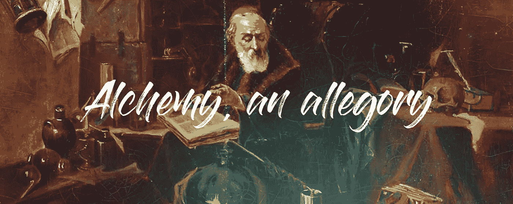
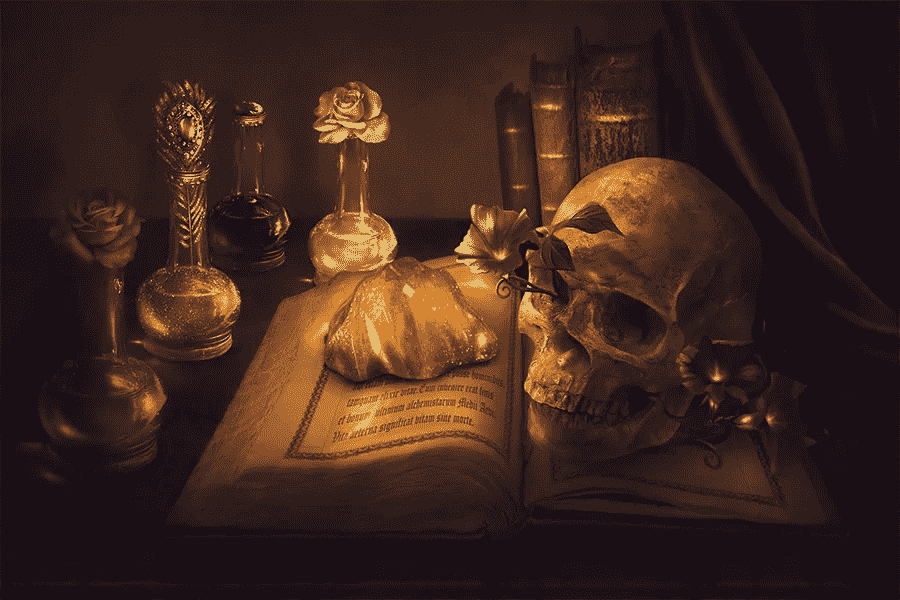
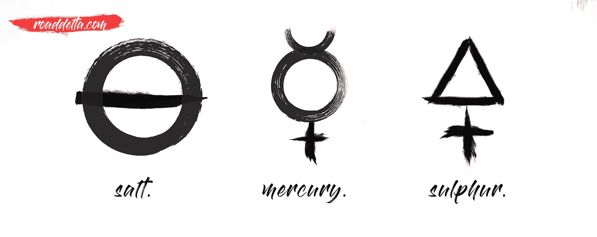
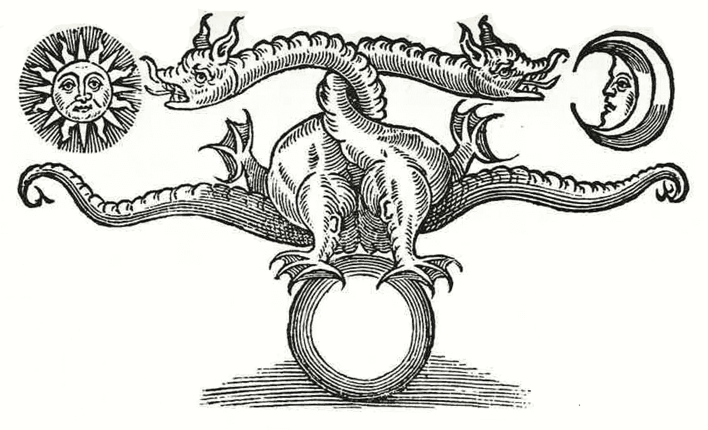

# 炼金术，自我提升的寓言

> 原文：<https://medium.com/swlh/alchemy-an-allegory-for-self-improvement-4408c9018012>

直到最近，炼金术对我来说还是一大堆废话。

对于不熟悉的人，我来描述一下炼丹师的主要目标。

*   创造魔法石，一种能把任何金属变成黄金的红色石头。
*   创造长生不老药，一种让你长生不老的液体。

你现在明白我怀疑的原因了吗？

这是中世纪的科学。化学和材料科学的先驱。但是在它的下面是一个关于人类状况及其一生进化的优雅隐喻。

在我们开始之前，我必须澄清一些事情。

炼金术充满了神秘主义和象征主义。人们永远不清楚所有绘画和文字背后的真正意图，但人们一直在试图理解它。卡尔·荣格就是其中之一，他花了很多时间在炼金术和个体化过程(荣格对自我成长的表达)之间建立联系。这篇文章主要倾向于荣格的工作，但是当然，不要从字面上理解。

有些事情最好用隐喻和寓言来沟通。就个人而言，自我提升的过程大大受益于这种方法。所以，敞开你的心扉，让我们一起投入吧！

# **马格纳斯作品**

拉丁语意为“伟大的工作”，它指的是创造魔法石的过程。

据说这种石头能把稀有金属变成贵金属，而且还能让人长生不老。听起来好像有人在营销这块石头方面做得很好。

Photo by [**Incantata**](http://incantata.deviantart.com/)

许多人认为，魔法石象征着对完美的追求，象征着个人的启蒙之旅。

我真正欣赏这个寓言的是隐含的行动感。自我成长的追求需要炼金术士行动起来，积极寻求制造一个具有非凡特性的物理物体。知识和实践都是值得称赞的。

在我最喜欢的一本书里，保罗·柯艾略的《炼金术士》，一个英国人请最伟大的炼金术士教他如何把铅变成金子。炼金术士简单地回答道:

去试试。

在今天的信息时代，很容易收集一个主题的所有知识，直到它的次要细节，分析它们并形成一个观点，而不实际实践任何东西。

没有实践的知识是没有意义的。不幸的是，这使我回想起我在大学的许多时光。

一个炼金术士应该总是让它的熔炉燃烧。

# **三位一体的元素**

由于炼金术士试图转化金属的活动，预计炼金术士应该对化学和材料科学有广泛的了解。

事实上，大多数炼金术士可以被称为中世纪的化学家。(顺便说一下，这可能会成为《权力的游戏》中一个非常有趣的角色)

像化学一样，炼金术士也试图定义物质的组成部分。代替原子，使用了三种不同的基本材料，称为质数:盐、汞和硫。

跟着我。这是最精彩的部分开始了。

许多人认为，这些质数不仅指自然界的不同构造，更具体地说，是指人类条件的组成部分。

盐代表身体，物理层面。

硫磺代表灵魂，无形的维度。它是不成形的，不稳定的。

水星代表思想，是物质和无形维度之间的中介。

在我看来，这三位一体提出了一个有趣的模式来看待自我提高。炼金术士需要控制这三种元素来制造魔法石。

# **下兔子洞……**

炼金术要比这复杂得多。多得多…

每一种元素、金属、工艺……每一样东西都有一个与之相关的符号。有时，符号的名称也代表一个概念或包含一个更大的叙述参考。

以元素汞为例。它代表思想，身体和灵魂之间的联系。水星也是一个罗马神的名字，是连接上层世界和下层世界的桥梁。

太阳和月亮也代表了一些东西。它可以指贵金属金和银，但也可以指男性和女性能量。一旦你开始解码这些符号，你就可以开始尝试解释炼金术上的一百幅插图…

Dragons are very present in alchemy.

这是我开始对炼金术失去兴趣的地方，炼金术是一种将自我发展过程人格化的方式。在某种程度上，它变得过于神秘和过度分析。

炼金术的叙述非常适合艺术，它的知识可以产生非常有趣的概念。就像我之前提到的，保罗·柯艾略的《炼金术士》是我最喜欢的书之一，因为它将这些神秘的元素融入了故事中。此外，钢之炼金术士是任何动漫迷的必看节目。

炼金术有趣又耐人寻味。它是对人生旅程的一个美丽寓言。将自己转化为贵金属的伟大工程，在盐、硫和汞方面有所改进。

喜欢这篇文章吗？点击❤并分享内容，表达你的爱。