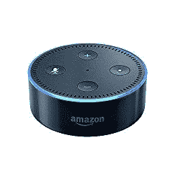

# Alexa 技能:基础(第一部分)

> 原文：<https://medium.com/swlh/alexa-skills-foundation-part-1-c86229ba70da>

这是这一系列博客文章中的第一篇，在整个系列中，我们将学习如何创建自定义的 Alexa 技能。

> ***先决条件*** *:基本或无编程经验。*
> 
> ***最终产品/预期结果*** *:我们将能够与支持语音的亚马逊设备交谈并向其发出命令，该设备将依次执行所需的操作。*

因为我们的目标受众是从开发者到没有编程经验的人，所以让我们花一点时间来描述 Alexa 的技能，并回答你们在深入研究之前可能会有的几个问题。

这个博客是那些想了解更多 Alexa 技能和亚马逊设备的人的基础博客。如果您已经熟悉该技术和设备，您可以跳过这一步。

不再拖延，让我们开始解决我们的第一个问题。

# 什么是 Alexa？

**回答:** *Alexa 是重量级品牌亚马逊的语音服务，为亚马逊 Echo、亚马逊 Tap、亚马逊 EchoDot、Echo spot 等设备提供支持。*

你还可以在亚马逊的 Fire TV、Fire 平板电脑和任何其他支持 Alexa 语音服务的设备中找到 Alexa。

# 怎么和 Alexa 说话？

**答:** *用醒字。*

首先，Alexa 总是在听唤醒词，即*将激活 Alexa* 的词。默认的唤醒词是“Alexa”，但作为用户，你可以自定义唤醒词，并从以下列表中选择:“Alexa”，“亚马逊”，“回声”或“电脑”。

[Amazon Echo Dot](https://amzn.to/2yxK2Fr)

一旦说出唤醒词，Alexa 就会醒来:)并开始听你说话。

如果您使用的是 Amazon EchoDot，您会注意到一个蓝色的圆形带状灯亮起，通知用户设备处于活动状态(如图所示)。

您现在可以开始从设备(在这种情况下是 EchoDot)发出任务或询问问题

# 什么是技能？

**回答** : *设备(Alexa)拥有的内置能力被称为技能，或者更准确地说是“Alexa 技能”。*

例如，你可以让 Alexa 设置一个明天早上 6:00 的闹钟，只需说出以下内容:

> 用户*:“Alexa”，“设置明天早上 6:30 的闹钟”*
> 
> 作为回应，Alexa 将做出如下回应:
> 
> Alexa *:“闹钟设定，明天早上 6:30”*

很容易，不是吗！

# 不同类型的 Alexa 技能

Alexa 技能可以分为以下两种类型:

1.  内在技能和
2.  自定义技能。

# 内在技能

因为 Alexa 有许多其他内置技能，你可以要求 Alexa 执行多个其他任务，如:

> 设置提醒、查看天气预报、听歌曲等。

如果 Alexa 正在执行一项持续的任务，如播放歌曲或音乐，您可以通过以下方式温和地告诉 Alexa 停止:

> 用户 *: Alexa，停！*

就这样，你学会了如何操作亚马逊的声控设备:)

> Alexa 还可以控制开关和恒温器等智能设备。

# 自定义技能

到目前为止，我们讨论了一些与支持亚马逊语音服务的设备(如 EchoDot、Tap 等)捆绑在一起的很酷的技能。)但是你可以通过建立自己的定制技能来真正利用这些语音设备的能力。例如:

> *你可以用这些声控设备预订优步的顺风车，从超市订购食品，甚至办理日常银行业务。*

要观看亚马逊 Alexa moments 的快速介绍视频以体验 WOW 因素，请查看以下链接:

# 一些令人惊叹的支持亚马逊语音服务的设备:

[Amazon Echo Show](https://amzn.to/2q55rBd)

Echo Show:观看视频 flash 简报、亚马逊视频内容、查看音乐歌词、安全摄像头、照片、天气预报、待办事项和购物清单、浏览和收听有声读物等。全部免提—尽管问。

[Amazon Echo Spot](https://amzn.to/2D04F0P)

Echo Spot:第二代远场语音识别，用于观看视频 flash 简报、查看天气预报、制作待办事项和购物清单、收听 Kindle 电子书等。全部免提—尽管问。

# 敬请期待！

在即将到来的帖子中，我将涵盖更先进的概念，如 Alexa 技能包，自定义技能的组成部分，规划和创建 Alexa 技能，然后最终测试我们已经建立了什么，并准备提交。

关于其他更新，你可以在我的推特账号上关注我 [@NavRudraSambyal](https://twitter.com/NavRudraSambyal)

感谢阅读，如果发现有用请分享:)

## 这篇文章发表在 [The Startup](https://medium.com/swlh) 上，这是 Medium 最大的创业刊物，拥有+383，380 名读者。

## 订阅接收[我们的头条新闻](http://growthsupply.com/the-startup-newsletter/)。

