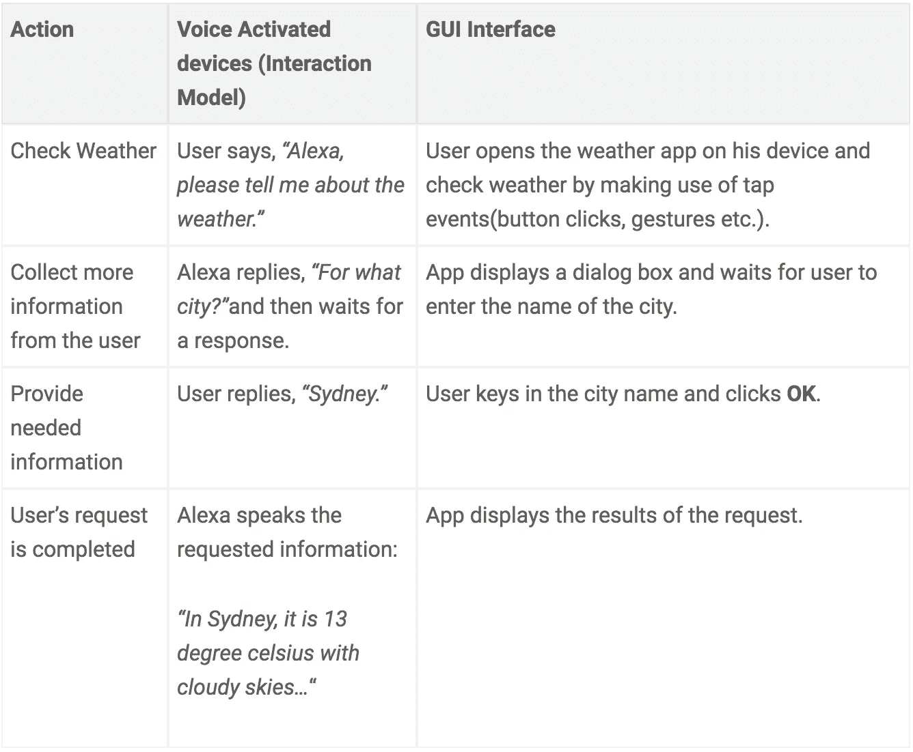
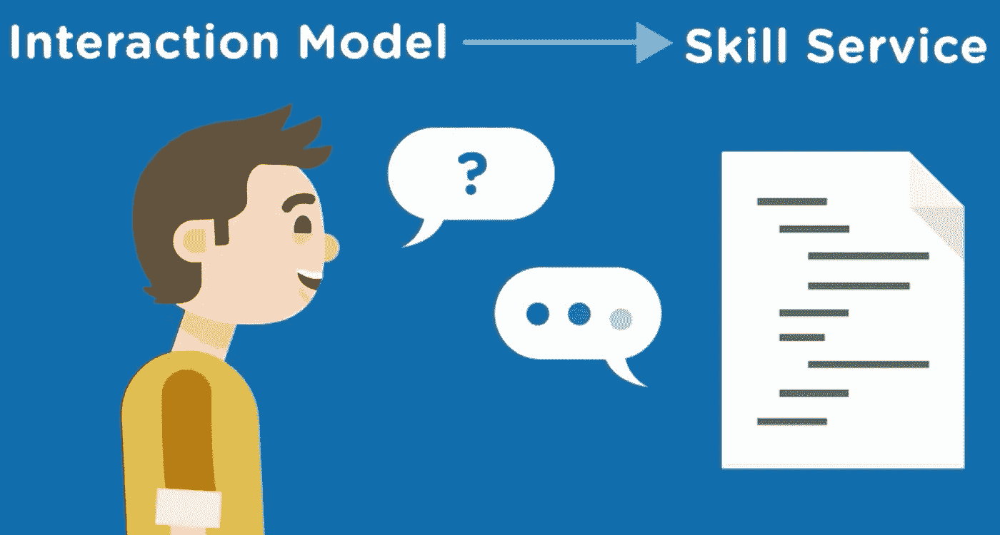

# Alexa 技能:基础(第二部分)

> 原文：<https://medium.com/swlh/alexa-skills-foundation-part-2-8b95f2c37259>

在 [Alexa 技能:基础(第一部分)](http://codealogic.org/2018/05/16/create-your-own-alexa-skill-without-prior-programming-experience/)中，我们讨论了 Alexa 和亚马逊语音服务的基本知识，并探索了一些日常购买中容易获得的设备。

[Echo 2nd Generation](https://amzn.to/2q75z35)

在本帖中，我们将讨论推动亚马逊语音技术的概念。我们将详细介绍以下概念:

*   自定义技能
*   Alexa 技能包
*   定制技能的组成部分

我们将熟悉自己的基本概念，在下一篇文章中，我们将使用所有这些概念建立一个 Alexa 技能。

所以不浪费任何时间，让我们讨论一个**自定义技能**。

# 自定义技能

Alexa(亚马逊的语音服务)的定制技能可以定义为使客户能够在使用亚马逊语音激活设备(如 Echo Dot、Echo spot、Echo Show 等)时创建个性化体验的能力。

自定义技能由两部分组成:

*   互动模式和
*   技能服务

让我们详细讨论这些组件

# 互动模式

*在 Alexa 的背景下，交互模型有点类似于传统应用程序中的图形用户界面。用户不再点击按钮和从对话框中选择选项，而是通过语音提出请求和回答问题——亚马逊*

换句话说，交互模型由用户在尝试与 Alexa 交互时可以使用的各种短语组成。

下表显示了当用户通过触摸事件进行交互和当他/她通过语音命令进行交互时，用户交互的快速比较。

当用户说出问题并提出请求时，Alexa 使用交互模型来解释和翻译这些话，并将其转化为可以由特定技能处理的特定请求。该请求然后被发送到**技能**。

> 创建自定义技能时，您可以定义自己的交互模型。智能家居技能 API 和内容技能 API 提供了内置的交互模型。

## 交互模型的例子

请注意用户可以说出的短语:

**用户:** Alexa，*问摩根大通，易贝的目标价是多少*。

*   *“JP mor gan*”是标识特定技能的 ***调用名*** 。调用自定义技能时，用户必须包含此名称。
*   *“易贝的目标价是多少*”是 JP 摩根互动模型中的一句话。这个短语映射到该技能支持的特定意图。

Alexa 使用这种定制的交互模型来创建请求的结构化表示，称为*意图*。Alexa 发送意向到**JP 摩根 技能。然后，该技能可以查找潮汐信息并发回响应。**

如上所述，定制技能的另一个组成部分是技能服务。

# 技能服务

技术服务是存在于互联网某处的代码，它代表 Alexa 回答执行任务的问题。

自定义交互模型是 Alexa 将问题和任务发送给技能服务所需的模型

我们将使用 **Alexa 技能工具包**来建立我们的定制技能。我们已经知道要做什么，所以我们需要创建两个组件，即前面讨论的交互模型和技能服务。

# Alexa 技能包

我们可以使用 Alexa Skills Kit 不仅建立定制技能，还可以建立智能家居技能(控制恒温器或开关等家用电器)或 Flash 简报技能(用户可以从新闻来源或其他娱乐内容中快速获得信息)。

Alexa 技能套件由一组以下组件定义:

1.  软件库
2.  证明文件
3.  在线工具

## 软件库:

软件库是开发人员用来为特定平台(如 Alexa 语音服务平台)开发和构建应用程序的程序。Alexa 技能工具包目前可用于 Node.js、Java、C#和 Python。因为很容易找到用这些语言工作的工具，所以你有很多选择来编写服务来处理来自 Alexa 的请求。

对于我们的演示项目，我们将使用[Alexa skills kit SDK for node . js](https://github.com/alexa/alexa-skills-kit-sdk-for-nodejs)。您不需要担心实现的细节，因为我们稍后会讨论您需要的一切。

## 文档:

当提到提供关于 Alexa 的信息时，亚马逊的开发者文档非常方便，但你可能会发现一开始有点吓人，因为提供的信息是成堆的。如果是这种情况，请不要担心，我们将以简明扼要的方式介绍这些概念，这将使您更容易开始，一旦您感到满意，您可以继续并访问以下链接了解更多信息:

[Alexa 技能工具包词汇表](https://developer.amazon.com/docs/ask-overviews/alexa-skills-kit-glossary.html)

## 在线工具

构建定制交互模型所需的所有东西/工具都可以定义为在线工具。

为了构建一个自定义技能，你需要向 Alexa 提供一些你期望 Alexa 回应的对话示例，换句话说，你需要教会 Alexa 如何解释用户是否在提问。这就是所谓的自定义交互模型。

让我们分解自定义技能的组成部分，并讨论用于描述用户如何与 Alexa 交互的术语。

# 定制技能的组成部分

Alexa 中的自定义技能由四个部分组成:

1.  祈祷
2.  说话
3.  意图和
4.  时间

**调用**是以自定义技能开始互动的行为，例如短语:“Alexa，问 JP Morgan what 的目标价格是多少？”告诉 Alexa 使用 JP Morgan 技能获得 ebay 的价格。关键词 JP 摩根被称为 ***调用名称*** 。

> 这些名字代表了一个自定义的技能名称，可以用来与 Alexa 进行交互。通常，调用名称应该由两个单词组成，因为不允许使用单个单词的调用名称，除非该名称对于您的品牌或 IP 是唯一的。

调用名和调用名后面的短语的组合允许正确的技能来响应用户的查询。调用名之后的短语可以称为 ***发音*** 的一个例子。

为了让 Alexa 正确回答用户的问题，需要为一项技能配置多种话语。例如，对于上面的例子，用户可能会问:“Alexa，问 JP 摩根易趣卖多少钱？”

> **意图**表示满足用户口头请求的动作。当您创建一个新的定制意图时，您需要提供一个名称和一个语句列表，用户会说这些语句来调用这个意图— Amazon

为了从动作/意图中提取更详细或具体的信息，我们使用 ***槽*** 。例如:“Alexa，让 JP 摩根把张愉珍的最新研究报告发给我”。这里我们可以看到，用户希望将 ***最新的研究报告*** 从所有可能存在的报告中剔除。

> *样本话语*是映射到意图的一组可能的口语短语。——亚马逊

[Echo Dot Kids Edition](https://amzn.to/2PM4Z64)

你不需要覆盖每一句话，因为 Alexa 将使用自然语言处理来自动响应与已经提供的请求非常接近的请求。

在接下来的帖子中，我们将开始计划和创建一个 Alexa 技能，因为我们最终会创建意图模式。在那之前，请尽情阅读并保持关注！

关于其他更新，你可以在我的推特账号上关注我

感谢阅读，如果你觉得有用，请分享🙂

## 这篇文章发表在 [The Startup](https://medium.com/swlh) 上，这是 Medium 最大的创业刊物，拥有+383，719 名读者。

## 在这里订阅接收[我们的头条新闻](http://growthsupply.com/the-startup-newsletter/)。

