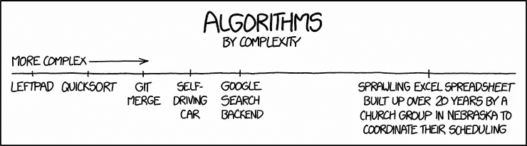

# 算法、复杂性分析和数据结构很重要！

> 原文：<https://medium.com/swlh/algorithms-complexity-analysis-and-data-structures-matter-9ed0b93ea3b7>

Algorithms by Complexity — source: [https://xkcd.com/1667/](https://xkcd.com/1667/)

每隔几个月，我们就要经历一次费力的招聘过程。这是一个多阶段的面试，从在线申请开始，然后是现场面试，最后是相对困难的技术挑战。鉴于我们每个周期都会收到数百名申请人，我们不得不将现场面试精简到最基本的内容，最长不超过 20 分钟。在这 20 分钟里，候选人未来 4 个月(可能更久)的生活是由一系列问题和回答决定的。

我们希望评估潜在的学生，因为他们在本科阶段接受过培训，所以我们设计了面试，涉及一些关于[数据结构](https://en.wikipedia.org/wiki/Data_structure)、[关系数据库理论](https://en.wikipedia.org/wiki/Relational_database)和[算法](https://en.wikipedia.org/wiki/Algorithm)的基本问题。大多数候选人都没有通过这一部分的考试，学生们会变得很有防备心，并且会打嗝说出一些可怕的话，比如:

> “但我知道 X、Y 和 Z 语言，我从未在我所做的项目中使用过算法或数据结构”
> 
> “我已经专业工作了 X 个月，从来没有实现过链接列表、二叉查找树或<insert data="" structure="" name="" here="">”</insert>
> 
> “我几年前上过这门课，但我全忘了……”
> 
> “我已经毕业 X 个月了，但这从来不是我们计算机科学课程的一部分”

更糟糕的是，我们的问题一点都不难。他们甚至远离谜题或白板问题解决，通常围绕着与候选人进行讨论，以评估他们是否能够说出算法和数据结构的目的，并描述开发人员如何估计算法的空间和时间复杂性。除了他们的大学项目之外，没有写过一行代码的计算机科学和工程专业的应届毕业生，还有什么可以评价他们的呢？

# 现实

一些主要的技术公司(谷歌、亚马逊、脸书等。)在面试阶段很大程度上依赖于解决算法性质的问题来评估候选人。此外，在软件工程社区中，关于在面试过程中使用数据结构/算法/难题来衡量被面试者能力的优势，存在着巨大的争议。

> 大卫·海涅梅尔·汉森 (DHH)是“Ruby on Rails 的创造者，Basecamp(前身为 37signals)的创始人&首席技术官，NYT 畅销书《返工与远程》的作者，勒芒级获奖赛车手。”

然而，让我们不要混淆面试中这些问题的价值和这些领域在软件工程师职业生涯中的重要性！

在软件开发人员(特别是 web 和移动开发人员)职业生涯的最初几年，没有在这些理论领域培养能力是可以原谅的。事实上，我们中的许多人被明确指示不要重新发明轮子，只使用现有的解决方案来完成工作。是真的。

在我构建软件产品的前 5 年里，我从未实现过[冒泡排序](https://en.wikipedia.org/wiki/Bubble_sort)或穿越过[二叉查找树](https://en.wikipedia.org/wiki/Binary_search_tree)，然而，随着我职业生涯的推进，我发现自己在处理更广泛的问题，这些问题的解决方案在 StackOverflow 上并不容易找到！我来解释一下:

1.  最近，我不得不将存储在关系数据库中的数据转换成带有命名边的[网络](https://en.wikipedia.org/wiki/Network_theory)可视化。祝你在不了解网络理论和树的情况下解决这个问题。
2.  您正在构建的应用程序是否要求您在用户创建帐户后向他们发送电子邮件？你是不是在想:“我只要在我的控制器中执行 **send_email()** 方法，然后就可以收工了”？再想想。虽然这可能适用于 5、10、20 甚至 100 个并发用户，但迟早会达到一个极限，使用 [**队列**](https://en.wikipedia.org/wiki/Queue_(abstract_data_type)) 的需求将不可避免。这里有一个转折，如果你发送的邮件因为某种原因失败了，你会怎么处理？
3.  您已经为您的一个 web 产品构建了一个 API，让所有人惊讶的是，在几个月内，您现在每天都有 100，000 个请求发送到您的端点。您的服务器正在崩溃，它无法处理如此多的请求，并且您的数据库资源利用率高得惊人！添加新的服务器不是一个选项，因为您的应用程序不是为负载平衡器而设计的，您既没有时间也没有钱来做这些。缓存来救急了，不过话说回来，你不知道什么 [**【键/值】(字典)**](https://en.wikipedia.org/wiki/Associative_array) **商店**或者 [**散列表**](https://en.wikipedia.org/wiki/Hash_table) 都是**。**

这份清单还在继续…

当然，包和库抽象了我们每天做的大量日常工作。然而，很少，但毫无疑问，我们偶然发现的问题是，根本没有一个*可谷歌* /可下载的修复程序，并且只有一个狭窄的工具库可供选择，这使得你在面对挑战时毫无希望。

# 答案

在 [SE Factory](https://medium.com/u/caf23bae0974?source=post_page-----9ed0b93ea3b7--------------------------------) 我们高度相信计算机科学的基本主题的价值，以及开发对它们的理解如何帮助开发人员在多年的服务中从平庸提升到高价值的资产。

因此，我们正在引入一个名为**“计算机科学基础(FCS)”**的新的循环项目，该项目为期 **4 周，每周 3 天(周一、周三和周五)**。在这几周里，我们将复习编程的构建模块、算法和分析、数据结构、面向对象编程、关系数据库以及文件系统和网络中的一些精选主题，为我们的旗舰项目[全栈 Web 开发](https://sefactory.io/)做准备。

你可以在这里复习教学大纲[，在这里](http://fcssyllabus.sefactory.io/)申请即将到来的周期[。](http://apply.sefactory.io/)

第一轮 FCS 将于 2018 年 1 月 15 日进行。

*感谢你* [*穆罕默德·斯卡菲*](https://medium.com/u/992e3df74b60?source=post_page-----9ed0b93ea3b7--------------------------------) *阅读这篇文章的草稿*

## 这个故事发表在 [The Startup](https://medium.com/swlh) 上，这是 Medium 最大的企业家出版物，拥有 284，454+人。

## 订阅接收[我们的头条](http://growthsupply.com/the-startup-newsletter/)。

