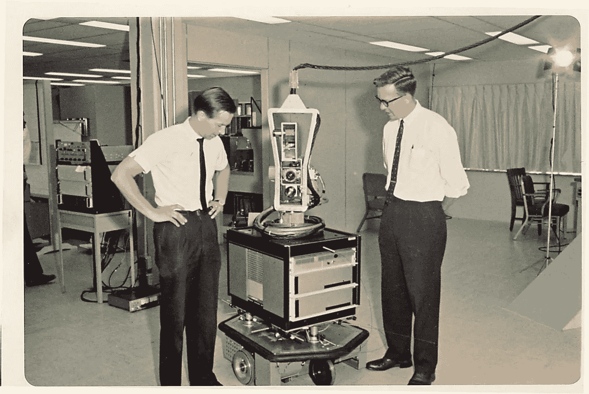

# 让你更有效率的算法

> 原文：<https://medium.com/swlh/algorithms-to-make-you-more-effective-8ae8749be970>

## 我们能从计算中学到什么来让自己变得更好？

Shakey the Robot. (Source: Computer History Museum)

# 你的焦点以及如何保护它

在我职业生涯的早期，我认为成功与说“是”紧密相连。

那个小忙？没问题。有人刚刚在……向我提到的那个有趣的想法