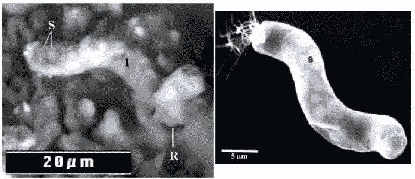
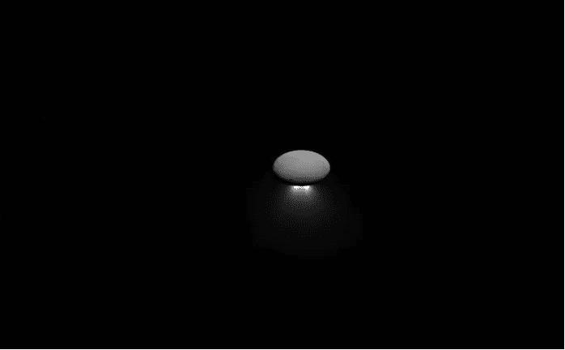
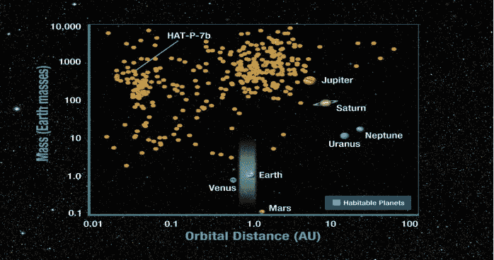

# 外星生命:科学评论

> 原文：<https://medium.com/swlh/alien-life-a-scientific-review-623058671409>

# 由 [1](https://medium.com/u/4fb2aa542c6a#one)

在这篇文章中，我们将探讨生命的组成部分是什么，以及生命对它们的依赖程度到底有多大。在我们未来寻找地外生命的尝试中，我们也将努力找出我们的关注点。

# 生命的组成部分是什么？

那么，创造生命需要什么？我们首先想到的是碳。地球上的每一种生命形式本质上都是一种复杂的碳基化学物质，几乎 45–50%的干生物质都是由碳构成的。原因在于碳具有形成大量结构的能力，如链、环和三维大分子，它们在很宽的温度范围内都非常稳定。任何本质上基于化学的生命都需要这种大分子和聚合化学的存在，以与不断变化的环境和其他化合物相互作用。[ [3](#x1)

那么，有没有可能其他一些元素像碳一样构成生命的主干？也许有，硅是这个位置的最大竞争者。像碳一样，它也能形成大分子结构，能形成强共价键，能与许多元素形成化合物。但这需要环境满足一些非常严格的要求，通常在太空中，我们会看到更多的碳基化合物，而不是硅化合物。但这也留下了一个可能性，不管这种情况在宇宙的某个地方发生的可能性有多小。[ [3](#x1)

在类似地球的场景中，下一个对生命至关重要的东西是水。《生命的矩阵:水的传记》一书的作者、《自然》杂志的编辑菲利普·布尔认为，水具有形成三维氢键网络的独特能力。这使它能够参与各种生物过程。水甚至可以非常好地处理分子间的相互作用，可能是世界上唯一已知的可以如此迅速地完成所有这些工作的普通液体。同样，由于氢键的存在，冰点和沸点之间的温差仍然很大。水也是一种完美的热量调节剂，这使得它绝对适合生命。

最后但并非最不重要的是氮气。它是氨基酸和尿素的基本成分。氨基酸负责蛋白质的形成，蛋白质是酶和激素的基本结构成分，是每个生物正常运作所必需的。

除了这三种物质之外，还有许多其他物质对生命显然很重要，但在陌生的环境中，它们可能会被其他一些元素所取代。

另一件要考虑的事情是能源和环境。地球上的大多数生命形式本质上都是由太阳提供能量的，地球的环境温度也在生命的繁盛中发挥了重要作用。

这让我们好奇的头脑想到了一个明显的问题。不满足所有这些条件，任何形式的生命都能生存吗？答案是肯定的。这个答案的验证就在地球上进行。在被认为对其他陆地生命形式不可容忍的恶劣甚至致命的环境中不仅生存而且繁衍的生物被称为极端微生物。例如，冬眠中的缓步动物可以在-272 摄氏度至 151 摄氏度下存活，可以在真空和极度脱水下存活，可以承受高达 6000 atm 的压力，并且可以耐受高水平的 X 射线和伽马射线辐射。[ [5](#four)

这就引出了我们的下一个问题。这些极端微生物能在太空提供的最恶劣条件下生存吗？Karsten Pedersen 和 Cunningham 等人在这方面进行了有趣的研究，他们向我们展示了一些微生物可以生活在岩石中，并可以创造一个地下生物圈。[[6](#five)][[7](#six)][[8](#seven)]

因此，他们的结果证明，即使没有阳光和稳定的食物来源，生命也能生存。考虑到极端微生物疯狂的生存能力，如果我们想象它们骑在流星的背上进行星际旅行甚至星际旅行，这将不是一个牵强的想法。这一思维过程现在得到了理查德·胡伯博士 2011 年一篇备受争议的论文的支持，在这篇论文中，他声称在一颗 C11 碳质陨石中发现了蓝细菌的化石。[ [9](#eight)

*Figure 1: FESEM Backscattered Electron image of a filament of the meteorite on which Dr Hoober experimented, with N<0.5% and sulfur-rich globules S and rounded terminus R (left) which is pretty similar in size, morphology and internal composition to a bacteria present in earth (right).[*[*9*](#eight)*]*

但这并没有结束。我们的经验和知识深受我们在地球上观察到的生命的影响。另一个星球上的生活可能与我们想象的大不相同。可能有不使用热力学化学不平衡的生命形式，或者存在于固体或气体状态的一些形式。[ [10](#a5)

即使仅仅在我们的星球上，生命也首先在甲烷和氨的大气中进化，这对我们来说是致命的，但通过进化，生命已经慢慢适应了它所面临的挑战和环境。因此可以假设，生命有可能适应其他关键环境，如果发生这种情况，这种生命形式对我们来说可能非常怪异，难以置信。[ [11](#a6)

# 我们应该去哪里寻找外星人？

那么，我们应该去哪里寻找外星生命呢？NASA 的[愿景对此非常清楚，那就是跟着水走。水是生命的基本需求之一，因此通过找到它，美国宇航局希望找到外星生命。](https://www.nasa.gov/vision/earth/everydaylife/jamestown-water-fs.html)

在我们的太阳系中，没有其他星球的表面有液态的水。但是液态水可能存在于木卫二和土卫二厚厚的冰壳中，木卫二是木星的卫星之一，土卫二是土星的第六大卫星。[ [12](#nine) ]

同样，天王星和海王星的冰壳下也有大量的水。这两颗行星被称为冰巨人，必须指出的是，这种类型的冰巨人在我们的星系中非常常见。[ [14](#a1)

此外，如果我们更仔细地观察，在火星和金星这样的行星上也可能会有地下水，如果是火星，预计会有大量的储存。[ [15](#a9) ][ [16](#a8) ]

在非常厚的冰层下的超级寒冷的海洋中生活听起来是不可能的，但就我们目前对极端微生物的了解来看，这种可能性很小。此外，我们已经设法证明，由于各种热液系统，木卫二的海洋中可能有足够的能量(潮汐诱导的多孔流约为 5.8 mW m-2)[[17](#b1)]，以产生足够的有机和氧化剂分子来维持一个生物圈。[ [18](#a2)

对于卫星恩克拉多斯来说，这个案例更有意思。2006 年卡西尼号宇宙飞船从其南极探测到高达 3-7 千兆瓦的大量热辐射。如此巨大的地热能可能表明土卫二的地下有足够的能量来产生和维持稳定的生态系统。[ [19](#b2) ][ [17](#b1) ]

*Figure 2: Picture taken from NASA Cassini spacecraft showing Enceladus and its south polar jets backlit by the Sun. These jets further prove the existence of strong geothermal energy and heat in its south pole.[*[*20*](#i1)*]*

*。*

到目前为止，我们还不能测试这些海洋中的任何生命迹象，但美国宇航局正在积极准备一项任务，深入欧罗巴的地壳，探索其海洋。那些对技术着迷的人可以看看《天体生物学》杂志上的这篇有趣的文章，这篇文章介绍了这次任务中复杂钻头的设计。

从我们到目前为止所讨论的内容来看，很明显有一点点可能性，即有独特的生命形式生活在极端或完全敌对的环境中。离我们最近的行星是木星，它是拥有这种生命形式的主要候选者。

研究发现，木星可能有一个或多个区域的环境与原始地球非常相似，这些区域可能是足够小的生物体的家园，可以在该区域漂浮或飞行。[ [11](#a6) ][ [21](#a7) ]

此外，也有人试图寻找类似地球的行星，我们发现地球大小的行星在开普勒领域相当常见。然而，即使是它们中最近的也有将近 12 光年远，现在我们还没有这样的能力将探测器发射到那么远的地方。[ [22](#a3)

*Figure 3: Image showing the distribution of mass and orbital distance of discovered planets and the habitable zone which can support Earth-like life.[*[*23*](#i2)*]*

# 结论

寻找外星生命是最有趣的前沿研究领域之一，而事实上我们还没有遇到任何外星生命是我们这个时代最大的谜团之一。如果你回想起费米悖论，它变得越来越令人困惑而有趣。已经有研究证明这个悖论的逻辑无效，但它仍然是最神秘的悖论之一。总的来说，研究将会继续下去，如果有一天我们能找到一种外星微生物，并解决这个古老的问题，那一天将会作为人类及其科学成就最伟大的日子之一而被铭记。

# 文献学

1.道金斯:认为我们在宇宙中是孤独的是傲慢的。《世界报》(2014 年)。在

2.Magnussen，s .和 Reed，d .碳含量估计。《国家森林评估知识参考——估算和监测建模》( 2004 年)。在

3.Schulze-Makuch，d .和 Irwin，l.《其他世界上外来形式的外星生命的前景》。自然科学杂志(2006 年)93，155–172 页。

4.水:生命的分子。天体生物学杂志(2003 年)。在

5.极端微生物和极端环境。生活 3，482–485(2013)。

6.深层地下生物圈。地球科学。修订版 34，243–260(1993 年)。

7.深层花岗岩中的微生物生命。FEMS 微生物。修订版 20，399–414(1997 年)。

8.Cunningham，K.I .，Northup，D.E .，Pollastro，R.M .，Wright，W.G .，和 Larock，E.J.《新墨西哥州卡尔斯巴德洞穴国家公园 Lechuguilla 洞穴中的细菌、真菌和生物岩溶》。环境。《地质》第 25 卷，第 2–8 页(1995 年)。

9.CI1 碳质陨石中的蓝细菌化石:对彗星、欧罗巴和土卫二上生命的暗示。宇宙学杂志 13，(2011)。

10.行星系统有机生命极限委员会；生命起源和进化委员会；空间研究委员会；工程和物理科学司；生命科学委员会；地球和生命研究司；国家研究委员会。行星系统中有机生命的极限。25(国家学术出版社，2007 年)。在

11.庞南佩鲁马和莫尔顿,《木星上的生命前景》。空间生命科学 4，32–44(1973)。

12.木卫二上有液态水吗？。地球物理研究快报 6，731–734(1979)。

13.美国国家航空航天局的哈勃观测显示木星最大的卫星上有地下海洋。美国航天局(2015 年)。在

14.Reh，k .，Hofstadter，m .，Elliott，J. & Simon，a.《冰上巨人》。(2017).

15.Lyons，W.B .，Welch，K.A .，Snyder，g .，Olesik，j .，Graham，E.Y .，Marion，G.M .，和 Poreda，R.J.《南极洲麦克默多干河谷湖泊的卤素地球化学:溶质起源和湖泊演化的线索》。Geochim。宇宙奇姆。《学报》69，305–323(2005 年)。

16.Baker，V.R .，Dohm，J.M .，Fairen，A.G .，Ferre，T.P.A .，Ferris，J.C .，Miyamoto，h .和 Schulze-Makuch，d .地球外水文地质学。水文地质学杂志 13，51–68(2005)

17.小型海洋行星中的热液系统。天体生物学 7，987–1005(2007 年)。

18.欧罗巴上微生物生命的能量。《自然》403，381–382(2000 年)。

19.斯潘塞，j .卡西尼遇到土卫二:背景和南极热点的发现。科学 311，1401–1405(2006)。

20.美国宇航局，JPL 加州理工学院，空间科学研究所。从远处喷射。(2017).在

21.木星上的生命？。宇宙化学进化和生命起源 483–486(1974)。doi:10.1007/978–94–015–1118–6 _ 38

22.围绕类太阳恒星运行的地球大小行星的普遍存在。美国国家科学院院刊 110，19273–19278(2013)。

23.美国宇航局。可居住行星带。(2009).在

24.不存在费米悖论。伊卡洛斯 62，518–520(1985)。

德班苏·巴塔查亚

嗨，你好！我是德班苏，今年 21 岁。我在加尔各答大学迪纳班杜安德鲁斯学院学习物理。我喜欢太空，喜欢在晴朗的日子看天空。我的其他爱好包括编码、足球、听轻音乐和读故事书。

**社交媒体链接:**

【https://www.facebook.com/debansu.bhattacharya.79】[脸书](https://www.facebook.com/debansu.bhattacharya.79)

**推特:**https://twitter.com/ThePhyTraveller

**中等:**https://medium.com/@iamjeet05

指南:

— — — — — — — — — — — — — — — — — — — — — — — — — — — —

Tafheem 是一名太空爱好者，在太空生物学领域工作，正在研究外层空间的自我维持环境。他和一个充满活力的研究团队一起，正在建立一个空间学习平台。此外，他还致力于在各种印度学校创建首个针对特定主题的互动教育游戏模块。

[https://www.linkedin.com/in/tafheemmasudi](https://www.linkedin.com/in/tafheemmasudi/)

 [## 塔菲姆·艾哈迈德·马苏迪

### 塔菲姆·艾哈迈德·马苏迪在脸书。加入脸书，与塔菲姆·艾哈迈德·马苏迪和其他你可能认识的人联系…

www.facebook.com](https://www.facebook.com/tafheemmasudi)  [## 塔菲姆·马苏迪(@塔菲玛苏迪)|推特

### 塔菲姆·马苏迪的最新推文(@ tafheemmasudi)。想成为科学家。印度本加卢鲁

twitter.com](https://twitter.com/tafheemmasudi) 

Sukant Khurana 博士经营着一个学术研究实验室和几家科技公司。他也是著名的艺术家、作家和演说家。你可以在 www.brainnart.com 的[或 www.dataisnotjustdata.com](http://www.brainnart.com)的[了解更多关于苏坎特的信息，如果你希望从事区块链、生物医学研究、神经科学、可持续发展、人工智能或数据科学公益项目，你可以在 skgroup.iiserk@gmail.com 联系他，或者通过 linkedin](http://www.dataisnotjustdata.com) [的 https://www.linkedin.com/in/sukant-khurana-755a2343/](https://www.linkedin.com/in/sukant-khurana-755a2343/)联系他。

这里有两个关于 Sukant 的小纪录片和一个关于他的公民科学努力的 TEDx 视频。

## 这篇文章发表在 [The Startup](https://medium.com/swlh) 上，这是 Medium 最大的创业刊物，有 328，729+人关注。

## 在这里订阅接收[我们的头条新闻](http://growthsupply.com/the-startup-newsletter/)。

