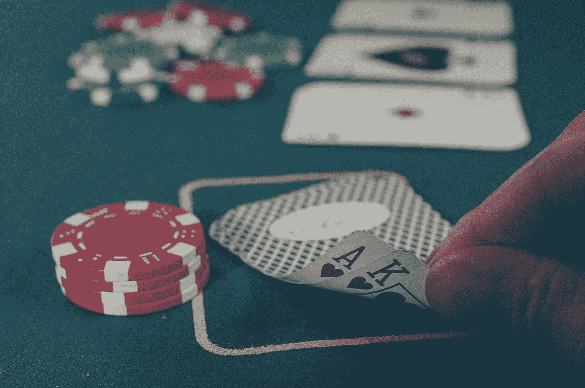

# 全押:传奇扑克玩家的决策经验

> 原文：<https://medium.com/swlh/all-in-lessons-on-decision-making-from-a-legendary-poker-player-6cebf6edfdaf>

生活充满了大大小小的决定。我们每天都要做无数的决定，而且通常情况下，我们都是在潜意识或接近潜意识的层面上做这些决定。但是不管我们是有意还是无意地这样做，我肯定你同意在生活中有些情况下我们希望自己做出更好的决定。

那么如何才能做出更好的决策呢？一种方法是学习传奇职业扑克玩家的经验和教导。

那位扑克玩家是安妮·杜克。在她的职业生涯中，她赢得了超过 400 万美元，收集了一个世界扑克锦标赛手镯，并且是唯一一个赢得世界扑克锦标赛冠军和 NBC 全国单挑扑克锦标赛冠军的女性。

> 简单地说，当你坐在牌桌前时，你不想面对她。

现在，她是一名企业顾问和发言人，帮助个人做出更好的决策。她最近出版了一本关于决策的书，名为 [*《下注中的思考:当你没有掌握全部事实时做出更明智的决定*](https://www.amazon.com/dp/B074DG9LQF) 。

在玩扑克时，杜克和她的对手必须做出无数个决定，所有这些都是在极其紧张的情况下做出的。事实上，扑克玩家每手牌可能要做出多达 20 个决定*。当你和世界上一些最好的玩家一起玩百万美元的游戏时，你会开始感受到压力。*

考虑到这一点和她对认知心理学的长期兴趣，杜克大学是我们如何做决定以及我们如何在生活中提高决策能力的优秀权威。杜克和我在最新一集的[大胆的力量](http://www.thepowerofbold.com)中谈到了这些问题。

> 你可以在 iTunes 或 Google Play 上找到安妮·杜克的采访。

虽然我鼓励你查看整个采访，但我选择了一些我在与安妮交谈时收集的最喜欢的见解。

## 1.为什么生活就像扑克

牌桌是一个高度紧张的环境，其中包含隐藏的线索和不完整的信息。像 Annie 这样的玩家可以看到自己的牌，在某些游戏中，还可以看到放在桌子中间的公共牌。当他们看到自己的牌时，他们可以看到其他玩家的反应，并可以利用对手的下注来暗示自己手中的牌。

也就是说，有一个重要的警告:玩家不能看到对方的牌。

这使得在任何给定的场景中计算最佳或最差的选择变得极其困难。对手可能在虚张声势，当他们手里的牌很弱时，却发出他们有一手好牌的信号(反之亦然)。即使你赢了一手牌，你也常常看不到对手的牌。你可能是因为运气而不是技巧赢了。

这不像下棋，例如，所有的棋子都在棋盘上，你可以看到所有可能的走法。

最终，安妮认为生活更像扑克而不是象棋。当我们要做决定的时候，我们并没有所有我们想要的信息。有不完整的信息，也不完全清楚你是基于技巧还是运气做出了好的还是坏的决定。

最终，我们生活在一个混乱的世界里，这使得我们很难决定当我们把经验作为未来决策的框架时，我们应该相信多少。

## 2.决策中的“结果”问题

安妮在*思考赌注*中提出了一个有趣的问题。

本质上，她要求读者想一想他们做过的最好的决定和最坏的决定。

> 我敢打赌，你最好的决定导致了一个伟大的结果，而你最糟糕的决定导致了一个非常糟糕的结果。

这是由*产生的*的想法，它是在扑克世界中发展起来的，但也适用于我们在日常生活中做出的决定。结果意味着我们倾向于将决策的质量等同于其结果的质量。

仅举一个例子，让我们看看第 49 届超级碗。新英格兰爱国者队正在与西雅图海鹰队对抗，他们在第四节的后期遇到了严重的麻烦。海鹰队落后 4 分，在比赛还剩 26 秒时站在爱国者队的一码线上。海鹰队的四分卫拉塞尔·威尔逊没有把球交给海鹰队的明星跑锋马肖恩·林奇，而是试图传球，但被爱国者队拦截，有效地结束了比赛。

糟糕的决定？当时许多人都这么认为。

然而，杜克大学解释说，评论员和愤怒的球迷只是结果。看看 NFL 历史上的类似情况，海鹰队做出了一个成功概率很高的决定，但非常不走运(显然在那种情况下拦截发生的几率为**2%到 3%**)。这个决定并不坏，但结果显然是坏的。

虽然我们很多人都是“以结果为导向”，但采取这种态度可能会导致糟糕的决定。当评估一个决定时，通过观察结果，我们倾向于重复导致那个好结果的同样的思维过程，即使那个结果几乎完全是基于运气而不是我们的技能。

的确，很难评估一个决定是主要基于技能还是运气。有无数的变数在起作用。但是，通过放慢速度，承认你可能会强调结果的质量，而不是你的决定的质量，你可能会构建一些隐喻盔甲，可以帮助你在未来做出类似的棘手决定。

## 3.在赌注中思考

那么，在评估一个即将到来的决定时，我们如何才能增加我们思考得更加客观和理性的几率呢？

我们应该像玩扑克的人一样处理这种情况。

> 我们应该在赌注中思考。

通过这样做，我们在评估我们对一个或多个特定信念的信心，这些信念构成了我们将要做出的特定决定的基础。

安妮给出了一个简单的假设:如果你有信心《T2》和《公民凯恩》获得最佳影片奖，我问你，“你想打赌吗？”，你可能会更加勤奋地质疑你的信仰。你可能想调出谷歌或维基百科。你开始拥抱不确定性，可能会说你有 80%或 90%的信心认为《T4》和《公民凯恩》获得了最佳影片奖(实际上没有)。

这种模式可以应用到你生活中大大小小的决定上。

比方说，你正在考虑是否要辞去工作成为一名企业家。安妮说，你应该尝试评估所有可能发生的情况，并为每种情况分配概率。评估每种情况的潜在回报，不仅仅是财务方面，还包括你的快乐和生活满足感。虽然失败可能是最有可能的情况，但你可以计算出对你的回报是值得的。

我们的目标不是计算每个场景中成功或失败的准确百分比。你不需要精确。简而言之，押注思维迫使你对自己长期持有的信念变得不那么情绪化，并以更客观的方式评估决策(无论是大的还是小的)。

## 4.拥抱死亡前

告诉我这听起来是否熟悉。

当考虑我们未来的目标时，我们首先想象自己非常成功，无论是成为千万富翁，登上《商业周刊》的封面，还是《纽约时报》的封面。我们成功了。在设想到这一点后，我们问自己，“我是怎么来到这里的？”然后我们回过头来决定我们需要做什么决定来达到我们的最终目标。这叫做回写。

综上所述，我们可能在倒退。

安妮建议我们不要回溯，而是进行一次*预死亡*。这意味着我们对未来持更加悲观的态度。我们展望未来，问自己“哪里出了问题？为什么我没有达到目的？”

通过这样做，你最终会对你的计划进行压力测试，这样你就可以看到可能会让你偏离方向的潜在问题点。你对潜在障碍的反应会更少，更有可能有一个继续向目标前进的计划。虽然最初很难，但生活在那个消极的世界里实际上可以增加你成功的可能性。

虽然许多企业家强调积极和乐观，但死前可能会提供另一种视角，帮助你避免前进道路上的一些路障。你自己试试，看看会发生什么。

## 5.找到两个伙伴

不幸的是，有一些坏消息。

即使我们意识到结果的问题和心理偏差的问题，如确认偏差和后见之明偏差，以无偏见的方式客观地评估你的决定是极其困难的。我们倾向于将好的结果视为技能的结果，将坏的结果视为坏运气的结果，而在评估他人的决定时则相反。

那么，做出更好决策的解决方案是什么呢？

我们都需要找几个朋友来组成一个“决策舱”如果你能找到几个打算帮助你做决定的人(你也帮助他们)，我们就能更好地做决定。

小组的一些目标应该是让每个成员对他们的目标负责，尽可能变得理性，对每个成员的决定指手画脚，对与我们意见相左的观点持开放和宽容的态度。目标是将与你的观点相反的信息视为一种威胁*本身*，而是一艘救生船，帮助你对世界形成更准确的看法，从而做出更好的决定。一旦你的决定变得更好，你就增加了长期成功的几率。

# 成为更好的决策者

*在赌注中思考*是一本杰出的书，可以指导我们在日常生活中做决定。这当然不容易，但采用安妮的一些策略可以帮助我们在展望未来时变得不那么情绪化，也不那么偏见。

虽然我们不能消除所有的认知偏见，但我们可以增加在最重要的时候变得更加客观的几率。在一个充满不确定性和隐藏信息的世界里，这可能是我们能做的最好的事情。

*感谢阅读！再一次，你可以通过访问我们在* [*iTunes*](https://itunes.apple.com/us/podcast/episode-20-poker-legend-annie-duke-on-making-smarter/id1240586023?i=1000408198703&mt=2) *或*[*Google Play*](https://play.google.com/music/m/Dbdxgmugldzhmpfw4sfd5istqra?t=Episode_20_Poker_Legend_Annie_Duke_on_Making_Smarter_Decisions-The_Power_of_Bold)*的页面来访问安妮关于大胆的力量的采访。如果你想阅读这一集的文字记录，请访问 Bold 的* [*网站*](http://www.thepowerofbold.com) *。*

附注:如果你喜欢你所读到的，请随意为这篇文章鼓掌！我非常感激。

## 这个故事发表在 [The Startup](https://medium.com/swlh) 上，这是 Medium 最大的创业刊物，有 313，216+人关注。

## 在这里订阅接收[我们的头条新闻](http://growthsupply.com/the-startup-newsletter/)。

