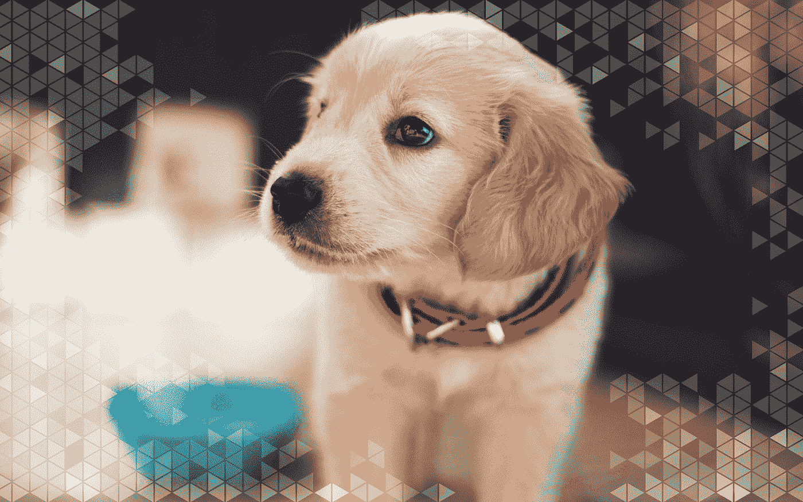

# 所有的感觉——为情感而设计

> 原文：<https://medium.com/swlh/all-the-feels-designing-for-emotion-8f35c4698c26>

这个人需要去商店，所以他开车去商店买了他需要的东西。

很无聊的故事，对吧？但事实上，这是一个故事。它有一个英雄。它有开头、中间和结尾。它甚至有一个英雄克服的挑战。但是它非常无聊。那么这是怎么回事？少了什么？就像生活中的任何事情一样，故事可以有各种各样的形式。有些令人难以置信地引人入胜，而有些，就像上面的一个，还有很多不足之处。

伟大的故事带我们踏上情感之旅。这个男人和他去商店的史诗般的追求的不那么令人兴奋的故事完全没有任何情感。它干透了。但也很简单。简单就是好，对吧？不是所有的设计都应该尽量简单吗？不就是大家爱苹果产品的简洁吗？嗯……算是吧。简单是关键，但还不够。伟大的设计也要唤起情感。如果我们告诉你，上面故事中的男人实际上是一位父亲，他要为他的女儿接一只小狗过生日，而他已经六个月没见过她了，那会怎么样？你的情绪会更加高涨。

Photo by [Berkay Gumustekin](https://unsplash.com/photos/ngqyo2AYYnE?utm_source=unsplash&utm_medium=referral&utm_content=creditCopyText) on [Unsplash](https://unsplash.com/search/photos/puppy?utm_source=unsplash&utm_medium=referral&utm_content=creditCopyText)

反思我们社会的伟大故事，从莎士比亚到《星球大战》,英雄们和所有的主要角色在整个故事中都经历了一系列的情感。从对冒险的渴望，到对伟大爱情的渴望，从失败的绝望，到成功的激动——这些情感迷住了我们，让我们想要更多。设计也是如此。他们需要创造一次情感之旅。如果我们的设计不能唤起这些情感，我们会让用户感到厌烦和不感兴趣。但是如果我们可以带他们进行一次情感之旅，他们会继续回来买更多，更好的是，他们会带着他们的朋友一起去。但不要只是从我们这里拿走。《T2 的传染性》一书的作者乔纳·伯杰和他的同事仔细查阅了数千篇《纽约时报》的文章，以确定哪些文章在网上被分享得更多以及为什么。他们发现，人们更有可能分享充满 T4 情感冲击的新闻文章。

# 情绪影响

我们为之设计的人是有情感的生物。忽视这一点就像忽视他们有眼睛或脚一样。情绪对于他们是谁以及他们如何与世界互动至关重要。我们的设计需要考虑到这一点。情感驱动着用户的决策，并决定着我们的设计在我们的英雄体验多年后是否会被记住。

# 决定，决定

Photo by [Justin Luebke](https://unsplash.com/photos/BkkVcWUgwEk?utm_source=unsplash&utm_medium=referral&utm_content=creditCopyText) on [Unsplash](https://unsplash.com/search/photos/decision?utm_source=unsplash&utm_medium=referral&utm_content=creditCopyText)

情绪在决策中起着巨大的作用。即使你认为你是世界上最有逻辑的人，仔细权衡所有的数据以得出最佳的决定，事实是，在你不知道的情况下，情绪也潜伏在那里，秘密地影响着你的选择。这是通过大脑中被称为腹内侧区的区域发生的。大脑中这个偷偷摸摸的小区域实际上负责将我们对过去经历的记忆与情绪联系起来。所以，如果每次想起你参加的最后一场葬礼，你仍然会哭，或者当你回顾你所爱的人的毕业典礼时，你会骄傲地膨胀，你要感谢你的腹内侧肌。

好吧，所以记忆是情绪化的，但是这和决策到底有什么关系呢？事实证明，当我们做决定时，我们实际上会想象如果我们经历了每一个选择，我们的生活会是什么样子。就我们大脑的化学物质而言，这些想象的未来和我们重温真实记忆时并没有什么不同。因此，当我们的大脑创建这些可能未来的“记忆”时，腹内侧区会寻找情绪来分配给它们，就像真实记忆一样。但因为这些都不是真实的，所以需要通过查看与你所设想的未来最接近的记忆，来有根据地猜测什么样的情绪适合每个虚构的场景。这就是为什么你有时会发现自己说，“我对此有不好的预感”，即使你正在谈论的事情还没有发生在你身上。不知何故，你认为将要发生的事情类似于过去的一次糟糕经历，你的大脑正在重新利用这些情绪，以帮助你避免让自己陷入困境。

每当我们在快餐店选择饮料量时，这种类型的情感决策就在起作用。中杯或普通杯的饮料实际上是根据你去的餐馆的不同而不同的大小。但是，对我们大多数人来说，这个决定不是由盎司决定的；这是为了适应“有规律”的社会规范。事实上，康奈尔大学的研究人员发现，如果大份食物被标为“普通”，人们愿意吃两倍的食物

作为设计师，我们可以利用腹内侧区对决策的不断干扰。我们可以利用过去的共同经历来影响他们应该选择什么样的选项。就像在文学中一样，我们可以不祥地呈现不太理想的选项，依靠黑暗的比喻来唤起一种怪异的感觉。相反，我们可以确保正确的选择唤起温暖、新奇和光明的感觉。

# 持久的印象

显然，作为人，我们都想给人留下好印象，但是你如何用你的设计给人留下持久的印象呢？你不希望人们经历你为他们精心制作的东西，然后在结束后马上忘记。当然，你希望他们因为正确的原因记住你。你不想让他们经历的最糟糕的事情被载入史册。

糟糕的经历充满了情感。让我告诉你我前几天晚上的一次糟糕经历。我在一家我去过很多次的附近餐馆。但这是那种事事不顺心的拜访。我们的到来没有受到任何欢迎。没有人让我们坐了几分钟。随着时间一分一秒地过去，很明显空调坏了。为了纠正这一点，餐厅雇用了一系列吊扇，它们在循环空气方面做得不错，但不幸的是，它们被放置在灯具的下面，产生了一种疯狂的频闪效果，这种效果更适合俱乐部，而不是一个漂亮的晚餐环境。最后，我们坐在展位上，太小了，以至于我们不得不吸气才能挤过桌子。我可以继续，但实际上这些细节都不是重点。重点是他们产生的感觉。愤怒、沮丧、后悔——这些感觉现在与那个地方联系在一起，以至于我们再也不会去那里了。

Photo by [Ryan Franco](https://unsplash.com/photos/XECZHb6NoFo?utm_source=unsplash&utm_medium=referral&utm_content=creditCopyText) on [Unsplash](https://unsplash.com/search/photos/grumpy?utm_source=unsplash&utm_medium=referral&utm_content=creditCopyText)

现在，这并不都是悲观的。积极的情绪会产生相反的效果，但不幸的是程度不同。“黑暗面更强吗？”正如卢克在了解原力时问尤达的著名问题。是的，是的——事实上是五到七倍。研究人员发现，负面经历比正面经历更有效，持续时间更长。作为设计师，我们需要确保我们积累了足够多的正面经验，我们与英雄的关系可以承受一次糟糕经历的打击。

# 带着感情

没有情感，我们的设计会很无聊。而且，我们不能忍受无聊，尤其是在当今这个有这么多设计竞相吸引眼球的世界。但是要非常有意识地去构建你的情感之旅。仔细构思你经历中的高潮和低谷，以交付一个有情感冲击力的设计。

*原载于 2018 年 7 月 23 日*[*innovate everything . io*](https://innovateeverything.io/all-the-feels-designing-for-emotion/)*。*

## 这个故事发表在 [The Startup](https://medium.com/swlh) 上，这是 Medium 最大的创业刊物，拥有 351，974+人关注。

## 在这里订阅接收[我们的头条新闻](http://growthsupply.com/the-startup-newsletter/)。

