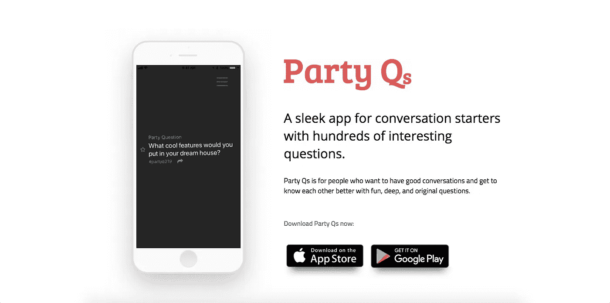

# 请允许我介绍我新的反作弊应用公司

> 原文：<https://medium.com/swlh/allow-me-to-introduce-my-new-anti-phubbing-app-company-13339f2661d5>

## 我们如何设计一个应用程序来停止尴尬的沉默

## 我想和我的中等家庭分享一个骄傲的时刻。

我已经在媒体上写了四年多了。我是[企业家手册](http://entrepreneurshandbook.co)的编辑，我们在那里出版关于企业家的早期故事，这些故事融合了灵感和实践。

我采访了戴蒙德·约翰、盖伊·拉兹、斯科特·沃尔切克，以及泽西麦克三明治店和 Orangetheory 健身店的首席执行官。

在我讲述的所有故事中，我通常写的是其他企业家做出的惊人之举。

今天，我要讲述我自己的故事。

我很高兴地宣布，我和我的联合创始人成立了我们的公司，我正式成为 [Party Qs，Inc](http://partyqs.com) 的首席执行官。🎊

From [partyqs.com](http://partyqs.com)

在这个故事中，我想分享我和我的共同创始人建立了什么以及为什么，我们试图解决的问题，以及我们如何能够在不花一分钱的情况下将一个应用程序发展到每月活跃用户超过 3000 人。

我知道现在为时过早，但我想现在就开始记录这段旅程。我相信我们正处于一个紧要关头(未来几周内可能会有*真的*令人兴奋的消息)。

但我想与你分享这个故事，这样你就可以了解如何将一个想法变成一个适用于 iOS 和 Android 的应用程序。

# 问题

我和我的共同创始人着手解决世界上的三个问题:

## **1。社交焦虑**

有时，我们都在社交聚会中挣扎，但对我们中的一些人来说，这是一个真正的问题(社交焦虑障碍(SAD)影响着美国 1500 万成年人。)

社交会让人精疲力尽。无论内向还是外向，当我们和人在一起时，我们总是不知道该说些什么。这是一个问题。

## **2。表层对话和尴尬的沉默**

当没有人知道谈论什么时，沉默开始了。你知道那种感觉。有人可能会坐立不安。另一个人可能会哼哼着看别处。另一个人可能会借口“去洗手间”

“沉默恐惧症”意味着对沉默的恐惧。当沉默发生时，千言万语被沉默放大，尤其是在更正式的餐桌上。

## **3。Phubbing(即“电话冷落”)**

《赫芬顿邮报》和其他出版物报道了“电话冷落”是如何成为一个现实问题的。通常，在今天的移动世界里，人们宁愿打电话也不愿进行面对面的交流。

> 几年前，这个关于 phubbing 的网站火了起来:

 [## 停止抨击

### Phubbing:在社交场合通过看手机而不是集中注意力来冷落某人的行为

stopphubbing.com](http://stopphubbing.com/) 

研究表明，我们的移动设备可以打破情侣之间的隔阂，严重破坏他们的关系。杀死约会对象最快的方法就是拿出你的手机。

# 大量的竞争是一件好事

当我们思考如何解决这些问题时，我们转向了带有对话启动问题的应用程序(破冰程序)。

我们发现了大量的问题应用程序。似乎几乎每个开发人员和他们的兄弟都开发了一个问题应用程序，但是没有人积极关注解决上面讨论的更大的问题。

我们很快注意到，每个对话启动应用程序都至少存在以下四个问题之一:

1.  他们是设计糟糕的 T2 T3。冲突的颜色。字体不匹配。拥挤的空间。错别字、拼写错误和不直观的用户界面。
2.  他们精选了**坏问题**。我记得看到过一个，“你愿意奶酪出汗还是蛋黄酱流血？”无聊的，封闭的，或者幼稚的，问题是狡猾的，不屑一顾的，有时甚至是令人讨厌的。
3.  他们重复了一个小图书馆的问题。我看到一个有 50 个问题。这不是很多问题。依我拙见，重复问题是算法和经验上的弱点。
4.  许多应用程序都已经过时并被废弃。在试图快速被动地赚钱之后，创始人们已经继续前进。他们建立了一个问题应用程序，因为它简单易行，但缺乏深度、激情和承诺来帮助人们解决严重的社会问题。

这给对话应用市场带来了一个漏洞——这个市场有很多根深蒂固的、老的、停滞不前的玩家；颠覆的时机已经成熟。

# 起源故事:我们如何进入这个空间

几年前，我和妻子在田纳西州的一居室公寓里每周招待一小群朋友。

每个人都挤了进来，谈话声从一些不同的谈话中响起。

为了让每个人都在同一页面上，感到受欢迎和参与，并听取彼此的意见，我们从一个问题开始。每次都不一样，从深刻的问题，如:

> “什么最让你觉得活着？”

有趣的问题，例如:

> “如果每次都能打响指有东西出现，又挑不到钱，你会选什么？”

问了一个好问题后，房间安静下来。每个人都专注于听房间里的其他人会说什么。我们走到每个人身边，丰富多彩的答案照亮了房间。

这是我们夜晚的完美开始，每个人都感到团结一致。

像沙滩上的金属探测器一样，我开始编制这些问题的清单。很快，我的手机里就有了一张便条，上面列有几百个有趣的话题。我联系了我的大学室友，一个天才的程序员，我们开始开发一个应用程序。

几个月后，我们诞生了有史以来最简单的应用程序，并将其命名为 **Party Qs** 。使用 React Native，我们在 App Store 和 Play Store 中发布了该应用。

Screenshots of the Party Qs App

我承认。最初的几个月是艰难的。直到[推出产品搜索](https://www.producthunt.com/posts/party-qs)，我们才认真考虑派对 Qs。

然后它又展开了对[产品的猎取](https://www.producthunt.com/posts/party-qs-2)*。*

*[Americanoize 杂志](https://americanoize.com/magazine/3-best-october-apps/)授予其 2017 年 10 月最佳新应用。*

*然后，一对在 Instagram 上有影响力的情侣，奥斯汀·雷伊和朱利安·迪亚格雷，在他们的 IG 账户上给派对 q 们一些爱。*

*今天，Party Qs 有 786 个精选问题(我手工输入了每个问题)和超过 3000 个月活跃用户。*

## *我听说过人们如何使用派对 q 的故事，每次我的脸上都会露出笑容:*

*   *在采访 RokBlok 的创始人 **时，我告诉了他关于派对 Qs 的事情。他说:“不可能。我和女朋友在异地恋时会用这个应用程序。”***
*   *一个用户拜访他在监狱里的朋友，玩派对问答游戏，聊些监狱以外的事情。*
*   *一位学校老师喜欢在上课前问她班上的中学生几个派对问题。*
*   *一位大教堂的青年牧师用派对上的破冰船开始了每周一次的青年小组活动。派对 Qs 实际上在打印的日程表上。*
*   *另一个用户花时间和他 12 岁的表弟 T21 在一起，并使用派对提问来超越通常的“你好吗”、“学校怎么样”等问题。*

*每个周末都有新用户涌入。*

**

*Graph of daily app users from the last 180 days*

*这种增长令人兴奋，但我们即将进入创业成长中最具挑战性的部分——商业模式。*

*商业模式是创业公司赚钱的方式。*

*我们已经验证了这个概念。我们知道它是可行的，价值是明确的，用户也喜欢它。*

*下一步是创收。在这里，我们可以发现我们是否真的有一项重要的业务，或者只是一个副业项目…*

## *跟我来获取这个故事的第二部分(我现在正在做)。*

*第二部分介绍了应用程序的盈利策略，我们如何测试不同的盈利模式，以及我们最终选择了哪种模式。*

## *使用这些链接在 [iOS](https://itunes.apple.com/us/app/party-qs-questions-app/id1149500660?mt=8) 或 [Android](https://play.google.com/store/apps/details?id=com.partyqs&hl=en_US) 上获得 100%免费的派对 Qs。*

**

## *这篇文章发表在《T4》杂志《创业》(The Startup)上，这是 Medium 最大的创业刊物，有 322，555+人关注。*

## *在这里订阅接收[我们的头条新闻](http://growthsupply.com/the-startup-newsletter/)。*

**