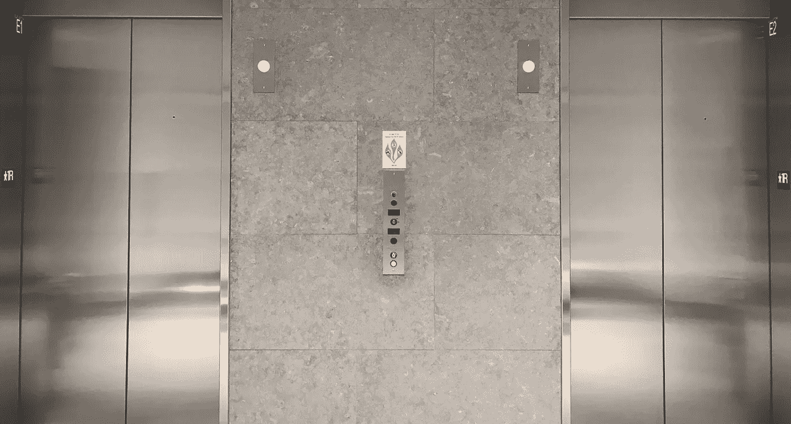

# 独自在电梯里。和一个风投。

> 原文：<https://medium.com/swlh/alone-in-an-elevator-with-a-vc-1a32ba15d329>

作为一个 3x 创业公司的创始人，我至少使用过几百次“电梯间推介”这个词，精心制作了几十次，并在各种行业会议、Disrupt 等技术会议上使用过我的电梯间推介，甚至在感恩节晚餐上与家人/朋友一起使用。

这些年来我也听到了很多。

然而，在 15 年多的时间里，直到几个月前，我还从未在电梯里投资过真正的投资者。

事情是这样的。

吃完午饭后，我正要回办公室，当我走进大楼的前门时，我看到中西部最大的风险投资公司的管理合伙人马克也从停车场入口走进大厅。

马克在我们大楼的顶楼有一间办公室，但在那里至少一年后，这是我第一次在大楼里碰到马克。

在大厅寒暄了几句后，马克和我一起进了电梯。我选择了我的楼层，马克选择了他的楼层，门关上了。

然后马克问了这个问题…

> “那你最近在忙些什么？”

从我的 iPhone 上抬起头，我环顾了一下电梯，心想…

等一下。我一个人和一个风投在电梯里。他刚刚问我在做什么。

*我将在一部真实的电梯里向一位风投进行电梯推介。*

*一个企业家实际上投了多少次风投？在电梯里？*

*头脑。吹了。*

该投球了！

如果你问我的任何一个朋友或同事，他们会告诉你，我不喜欢结构，我的电梯推销也是如此。我更喜欢一种自由式的方式，考虑到观众，以便帮助他们不仅理解我的创业公司做什么，而且理解为什么做 T21。

我对马克的推销是随意的，没有讲稿的，是谈话式的。在我们乘电梯到达顶楼*(当然，当电梯到达我的楼层时，我没有麻烦走出电梯)*后，马克，在痛苦的三秒钟停顿后，回应道…

> “我……爱死了。”

自从那次短暂的电梯之旅后，Mark 邀请我向他推介并演示我们的平台。我们还就潜在的融资进行了一些后续对话。

回顾那次乘电梯的经历，猝不及防让我不得不专注于我们创业公司的真实故事，我们为什么要创建它，以及它所提供的价值，而不是一份推销文稿。引起了共鸣。

几个月前，我的一个朋友向我推销了一个区块链概念……这个概念将会颠覆抵押贷款保险行业。他的推销充满了专业术语和流行词汇，所以我对他的推销失去了兴趣。

几周前，我在一场推介比赛中看到这位朋友站在台上，他的推介是这样开始的:

> “我们的初创公司将利用区块链把购房过程从 30 天缩短到 30 秒。”

这种推销是精心设计的，也是可理解的，它引起了观众和评委的共鸣，尤其是那些经历过痛苦而缓慢的购房过程的人。它实际上是如此相关，我可以一字不差地记得音高。

那位朋友在那天赢得了推介比赛和 10 万美元的投资。

下次你有机会推销时，跳过排练过的、技术性的电梯推销，而是考虑你的观众，采用真实的、对话式的、人性化的推销。

你的观众会感谢你的。

*顺便说一下，恰好马克的爸爸创造了“电梯推销”这个词——你可以在这里***了解一下。**

*__________*

*David Hunegnaw 是俄亥俄州哥伦布市的一名从业十年的企业家，LOUD Capital 的合伙人和 BYLINED 的创始人，BYLINED 是一个点播摄影平台，旨在将品牌与其粉丝联系起来，以获得真实、品牌的用户生成内容。大卫对中西部发生的所有伟大的创业活动感兴趣，对快速行驶的车轮感兴趣，对美好的一天结束时喝杯冰镇马提尼感兴趣。*

**通过*[*Twitter*](http://www.twitter.com/hunegnaw)*，* [*脸书*](http://facebook.com/hunegnaw) *或*[*insta gram*](http://instagram.com/hunegnaw)连接。*

**

## *这个故事发表在 [The Startup](https://medium.com/swlh) 上，Medium 的出版物有超过 256，410 人关注。*

# *订阅[在这里获取头条](http://growthsupply.com/the-startup-newsletter/)。*

**