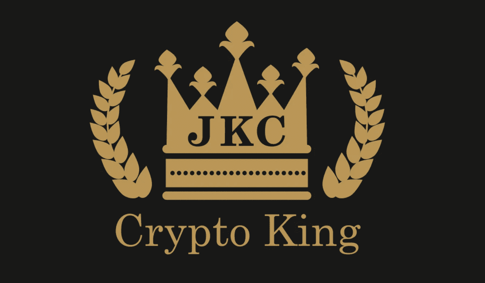
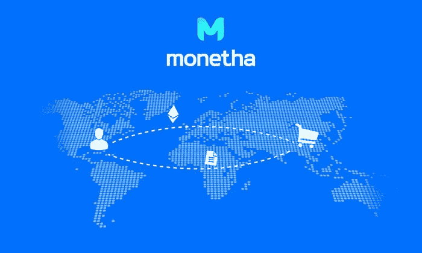

# 可能击败 BTC 的 Altcoins 回报:ZER、SNOV、ETH、MTH 和 MTL(2018 年 3 月 17 日)！！

> 原文：<https://medium.com/swlh/altcoins-likely-to-beat-btc-returns-zer-snov-eth-mth-and-mtl-march-17-2018-35ba45d6a041>

本周有 5 种加密货币可能会在短期内摧毁 BTC 的百分比收益。这 5 种加密货币包括 ZER(****)**、SNOV([**Bibox**](https://www.bibox.com/login/register?id=11305470&lang=en)**)**、ETH、MTH(****)**、MTL( [**币安**](https://www.binance.com/?ref=15316928) **)** 。每个人都有一个巨大的事件，公告，合作关系，或附加的效用，使他们登上这个名单。****

****这些硬币可以在这里买到:****

****[**隐视**](https://www.cryptopia.co.nz/Register?referrer=JaketheCryptoKing)****

****[**Bibox**](https://www.bibox.com/login/register?id=11305470&lang=en)****

****[**币安**](https://www.binance.com/?ref=15316928)****

****在五种突出显示的加密货币中，技术分析指出，ZER (Zerocoin 的市值最小，自 1 月以来的跌幅最大)或 SNOV(在月底前发布市场)的短期回报率最高。****

# ****SNOVIO — SNOV(市场发布)****

****SNOV 承诺在 2018 年 3 月 31 日(或更早)之前推出他们的市场。目前，SNOV 令牌除了能够被交易之外，没有其他用途。在不到两周的时间里，一旦市场启动，SNOV 令牌将大大增加其效用。****

****如果没有实际的效用，令牌是没有用的。硬币价格为 0.03 美元，市值为 1300 万美元，当 SNOV 在两周内发布其市场并为其令牌建立效用时，可能会看到指数收益。****

# ****zero coin-ZER(新交易所列表和钱包)****

****目前，ZER 只在一个交易所上市([**Cryptopia**](https://www.cryptopia.co.nz/Register?referrer=JaketheCryptoKing)**)**其价值大幅上涨的催化剂是他们即将宣布的一个主要交易所上市和一个新钱包。****

****自 1 月中旬的历史高点以来，ZER 已下跌逾 93%。1 月份，ZER 的交易价格约为 12 美元，远低于目前的 0.90 美元。****

****ZER 承诺在 3 月 31 日之前发布他们的移动钱包，一家大型交易所宣布他们的密码上市。ZER 的效用将大幅增加。增加一个钱包，同时通过宣布一个新的交易所来提高交易量和知名度，将大大增加 ZER 的短期价值。ZER [团队](http://zerocoin.org/people)和[概念](http://zerocoin.org/index)都令人印象深刻，具有革命性。随着钱包即将发行，一家大型交易所宣布上市，本周应该会给 ZER 的价值带来巨大的提振。****

# ****莫内萨— MTH(第一个产品里程碑)****

****[MTH](https://coinmarketcap.com/currencies/monetha/) 属于在接下来的两周内为其代币增加效用的一类。时间是一切的加密，因为它是至关重要的购买日期之前的重要公告。在这种情况下，他们的第一个产品里程碑是 2018 年 3 月 31 日。****

********

****MTH 的价值为每枚硬币 0.1 美元，市值为 2200 万美元。增加一点点效用将会显著增加这两个数字。2018 年 1 月 12 日，MTH 的交易价格为 0.59 美元，比今天的定价高出 500%以上。MTH 发展的最大里程碑将在两周内发生，然而价格比一月份低了 80%。****

****期待 MTH 在 2018 年 3 月 31 日实现其产品里程碑之前迅速升值。****

# ****以太坊— ETH (SEC 新闻)****

****如果 ETH 继续发布被证明是骗局或欺诈相关的 ico，他们将很快失去其作为业内最有声誉的 ico 之一的声誉。SEC 的介入可能会在短期内减少他们的业务，但应该会在不久的将来允许更多合法成立的 ico。****

****ETH 目前价值 611 美元，市值超过 600 亿美元。2018 年 3 月 4 日，ETH 的交易价格为 865 美元，自 SEC 发布“负面”消息以来，其股价已下跌超过 25%。通常，这种规模的市值硬币不会出现在“另类硬币”名单上。****

****本周，ETH 的联合创始人 Joseph Lubin 作为主题发言人出席了在德克萨斯州奥斯汀举行的西南偏南(SXSW)会议。显然，区块链技术将继续存在，对当前事件反应过度的加密货币是短期内获得高于平均水平回报的主要机会。****

# ****金属- MTL (METALPAY 和首席执行官的演讲)****

****MTL 即将发布 MetalPay。目前没有 MetalPay，MTL 就没有任何效用。他们的代币可以在交易所交易，但除此之外不能用于任何东西。****

****实施 MetalPay 后，MTL 代币的效用会随着 MTL 的潜在价值而增加。MTL 背后的概念令人难以置信。与 MTL 相比，大多数加密货币的交易速度是“慢”的，所有的费用都高于 MTL。这是因为 MTL 计划向用户付费发送密码。是的，他们实际上打算对用户使用 MTL 购买的每笔商品给予高达 5%的奖励，并且不收取交易费用。****

****MTL 通过改变目前的收费结构，彻底改变了加密世界。现在，使用 MTL 的商家和个人在每次发送或接收资金时，实际上会收到多倍的红利，而不是转移加密的额外费用。他们的首席执行官 Marshall Hayner 是加密领域的顶尖人物之一，将继续推动 MTL 成功推出 MetalPay。****

****MTL 1 月份的交易价格超过 10 美元，目前每枚硬币 3.67 美元，市值 8100 万美元。随着 MetalPay 的成功发布，他们的 1 月份高点应该会很快接近，因为 MTL 将彻底改变发送加密的费用结构。****

# ****结论—****

****要阅读结论或对可能胜过 BTC 的**替代币的详细描述，**请点击原文查看文章:****

****[**山寨币有可能跑赢 BTC**](http://bitcoinist.com/5-altcoins-outperform-bitcoin-march-17/) **(点击链接打开比特币主义者文章)******

*****阅读国王之前的文章，了解他目前推荐哪些 ICO，或者直接与国王取得联系，可以在 Twitter 上(****@ JbtheCryptoKing****)或者*[***Reddit***](https://redd.it/81hj5q)*(ICO 更新和每日报道)。*****

****我感谢所有我的忠实追随者！我正在努力建立一个社交媒体形象，希望你也能在 Instagram 和 Twitter 上关注我！在被发布到留言板之前的几个小时，你可以关注 Instagram: JaketheCryptoKing 和 Twitter: JbtheCryptoKing。****

******现在王国上不和:**[**https://discord.gg/qTjQp8W**](https://discord.gg/qTjQp8W)**(入群直接找我)。******

********

## ****这个故事发表在 [The Startup](https://medium.com/swlh) 上，这是 Medium 最大的企业家出版物，拥有 307，492+人。****

## ****在这里订阅接收[我们的头条新闻](http://growthsupply.com/the-startup-newsletter/)。****

********