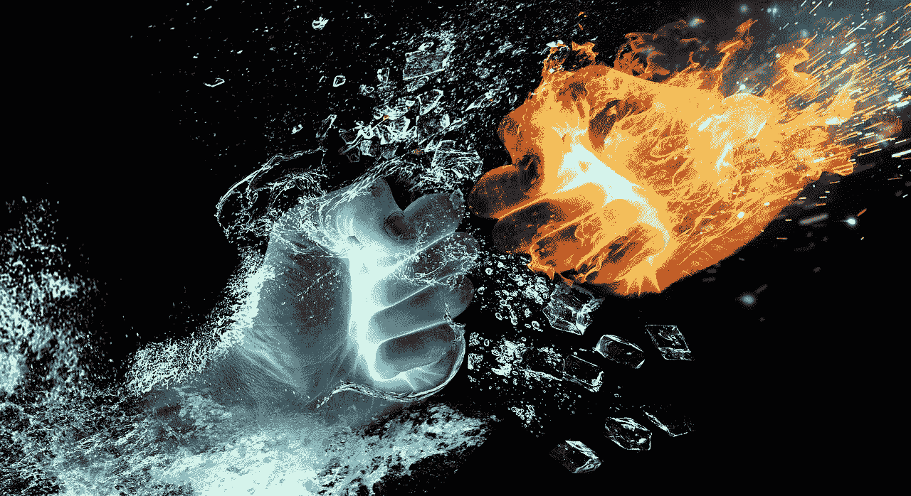

# 永远比你的对手做得更好

> 原文：<https://medium.com/swlh/always-do-better-than-your-opponent-8b306e1ecaee>

## ADo BeTYO

对美国历史学家巴里·施特劳斯来说，一个胜利者在赢得一场战斗后最大的错误就是等待成功降临。输者大概会比以往更有独创性。所以胜利者必须很好地评估下一步行动以保持胜利。不偏不倚地说，历史上明显有胜利者在胜利后的行动中失败。

大战……众所周知，德国在第一次世界大战结束时蒙受了耻辱，但很少有人能够意识到德国为收复失地和恢复国家“声誉”所做的军事准备。盟军认为他们已经结束了德国打另一场战争的任何希望，放松了。与此同时，第一次世界大战的大输家在第二次世界大战中以其革命性的*闪电战*【闪电战】战术创新，震惊世界。

太空竞赛……俄罗斯人赢得了 1961 年将人送上地球轨道的“战斗”,但他们输掉了将人送上月球的“战争”。1969 年登上月球时，北美宇航员尼尔·阿姆斯壮对全世界说“*这是个人的一小步，是人类的一大步*”。俄罗斯人在进入轨道后放松了，而美国人在 1961 年受到约翰·F·肯尼迪总统的演讲的鼓舞，他提议“在 20 世纪 60 年代末之前让人类登陆月球并安全返回地球”。

9 月 11 日……全球“反恐战争”的开始，在反恐立法和智能服务方面有所创新。自 9/11 事件以来，没有任何东西，或者几乎没有任何东西，能够逃过世界的眼睛，也没有任何其他人能够像布什总统那样用几句话概括美国的感情，他说:“这场冲突是在第三方的条件下及时发起的，但它将在我们选择的方式和时刻结束”。十年后，北美人消灭了应对 9/11 袭击负责的人。

由于无数的原因，过去许多国家在不同地区交替出现胜利者和失败者的立场。也许当你读到这些文字的时候，一个国家正在技术上超越另一个国家。但这不仅仅是国家的问题。它关系到世界上的每一个人，包括你！在未来，赢家和输家将继续交替这样的位置，因为输家可能会比赢家更有创意，而赢家可能会放松！

所以，如果你是赢家，找出输家在做什么来战胜你，并做得更好。不要放松！如果你是一个失败者，就要表现得像一个胜利者！不管你现在的职位如何… **a** 永远做 **b** 更好 **t** 韩 **y** 我们的 **o** 机会**做决定**！

_ _ _ _ _ _ _ _ _ _ _ _ S Q N Mind _ _ _ _ _ _ _ _ _ _ _ _ _

上面的文字是我之前在 MEDIUM 网站上写的另一个例子。SQNMind 理论试图从你阅读的每本书中提取精华。该理论包括将书中最有趣的段落提取到你头脑的“必要条件”类别中。这将把你的大脑变成原始知识的海洋，随时准备在任何情况下适应你的现实。

所以为了更好地解释这个理论，我在学习类别中写了一些解释，这是我多年阅读后形成的二十个解释之一。我用巴里·施特劳斯、尼尔·阿姆斯特朗、约翰·肯尼迪和乔治·布什作为动力。

分开书的段落！你不需要像我上面那样写它们，只要尽可能多的阅读它们就行了。与那些不读书、不读书、不记所学知识的人相比，一个有 SNQMind 的人在不同领域都有很好的成功机会。

这是第 3 章/场景 4，学习。下一幕是关于勇敢的。但是如果你错过了关于 SQNMind 理论的最后一整章，请点击[注意差距](/@danieljunior_58594/mind-the-gap-e6dd7ee7ad0e)。

**未完待续！**

The DJerian theory number ONE

## 这篇文章发表在 [The Startup](https://medium.com/swlh) 上，这是 Medium 最大的创业刊物，拥有+398，714 名读者。

## 在这里订阅接收[我们的头条新闻](http://growthsupply.com/the-startup-newsletter/)。

