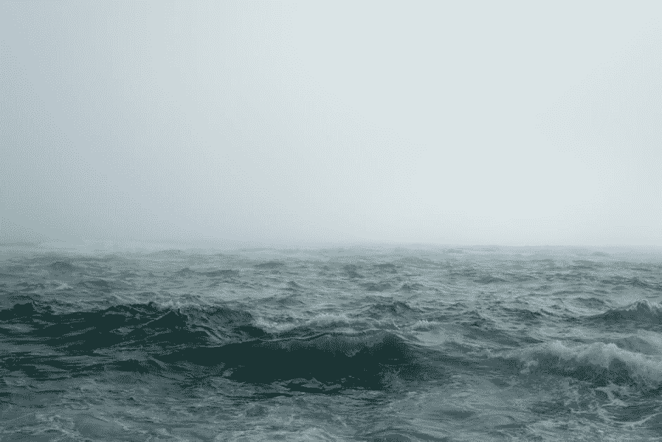

# 我是不是和我感觉的一样不知所措？

> 原文：<https://medium.com/swlh/am-i-as-overwhelmed-as-i-feel-8c4ab71a3524>

想象一下，你刚刚被丢进大海，周围什么都没有。当海浪袭来时，你惊慌失措，手足无措。看不到岸，下雨了，周围没有船，天开始黑了。你在为生存而战，你不知道自己是否能成功。你累坏了！现在，想象你知道你会活下来。

然后一切都变了:当你知道你会回到岸上，你可以冷静下来，专注于制定一个到达那里的计划。

生活很少把我们——真的——扔进大海。它不会把你无法处理的事情放在你面前(如果它处理了，你现在就不会在这里了)。但无论如何，你经常会感到不知所措——也许是艰难的商业计划、寻找新工作、长期的友谊、没有减少的信用卡账单，或者如何为你的企业找到客户。你的注意力和资源继续被分散，通常你知道你需要做一些不同的事情，但不知道是什么或如何去做。你会麻痹和恐慌。

> 你适应力强，足智多谋

但是，当你意识到你不会真的被淹死，你可以处理你面前的任何事情——真实地了解它，在你的内心而不仅仅是在你的两耳之间——你会突然感到充满力量、足智多谋和轻松。这座曾经令人望而生畏的山现在看起来是一个有趣的挑战。日常生活——不仅仅是它的目的地——似乎又变得令人愉快了。

想想马后炮。你过去经历的挑战可能曾经看起来是不可能的，但你克服了它们，因为你总是克服它们。人类有着难以置信的弹性，但是在挑战中，我们经常感觉不到弹性和足智多谋。当这种情况发生的时候*经常提醒自己，你是有弹性的，并且无限足智多谋*。当你冷静下来，停止挣扎和担心淹没在任何挑战中，然后你可以用你的常识来制定一个计划，解决挑战，向前迈进。

*请推荐本帖&* [*关注我*](/@jamesboileau/) *上媒。还在亚马逊上拿了一本我的书*[*Own Your Sh * t*](https://www.amazon.com/dp/0993779506)*。*