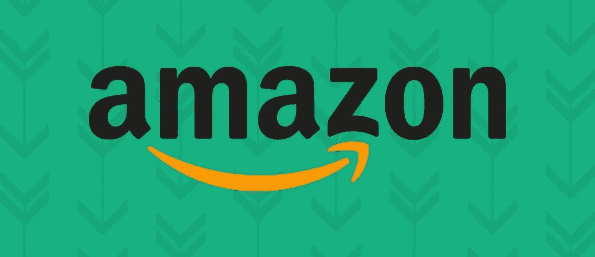
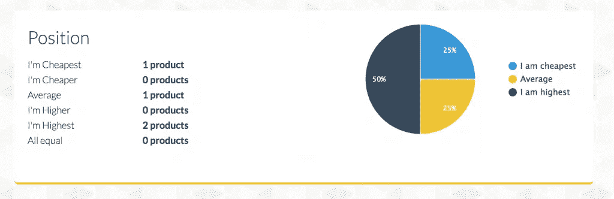
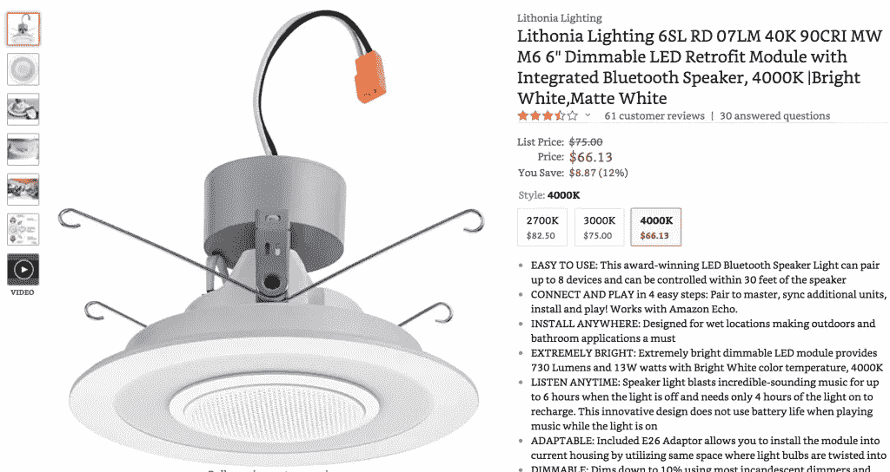
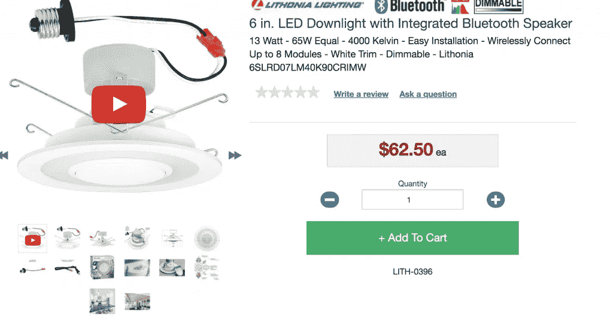
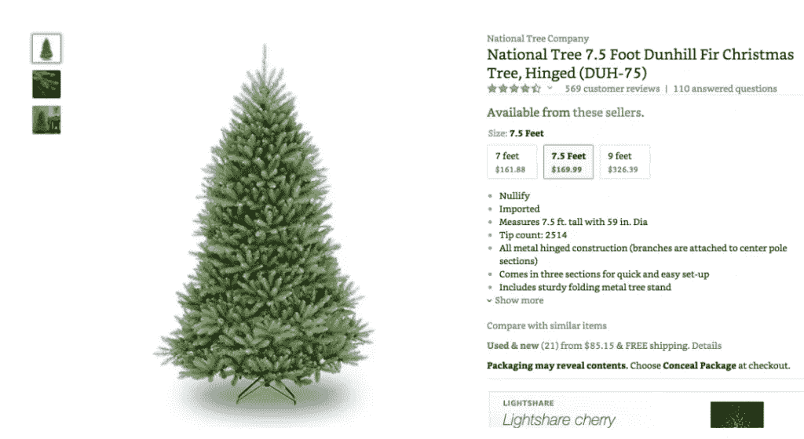

# 亚马逊获取市场受众的定价策略

> 原文：<https://medium.com/swlh/amazon-pricing-strategy-to-capture-marketplaces-audience-fdde12ef3403>

在像亚马逊这样的电子商务市场上取得成功需要制定一个经过深思熟虑和有计划的定价策略。

通常适用于独立电子商务商店的策略并不总是适用于在线市场。

任何市场平台的目标都是尽可能多地创造销售。然而，随着竞争日益激烈，要在竞争中脱颖而出变得越来越困难。

像传统的网上销售方法一样，你需要考虑你为该商品支付的费用、你的竞争对手目前的收费以及你目前的销售排名。

在本帖中，我们将探讨一些不同的定价策略，你可以用它们来抓住市场受众，增加你的销售额！

# 不要进行一场竞争到底

我们在 [Prisync](https://prisync.com/) 上一次又一次地提到这一点，但最糟糕的电子商务定价策略之一是竞相杀价——如果你试图在亚马逊上销售，情况也是如此。

“竞相杀价”是一种概念，通过这种概念，你的产品价格比你的竞争对手提供的任何东西都要低，以主导市场。

我们反对这种方法的原因有两个。

首先，它给人一种你在卖廉价产品的错觉。尤其是如果你希望建立一个品牌，随着你的成长，这将是无效的。

第二，你降低了你的利润率，冒了亏本销售产品的风险。

你可能与你的供应商达成了一笔好交易，他们可以以 0.10 美元一副的价格生产你的太阳镜。

但是，如果你的竞争对手以每件 0.05 美元的价格制造它们，那该怎么办呢？除非你能与你的供应商达成更好的交易，否则你的竞争对手总是能以比你更低的价格——以一种你无法与之竞争的速度。

如果你确实想降低你的产品价格，那么一个有效的方法就是把你的产品价格定在当前最低销售价格的 1.2-1.5%。这样，你将避免竞相杀价的做法，但仍能在自己的行业内保持[有竞争力的价格](https://blog.prisync.com/the-advantages-and-disadvantages-of-competitive-pricing-strategy/)。

你还需要考虑自己的经营成本。这些应包括(但不限于):

*   海运成本
*   任何国际销售的海关
*   支付电汇
*   亚马逊 FBA 费用
*   顾客退货费
*   您自己的退货费用
*   亚马逊佣金费用

# 使用定价工具帮助您保持竞争力

亚马逊的本质意味着你一直被竞争对手包围着。当客户搜索特定产品时，他们看到的不仅是你的产品，还有你竞争对手的产品。

这就是为什么使用一个[有竞争力的定价软件](https://prisync.com/)来帮助你在整个内容行业导航是非常重要的，无论是在亚马逊内部还是外部。

使用数据作为你的驱动力，你应该积极监控你的主要竞争对手当前和历史的定价策略，让你有机会根据你所获得的学习数据主动改变你自己的价格。

请记住，任何定价策略的目标都应该是出现在任何给定搜索词的亚马逊首页。不出现在这里会严重阻碍你的销售，实际上不管你实施什么定价策略。

使用软件帮助你分析历史和当前价格点的最大好处是，它给你提供了丰富的情报来推动你未来的定价策略。

您将能够使用这些数据来预测竞争对手的趋势，并准确了解哪些产品需要重新定价以及何时重新定价。利用这些信息，你将能够更好地理解什么时候需要[将你的产品](https://blog.prisync.com/ecommerce-product-bundle/)捆绑在一起，使用追加销售，或者甚至只是识别那些作为失败原因的产品。

# 关注价格感知

想一想购物者选择在亚马逊上购买产品的一些原因，用户在亚马逊上购物的主要好处之一是对交易的感知——购物者认为他们在网上获得了最好的交易。

但是，众所周知，因为亚马逊不断调整他们产品的价格(通常以小时为单位)，他们可以利用[的价格感知](https://blog.prisync.com/ecommerce-price-perception/)，实际上主导市场。

作为亚马逊卖家，你也可以遵循同样的方法。你所要做的就是让你的产品看起来比实际情况更经常地低于市场平均水平。

这个音箱从 75 美元降到了 66.13 美元。对于普通顾客来说，这是一个不错的折扣。亚马逊甚至还列出了节省的百分比。

如果我们在亚马逊之外研究这个产品，感知就会发挥作用。

事实上，在亚马逊之外购买产品更便宜，上面列出的价格甚至都不是降价。

因为一直以来，亚马逊的价格都普遍较低，所以人们觉得很划算。

在这种情况下，你应该考虑你在亚马逊之外的竞争对手对你的产品收取的价格，这样，尽管你的亚马逊价格，你看起来仍然比你的对手更划算。

# 季节性因素

你可能不会在三月以和十一月一样的价格卖一棵圣诞树，对吗？

[对于带有季节性因素](https://blog.prisync.com/dynamic-pricing-is-your-seasonal-marketing-savior/)的产品，这应纳入您的整体定价策略。许多产品都有一段集中销售期——在这段时间里，它们的销售额最高。

理解你是否属于这一类，是理解你何时能期望最高的利润周转率的第一个好处。

如果你不确定你是否有季节性影响，那么看看你自己以前的销售报告来解读你的产品什么时候卖得最好。

例如，这棵圣诞树目前的价格是 169.99 美元。

然而，如果我们使用一个[动态定价软件](https://prisync.com/)，我们可以看到随着时间的推移，价格有所波动。

季节性定价是一种动态定价方法，使电子商务零售商能够根据一天、一个月、一年的特定时间或产品在市场上的生命周期来优化价格。

毫不奇怪，他们的最低价是在 11 月，当时的价格仅为 99.99 美元，这可能是因为他们想利用假期期间寻找圣诞树的人数。

然而，在 3 月份，当需求减少时，他们可以为那些可能需要圣诞树的人收回成本。

因此，通过季节性定价，你将始终保持警惕，了解市场趋势以及你的竞争对手在提供什么。有了这种智慧，你总能知道在某段时间里哪里应该降价或涨价。

# 亚马逊定价策略的最终想法

当谈到你的亚马逊定价策略时，我希望这篇文章能给你一些启发。但是，请记住，统治亚马逊是一项艰巨的任务，通常需要时间。

当你尝试不同的方法时，很快就会清楚什么样的定价策略最适合你自己的业务和产品。

一个有效的亚马逊定价策略包括查看亚马逊过去的历史数据，考虑竞争对手自己的活动，并利用旺季实现利润最大化。

您过去使用过什么亚马逊定价策略？

## 这篇文章发表在[《创业](https://medium.com/swlh)》上，这是 Medium 最大的创业刊物，有 340，876+人关注。

## 在这里订阅接收[我们的头条新闻](http://growthsupply.com/the-startup-newsletter/)。

