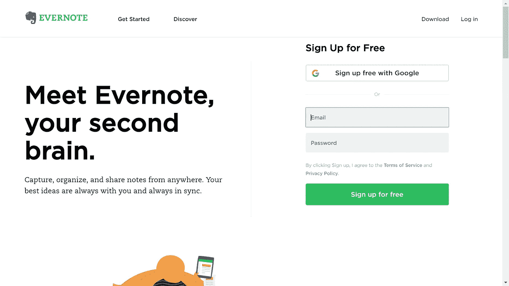
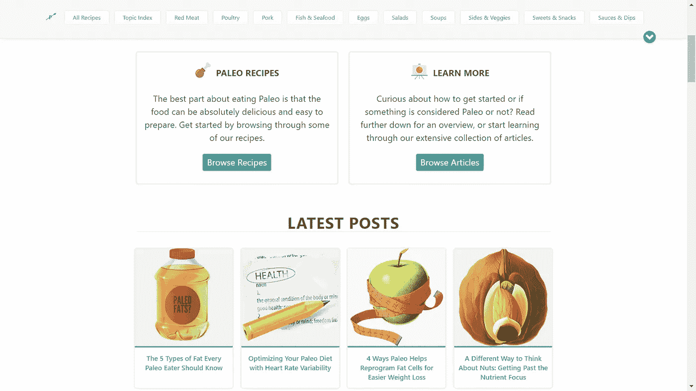
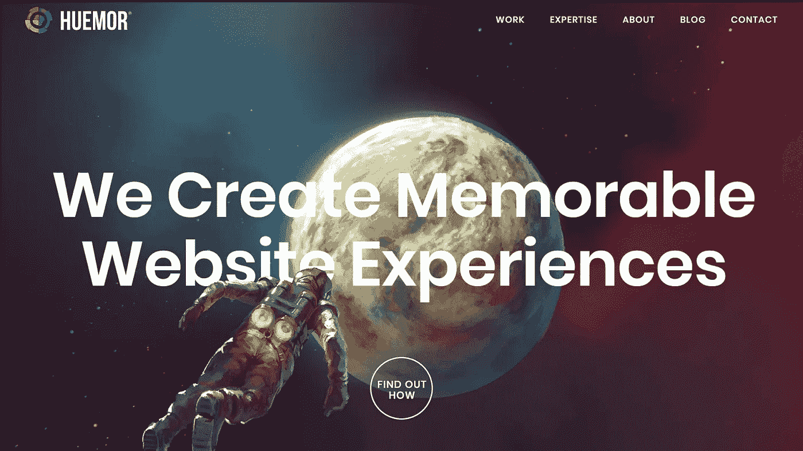
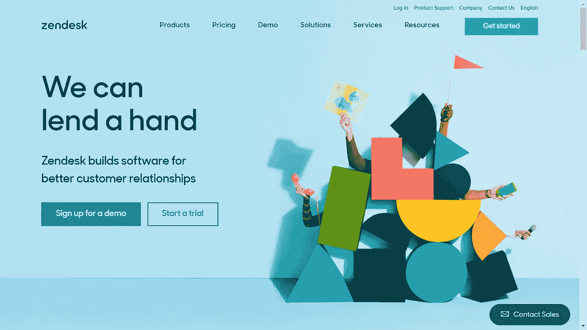

# 8 分钟的应用程序登录页面指南

> 原文：<https://medium.com/swlh/an-8-min-guide-to-app-landing-pages-4f70e4026e71>

## 了解你的应用营销策略的核心

Originally published on [http://www.appsterhq.com](http://www.appsterhq.com/?utm_source=CP&utm_medium=Medium)/

“应用程序登录页面是任何移动增长战略的重要组成部分”——我相信你已经听过很多次了。

受欢迎的“学习者”非常了解应用程序登陆页面的重要性，以至于你经常看到他们甚至在编写一行代码之前就已经建立了一个登陆页面。他们知道，成功的应用营销包括建立兴奋感，登陆页面是推动增长的关键。

但是是什么让一个 app 登陆页有效呢？如果你已经创建了一个——你能确定它工作得尽可能好吗？

这些是我们在 Appster 与[合作的初创公司提出的常见问题。在我下面的帖子中，我将深入细节，分享应用程序登录页面如何推动增长，以及你可以实施的屡试不爽的策略。](https://www.appsterhq.com/?utm_source=In&utm_medium=Blog)

# 什么是 app 登陆页面？

简而言之，应用程序登录页面是一个独立的网页，访问者可以访问它，它是为一个单一的转换目标而设计的。

您可以使用它来:

## 验证应用创意

[对一款应用](https://www.appsterhq.com/blog/i-have-an-app-idea/)有了新想法？有几种方法可以把登陆页作为你的想法的试验场。

*   请求电子邮件地址以换取要约；订户的数量可以表明用户兴趣的程度。
*   或者发送您的登录页面以收集潜在用户的反馈——您收到的评论可能会对用户的异议和需要改进的地方提供有价值的见解。

## 推动应用下载

有了登陆页面，你就可以通过与朋友、社交媒体关注者和有影响力的人分享链接来建立知名度和获得用户，甚至在你的应用发布之前。虽然你可以通过应用商店优化做很多事情，但登陆页面提供了更大的可见性，并让你通过商店上不可能的方式推广你的应用。

## 收集关于销售线索的信息

每次访问者在您的登录页面上填写转换表单时，您都会获得有关潜在用户人口统计的关键信息。有了这些见解，你将对正在转化的访问者的概况有更深入的了解，并能够在你寻求进一步参与之前，更好地为这些潜在客户制作量身定制的信息。

## 评估你的营销策略的有效性

通过跟踪和查看您的登录页面指标，您将更清楚地了解您的营销绩效，例如访问者如何转化，不同活动和优惠的结果如何相互比较，或者哪些信息策略最适合您的受众。随着时间的推移，您从这些数据中收集的模式和趋势将形成有价值的见解，有助于提高您的营销绩效。

## 你的应用登陆页面需要做什么:

# 1.传达令人信服的价值主张:

价值主张是您营销信息的焦点，应该简洁地突出以下要素:

*   你的应用如何解决你的用户的问题或改善他们的处境
*   它带来的好处
*   为什么他们应该使用你的应用，而不是市场上的其他应用

Slack 的产品页面就是一个例子，它勾选了所有正确的选项。

团队沟通是工作场所的一个常见问题，Slack 通过简洁的标题、文本、证明以及其消息传递功能的图像概述了它如何解决这个问题。

还有一个链接会把访问者引导到一个关于该功能更详细的页面，这样他们就不会在主产品页面上被过多的信息轰炸了。

小贴士:

*   **添加一点幽默:**在大多数登录页面以就事论事的方式显示信息的地方，枪口以其幽默的“展示，不要说”方式脱颖而出。它的[主页](https://muzzleapp.com/)，以简洁的视觉效果为特色，以及一系列的 NSFW 通知，清楚地说明了该应用的功能:有了枪口，你就不必忍受在工作时分享屏幕时弹出私人信息的尴尬。
*   **不仅仅是文案:**不要低估视觉元素在吸引人们注意你的价值主张方面的作用。Attensee 就是一个典型的例子:热图分析显示，当网站访问者向下滚动登录页面时，他们很快就失去了兴趣。Attensee 没有对他们的文案进行任何更改，而是在他们的价值主张后面添加了黄色背景，以使其突出。这个简单的改变产生了显著的效果，转化率提高了 12%。

# 2.展示清晰的行动号召:

行动号召(CTA)是指您希望访问者执行的行动。这可能是购买产品，为后续电话固定一个位置或注册试用。

无论是哪一个行动，你都必须在你的 CTA 中清楚地说明，使用“立即开始”、“免费注册”或“购买产品”这样的文字。保持简单，避免包含额外的请求——你不希望在你的登录页面上有一个以上的 CTA 分散你的访问者的注意力或使他们困惑。

Evernote 用其引人注目的 CTA 按钮将它钉了起来——文本说明了网站访问者应该采取的下一步行动(注册一个免费帐户)，绿色在网站的极简设计下非常突出。

这里有一个你应该避免的例子——Paleo Leap 的主页上有太多的 CTA，以至于访问者很难立即知道他们应该采取的下一步措施。

小贴士:

*   **测试一下:**测试一下你的 CTA 的各个方面，比如大小、颜色和位置。尝试在不同的文案风格之间切换——“立即订阅”是一种直接邀请访问者订阅你的时事通讯的方式，而“成为成长专家”则通过暗示订阅时事通讯的好处来间接传达你的信息。
*   **使其显而易见:**将你的 CTA 放在一个中心，很难错过的位置，并使用箭头和醒目的颜色来吸引注意力。如果你在页面上有额外的 CTA，相对于你的主 CTA 不要突出这些。

# 3.具有顶级视觉效果:

分散注意力的元素、模糊的文本、俗气的图片——这些都是登陆页面设计的大忌。“少即是多”是一个很好的口头禅；在保持你的设计干净和简单的同时，你可以避免过多的杂乱使你的访问者不知所措。

我们以呼吸器为例。中性的配色方案和白色空间很好看，CTA 按钮以醒目的颜色显示在中央位置。

但是也有例外。Huemor 没有采用极简主义的方法，而是在网站上使用了有趣的动画和醒目的颜色。然而，这些元素配合得很好，传达了该公司充满活力的品牌形象。

小贴士:

*   **快一点:**页面加载时间分秒必争。根据 Akamai 和 Gomez.com 进行的调查，[40%的用户放弃了一个加载时间超过三秒的网页——所以确保你的设计元素不会减慢加载时间。](https://blog.kissmetrics.com/loading-time/)
*   **测试一下:**动画和插画比照片效果好吗？哪些颜色获得了观众的积极回应？通过测试你的视觉效果，你会更好地理解吸引访问者的因素和设计元素。

# 4.挖掘社会证据的说服力:

有多少次你仅仅因为看到外面排起了长队就决定从小吃摊或餐馆点餐？或者在亚马逊上看了热情洋溢的评论后继续购买产品？

同样的原则也适用于数字体验。消费者希望感觉到他们不是唯一购买产品或使用服务的人，并在知道以前的客户对他们的购买感到满意时寻求安全感。社会证明，以证明、客户档案和新闻报道的形式，增加了你的产品的有效性。

小贴士:

*   **物以类聚:应用吸引力法则**在周五关于社交证明的白板演示中，兰德·菲什金分享道:“你不需要大数字，只需要相关的证明。如果你的客户有相当相似的个人资料，那么 3-4 封附有照片和简短描述的推荐信应该会非常有效。这些人与看到你登录页面的人越接近，社交证明触发器就越有可能发挥作用。”
*   **定期更新:**如果你在使用你的主页或产品页面(而不是临时登陆页面)，用最新的媒体报道、评价和统计数据来更新。
*   **利用社交媒体:** Twitter 是一个很好的平台，你可以在你的登陆页面上添加简短的引语和评价——即使是一句简短的“嘿，我喜欢你的新功能！”发微博。当把这些引用添加到你的网站时，确保链接到 tweet 的永久链接，而不是发布引用的人的主个人资料页面，因为评论会随着时间的推移而消失。

# 5.遵循逻辑信息层次结构:

信息层次指的是页面上信息的结构顺序。这里的目标是为你的访问者创造一个简单而轻松的体验:文本的结构应该使你的访问者的问题以逻辑顺序得到解决，并且应该在正确的时间提供正确数量的信息。

让我们来看看 Zendesk 的主页——这里的一点小调整可以帮助提供更大的清晰度。标题写着“我们可以伸出援手”；然而，下面的文字(“Zendesk 为更好的客户关系构建软件”)解释了他们的产品。在这种情况下，切换文本可以让访问者立即理解 Zendesk 提供了什么。小贴士:

*   采用框架:框架是一个方便的指南，你可以在研究阶段使用它来组织你收集的信息。

我正在利用 Unbounce 的竞选策略总监科里·迪利的智慧来获得这条建议。在一篇博客文章中，Dilley 概述了他设计登陆页面的层次结构:

–陈述优惠如何解决游客的痛点

–解释你的提议的好处

–解释为什么你在提供优惠方面处于独特的位置

–在用户愿意接受你的提议之前，解决他们最常见的异议

–陈述 CTA

–提供社会证明

与其他因素一样(如 CTA 和视觉元素)，测试这一点是关键。Dilley 解释道:“上述层次结构是一个很好的起点，但根据你独特的受众，里程可能会有所不同。所以别忘了测试。”

*   **使用各种视觉元素:**使用颜色、不同的字体、项目符号、标题和副标题——这些元素表明信息的层次结构，让访问者一眼就能识别关键信息。

# 最后

有了正确的战略和战术，你的应用程序登录页面可以成为你增长战略的关键部分——无论你是处于验证你的应用程序想法的初始阶段，还是已经到了评估你已经实施的营销和信息战略的阶段。

虽然我已经分享了创业公司和企业用来创建有效登录页面的成熟技巧和框架，但没有放之四海而皆准的方法——关键在于不断测试策略，以便找到最适合你的受众的方法。

*最初发表于*[T5【www.appsterhq.com】](https://www.appsterhq.com/blog/app-landing-pages/)*。*

//

## 感谢阅读！

# 如果你喜欢这篇文章，请随意点击下面的按钮👏去帮助别人找到它！

# 对应用程序有想法吗？[我们来聊聊](http://www.appsterhq.com/?utm_source=CP&utm_medium=Medium)。

在过去的几年里，我们已经帮助建立了超过 12 个数百万美元的创业公司。[查看我们如何帮助您](http://www.appsterhq.com/?utm_source=CP&utm_medium=Medium)。

