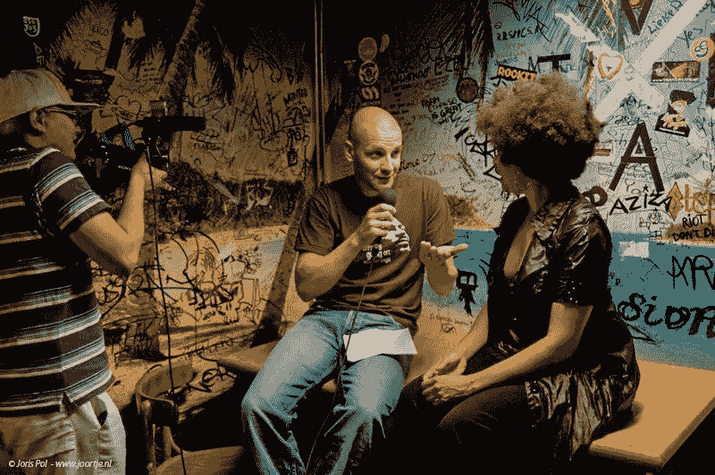

# 漫无目的的创业之路

> 原文：<https://medium.com/swlh/an-aimless-road-to-entrepreneurship-4236c2b4b93d>

> “一直以来，我都在寻找如何改善业务的答案。但让我回到正轨的是一个随机的人问我这样一个问题:你的人生目标是什么？”—维吉尔·旺索卡里奥

在我之前的文章《*》中，我分享了维吉尔·翁索卡里奥(Virgil Wongsokario)的故事，这位荷兰企业家对在线视频教育和制作充满热情，被称为“在线视频力量”。*

*上周我又有机会见到了维吉尔。在一家日本餐馆吃午饭时，我向他提出了一些问题。我们结束了一次有趣的谈话，关于他如何进入企业家的世界，以及他必须克服的最初几个挑战。我感到很受鼓舞，我相信很多人都能理解他的挑战。*

## *这是他的故事。*

# ***我的安全网***

*当我们等待我们的订单到达时，我问维吉尔他实际上是如何开始在线视频电源的。*

> *“十年前，也就是 2008 年，我创办了自己的初创公司。那是在我大学的最后一年，当时它在一个不同的公司名下，名为“有价值的项目”。我于 2009 年毕业，在拜耳找到了一份全职工作，做在线营销人员。”*
> 
> *“不管我的全职工作是什么，我继续为自己公司的一些客户做视频制作项目。那时，几个客户就足够了，因为我有一份工作，这是我的安全网。我的初创公司更多的是一个副业项目，因此，我没有动力投入更多时间来发展自己的业务。”*

**

> *“这一直持续到 2012 年，由于拜耳削减开支和员工，我决定辞职。我认为这是我的机会，是我认真对待自己创业所需的动力。我清楚地记得那天我是如何掉进这个黑洞的，在那里我不能思考、吃饭和睡觉。”*
> 
> *“我得到了自己忽视的初创企业，我不知道自己应该做什么。我试着给人们和公司发电子邮件和打电话，但得到的都是“不”。**我漫无目的地向成为全职企业家迈进——压力是有的，但在某种程度上，压力还不够。***

# ***从陌生人到导师***

*那么，什么时候是你发现你需要做什么的转折点呢？*

> *“2015 年是变革开始发生的一年。你看，我知道我需要认识新的人来获得新的线索，但是从来没有人教我如何去做，甚至在我上大学的时候也没有。事情对我来说并不乐观，那时我甚至和我的妻子离婚了。与此同时，我给自己找了份兼职，让自己的财务状况更加稳定。”*
> 
> *“临近 2015 年底，我看到一个人站在走廊的另一边。我强迫自己走向他，只是想开始一段对话。原来他，他叫维卡什，是个投资人，也是个教练。我们开始闲聊一切，甚至我的过去。谈话结束时，他邀请我去他家。起初，我没那么感兴趣，我把他的邀请推迟了六个星期。”*
> 
> *“最后，我可以说服自己打电话给他，去拜访他。我到了，我在那里，我想我们应该多聊聊，一起喝杯咖啡。**突然，维卡什问我人生目标是什么**。我只是盯着他，我不知道这个问题的答案。他走到另一个房间，我想他厌倦了我。然而，当他拿着一本书回来时，我能听到他的脚步声越来越近。他坐下来，递给我一本名为《没有借口》的书来自作者布莱恩·特雷西。"*
> 
> *“打开这本书真的花了我一些力气，因为我不喜欢阅读。当我盯着封面和封底时，他告诉我，这本书可能会改变我的生活。所以，当我回到家，我开始读这本书，我感到很受鼓舞。**这本书教会我对我现在的一切、我已经成为的一切以及发生在我身上的一切承担全部责任，并选择看到积极的事情。”***
> 
> *“那是我的转折点。从那天起，维卡什成了我每周都去拜访的导师。我开始参加研讨会，并每月阅读一本新书。”*

# ***发生了变化***

*从那以后发生了什么变化？*

> *“是的，我首先注意到的是我的社交能力。我开始变得更加自信，我的销售演讲也产生了更大的影响。此外，我变得更健谈，更开放，你可能已经注意到了。网络慢慢成了我的一个习惯。实际上，我获得的客户比我计划的要多。无论我去哪里，我只是随机地和人们交谈。这才是生意真正开始的时候。2016 年，我把公司名称从‘有价值的项目’改为‘在线视频力量’。”*
> 
> *“所有这一切的疯狂之处在于，我在寻找如何改善我的业务的答案。但是让我回到正轨的是一个随机的人问我一个问题:你的人生目标是什么？我不仅可以改善我的业务，也可以改善我自己。现在，我每天都在制定目标，我找到了我人生的真正目标——**在做我最热爱的事情的同时，为我的家人提供稳定的生活**。*

# ***消息***

> *“我想告诉每一个在生活中发现自己处于类似情况的人的是，走出去，结识新朋友。遇到一个不会给你答案，但会问你正在做什么的人。**因为通过提问，是一切知识的来源。**谁知道？你可能会为自己找到一个人生目标。”*

**原载于 2018 年 3 月 6 日*[*【ye-chen.com】*](https://ye-chen.com/an-aimless-road-to-entrepreneurship/)*。**

**

## *这篇文章发表在 [The Startup](https://medium.com/swlh) 上，这是 Medium 最大的创业刊物，有 303，461+人关注。*

## *在这里订阅接收[我们的头条新闻](http://growthsupply.com/the-startup-newsletter/)。*

**