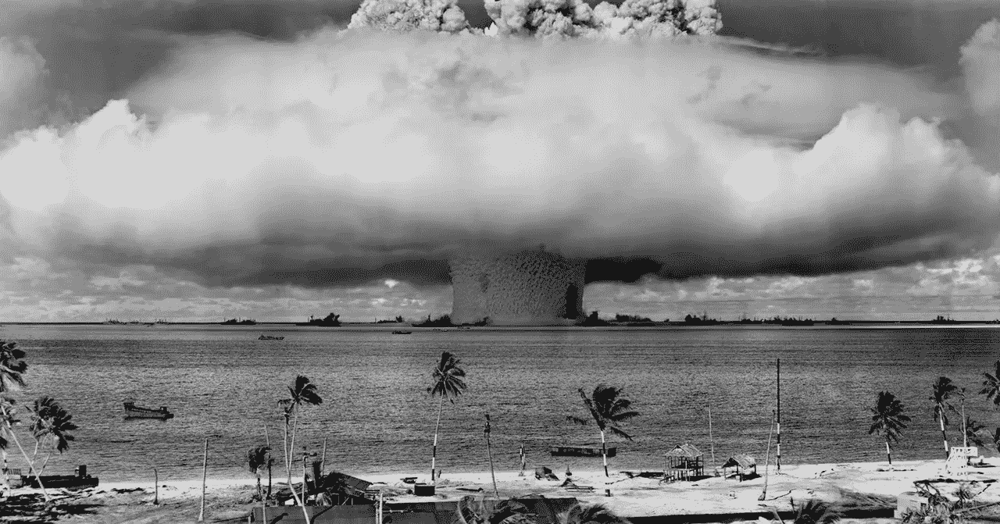

# 压力和压力的解毒剂？寻找更多。

> 原文：<https://medium.com/swlh/an-antidote-to-stress-and-pressure-seek-out-more-8515c96a73b5>

When the pressure gets too much (Credit: Pixabay.com)

了解你自己，或者俗话说。

随着时间的流逝和经验的积累，要理解是什么让我们运转，要弄清楚什么是有效的，什么是无效的。其中一个教训就是如何应对紧张、压力和逆境。

## 迷人的生活？