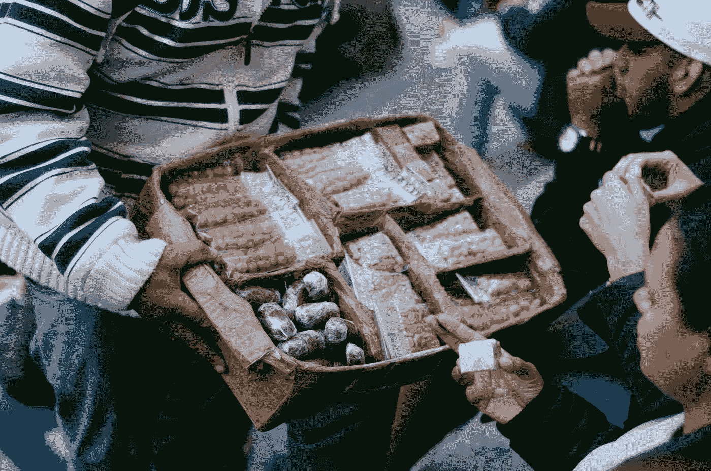
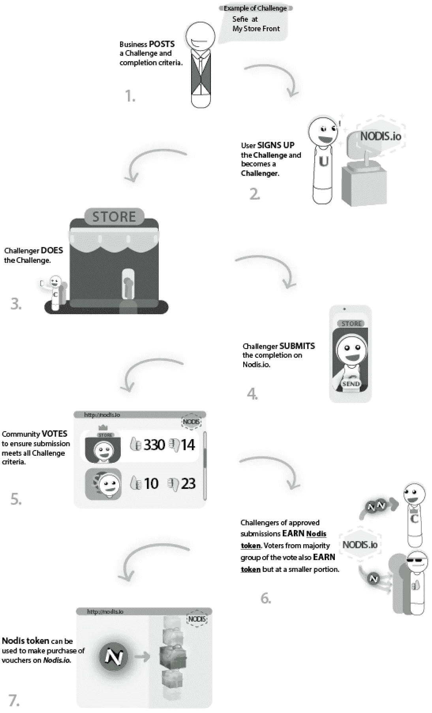

# 我们试图打造一款不需要“销售”的产品

> 原文：<https://medium.com/swlh/an-attempt-to-build-a-blockchain-based-product-that-doesnt-require-selling-5dfd90e86cfd>

> 这是“创业 180 天”系列的第 6 篇文章，记录了我的企业家之旅。如果你想从头开始，请点击[这里](https://theascent.pub/180-days-to-start-up-1-documenting-my-journey-to-building-a-potentially-valuable-solution-1b79191ccca3)看第一篇文章。

“person holding cardboard box with food pack” by [Gabriel](https://unsplash.com/@spenas88?utm_source=medium&utm_medium=referral) on [Unsplash](https://unsplash.com?utm_source=medium&utm_medium=referral)

我是一名*糟糕的*销售员。更具体地说，当我试图销售的产品与其他竞争对手没有什么差别时，我是一个糟糕的销售人员。我可以与具有间接或替代优势的产品合作(例如脸书与 Twitter)，但不是直接竞争(例如一个通用品牌与另一个通用品牌)。

我一直最喜欢的商业书籍之一是彼得·泰尔的《从零到一》。对我影响最大的一句话是…

> “如果你的产品需要广告或销售人员来销售，这还不够好:技术主要是关于产品开发，而不是分销。”

我不认为彼得一定是指一个伟大的产品不需要任何广告，销售团队，或分销渠道。我的观点是，真正独特的产品需要从解决利基市场的独特问题开始。像这样的产品只需要在它在利基市场上传播开来之前把消息传出去。一旦客户了解它优于现有选项，他们会再次购买更多。

这让我想到了彼得接下来的陈述…

> “创造性垄断意味着对所有人都有利的新产品和创造者可持续的利润。竞争意味着任何人都没有利润，没有有意义的差异化，以及为生存而斗争。”

我目前在建筑材料行业全职工作，担任产品营销经理。我增长最快的产品线是一个高级紧固件品牌。刚开始的时候，我并没有马上理解这些螺丝钉的价值主张。我只是觉得螺丝钉就是螺丝钉。在一次专业甲板建造者的演示中，我的观念开始转变。当这位专业人士试着拧下这些螺丝的时候，他的眼睛亮了起来，惊讶于它是如此的容易使用。这是一个每周使用数千个螺钉的家伙，他评论说我们的紧固件远远优于他几十年来使用的。他拿了一些样品，很可能像成千上万的其他承包商一样成为了一个忠实的客户。在过去的 7 年里，该产品线的收入每年都有两位数的增长。我们卖出了这么多优质螺丝，真是疯了。我们有强大的分销渠道，因为每个人都想销售这些产品。任何新的竞争都比不上我们。我们不需要疯狂的推销、不切实际的承诺或疯狂的折扣来吸引新用户。我们没有为生存而挣扎，我们的繁荣远远超出了我们的预期。虽然行业不同，但经营理念是一样的。我们想把 Nodis.io 打造成一个不需要销售的产品！

这引出了书中我第三喜欢的一句话…

> “未来几十年最有价值的企业将由寻求赋予人们权力而不是试图让他们过时的企业家创建。”

不幸的是，人们总是生活在恐惧中，害怕技术会消除成千上万的工作岗位。似乎科技公司不断过度强调技术的力量，以使企业更有效率和利润(意味着更少的员工)。真正有价值的企业应该以改善社会为目标。盈利能力应该只是底线之一，而不是*唯一的*底线。客户的需求*需要*成为我们发展的中心。

# [Nodis.io](https://nodis.io)

该产品使小企业能够在 [Nodis.io](https://nodis.io) 上发布挑战，供人们参与。完成后，参与者可以提交完成证明。批准过程由 Nodis.io 上的所有成员以投票的形式完成。

参与者将因批准的提交获得奖励代币。多数党的投票者也会因为他们的贡献而获得较少的代币。代币可以兑换产品或服务券，并可在商店兑现。

整个过程提高了发布挑战的企业的认知度、客户参与度和流量。最妙的是，只要求商家列出凭证进行兑换。这为代币提供了效用，并完成了营销周期。

> 请注意，社区投票机制是我们使用 blokchchain 的主要原因，因为它非常适合以透明和不变的方式收集共识。参见中我之前的文章《这个决定的更多理由》。

通过为小企业提供一种互动的方式来获得曝光率并吸引当地社区，我们可以潜在地为零售/餐馆/咖啡馆行业的大卫们提供一种针对性的营销工具，以对抗大型特许经营巨头。以下 3 个核心原则和目标融入了我们的发展，有助于我们实现这一目标:

*   *找到一个没有人(或至少很少人)试图解决的问题—* 帮助营销预算和专业知识都很少的小企业获得持续和长期的在线曝光
*   *一个可以让顾客受益的免费产品——*nodis . io 并不是要与脸书和其他社交媒体巨头竞争，也不是要与 Groupon 和仪式型服务竞争。它只是以几乎零成本提供了一个额外的客户参与渠道。挑战实际上可以与社交媒体网站一起工作。举个例子，它可以是“在我的商店前自拍，并在我们的 Instagram 上分享”。
*   *区块链是一项背景技术，是产品的核心，但不需要成为焦点—* 不，我们不想在炒作的基础上构建我们的产品。我们想在投票机制上利用区块链的分权。这将自动执行提交验证过程，因此小型企业所有者不必这样做。

我个人从我朝九晚五的工作中抽出一周时间，带着我们的原型走访了 150 多家小企业。绝大多数人的反应是积极的，60%的决策者表示他们愿意在产品推出时试用。凭借我们过去所做的研究和来自真实企业的积极反馈，我们相信我们正在做一些独特而有价值的事情。

我们还相信，我们正在创造一种不需要*销售*而只需要*被*看到的产品。

“selective focus photography of chess pieces” by [Randy Fath](https://unsplash.com/@randyfath?utm_source=medium&utm_medium=referral) on [Unsplash](https://unsplash.com?utm_source=medium&utm_medium=referral)

**在我两周后的下一篇文章中**，我想换个话题，更详细地谈谈我们的 Nodis token。更具体地说，我们产品的令牌组学以及我们如何定位我们的加密货币。

如果你觉得我写的东西有一点点有趣，请在媒体上关注我，并给我一些掌声。您也可以在 [Telegram](https://t.me/nodisgetnoticedgroup) 和 [Instagram](https://www.instagram.com/nodis.io/) 上关注我们，获取最新内容和项目更新。感谢阅读！

## 这篇文章发表在[《创业](https://medium.com/swlh)》上，这是 Medium 最大的创业刊物，有+ 375，367 人关注。

## 在这里订阅接收[我们的头条新闻](http://growthsupply.com/the-startup-newsletter/)。

