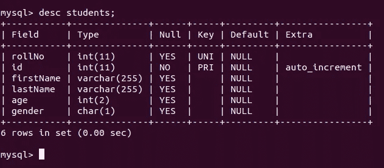
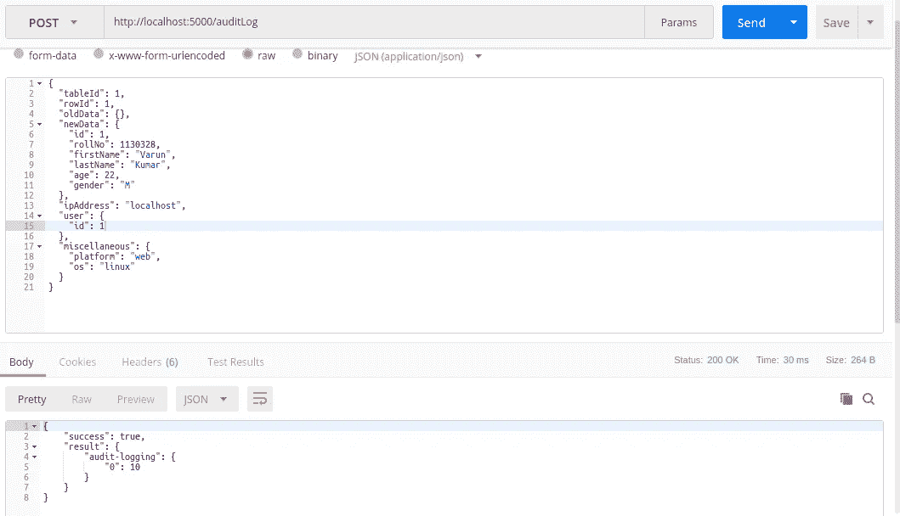
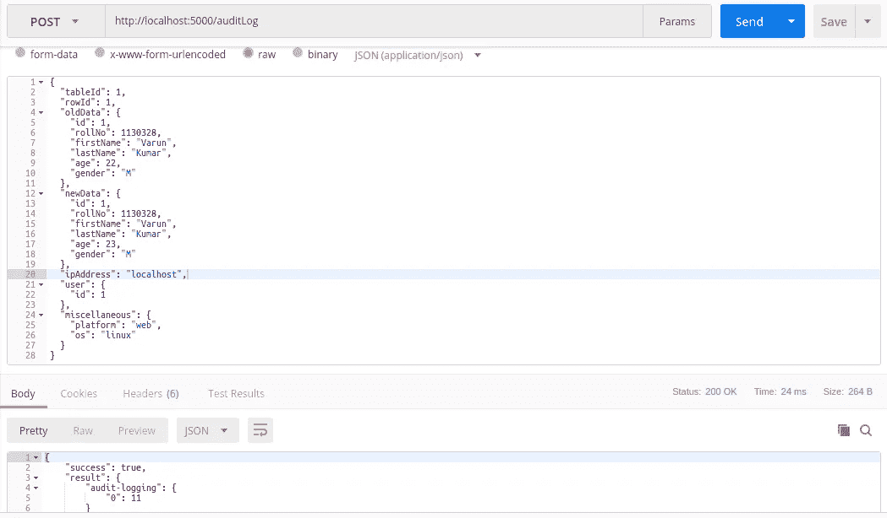
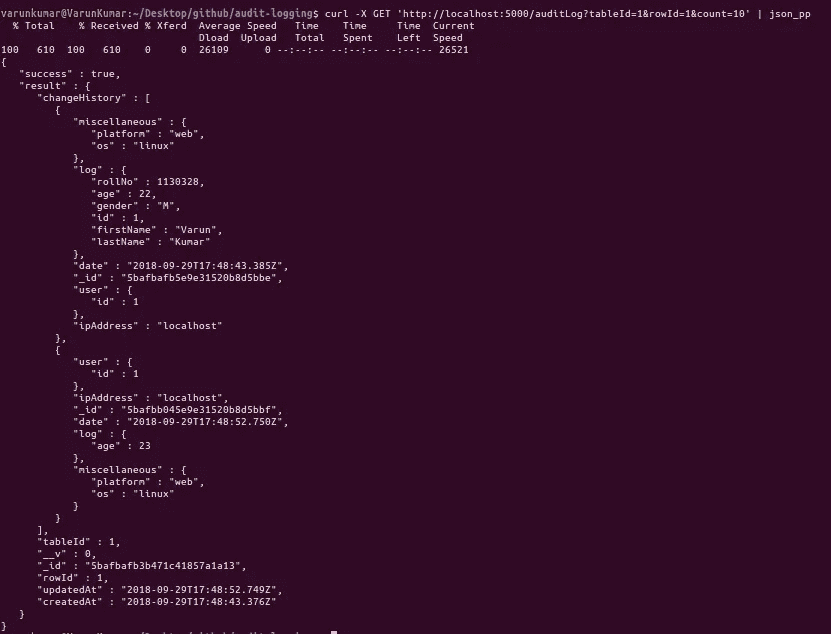

# 关系数据库的审计日志框架。

> 原文：<https://medium.com/swlh/an-audit-logging-framework-for-relational-databases-f902550cd849>

> 我刚刚用 MongoDB 和 Kafka 在 nodejs 中为关系数据库编写了一个审计日志框架。卡夫卡被用来提供存储的可扩展性和 MongoDB。我正在使用**卡夫卡节点**和**猫鼬**分别访问卡夫卡和蒙哥数据库。项目在此[https://github.com/varunon9/audit-logging-framework](https://github.com/varunon9/audit-logging-framework)。在这个博客中，我将展示它的用法。

## 要求-

我在我的项目中使用 MySql 数据库。我希望对我的表执行所有创建和更新操作的审计日志记录。

## 安装审计日志框架-

前往[https://github.com/varunon9/audit-logging-framework](https://github.com/varunon9/audit-logging-framework)建立项目。你将不得不安装卡夫卡，蒙戈和 nodejs。完成后，您可以继续学习本教程。

## MySql 数据库架构-

假设我们的数据库中有一个名为*学生*的表，我们想记录这个表的创建和更新操作。模式看起来像-

MySql database schema

为了简洁起见，这里只有一张桌子。在现实世界中，您会有多个表。要使用审核日志框架，您需要为所有表分配一个唯一的 id。审核日志框架接受两个强制参数-

1.  tableId(对于表来说是唯一的)
2.  行标识(在表中是唯一的，可以使用标识字段)

## 记录创建操作-

让我们在学生表中插入第一条记录。在现实世界中，您会编写 API 来对表执行操作。您需要将审计日志框架 API 与您的控制器/服务类集成。步骤应该是这样的-

1.  您收到一个 HTTP 请求，要求在*学生*表中创建一条新记录
2.  在执行数据库操作之前，您从行中获取**旧数据**。因为我们正在插入一条新记录，所以**旧数据**将是{}(空对象)。
3.  您对数据库执行写操作。该新插入的数据将为**新数据**。如果操作成功，您点击审核日志框架 api，POST[http://localhost:5000/audit log](http://localhost:5000/auditLog)类似如下-

audit-log for create operation

4.这里*用户*是执行该操作的用户详细信息(可选)；*IP 地址*是客户端的 IP 地址(可选)；*杂项*是您想要与审核日志一起捕获的任何其他信息(可选)。

## 记录更新操作-

现在假设*学生*在保存年龄详细信息时出错，他用新的年龄值= 23 更新了他的个人资料。

1.  现在**旧数据**将是当前数据，即
    {"id": 1，" rollNo": 1130328，"名字:" " Varun "，"姓氏:" " Kumar "，"年龄":22，"性别:" " M"}
2.  **newData** 将会是
    {"id": 1，" rollNo": 1130328，" firstName": "Varun "，" lastName": "Kumar "，" age": 23，" gender": "M"}
    注意，年龄现在是 23
3.  您再次点击 POST[http://localhost:5000/audit log](http://localhost:5000/auditLog)类似这样的内容-

audit-log for update operation

## 正在获取审核日志详细信息-

要获取给定的 **tableId** 和 **rowId** 的审计日志，您可以向[http://localhost:5000/audit log](http://localhost:5000/auditLog)发出类似这样的 get 请求( *count* 即默认情况下日志数为 5)

get audit-logs for a particular row inside given table

## **结论-**

我还没有大规模测试这个框架，但是这个简单的框架可以作为审计日志记录的良好起点。要调试问题，您可以检查日志目录中的日志。对于建议或问题，请在[https://github.com/varunon9/audit-logging-framework/issues](https://github.com/varunon9/audit-logging-framework/issues)创建 github 问题。

感谢阅读(或只是滚动):D

## 这篇文章发表在[的《创业》(The Startup](https://medium.com/swlh) )上，这是 Medium 最大的创业刊物，拥有+427，678 读者。

## 在这里订阅接收[我们的头条新闻](https://growthsupply.com/the-startup-newsletter/)。

