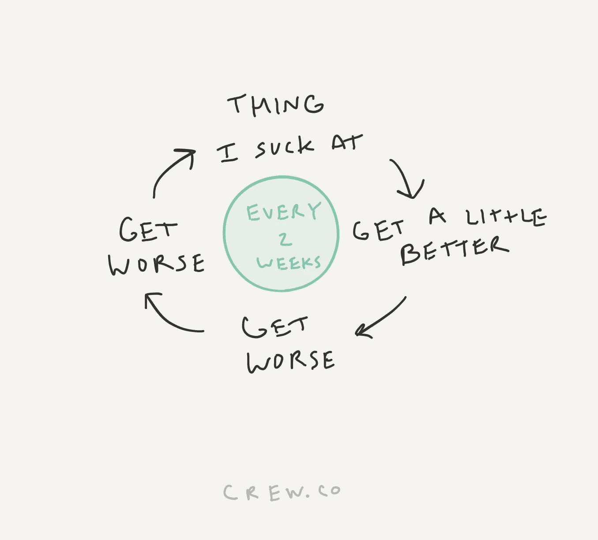
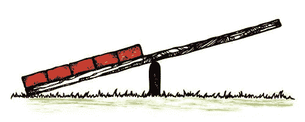
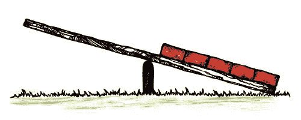

# 打破坏习惯的极端方法

> 原文：<https://medium.com/swlh/an-extreme-method-for-breaking-your-bad-habits-8d269b5302da>

## 当渐进式变革无法解决问题时，该怎么办

Your bad habit vs. ‘manageable change’

我在很多事情上都很糟糕:

试图在一天内完成太多事情。

定期锻炼。

保持我的衣柜干净。

我试图变得更好，但无论你多么想改变，都很难。尤其是你不擅长的事情。

有很多力量在推动你不去改变。你的大脑不想改变。你的身体不想改变。这个世界不想改变。

当我做不好某件事时，比如试图在一天内完成太多工作，我会告诉自己我需要变得更好，并立即采取一些行动，我认为这些行动会让我达到我想要的改进水平。

例如，我意识到我通常会列出 10 件以上一天要做的事情(一天要做的事情太多了)。我很少能完成其中的三件事。所以几乎每天结束时，我都会感到焦虑，因为我觉得自己做得不够。

我的解决办法是限制自己每天只做 5 件事情。这听起来不错。每天 5 项任务听起来很合理。我告诉自己，“很好。你发现了一个问题，并提出了具体的、可管理的改进措施。干得好。”

我感觉好多了。

但我只在头几天感觉好些。然后，我的清单开始一天比一天长。不到一周，我又有了一张 10 多项待办事项的清单。

每次我试图改善我的待办事项行为时，我都会循环这个行为。

我毫无进展。

今天我明白了我试图改变的方式可能是我不擅长的另一件事。

# 与其做一定程度的改变，为什么不来个 180 度的大转弯呢？

我最近读了一篇名为“[过度补偿以补偿](https://sivers.org/compensate)的文章，作者是网上最大的独立音乐销售商之一 CD Baby 的创始人兼作家德里克·西弗斯。在帖子中，德里克说**我们大多数人未能改变是因为我们做得不够**。

德里克用跷跷板上的砖块来比喻他的观点。

当我们想改变一些东西时，我们从跷跷板一侧的所有砖块开始。

如果你做了一个小的、可管理的改变——比如把你的待办事项清单缩短几项——就像移动一块砖。你可能会感觉好一点，但这不足以让你平衡。

做这个小小的改进的问题是，它不能说明你一生都在以你一贯的方式思考和做事情。

习惯很难消除，因为习惯是阻力最小的途径。我们的大脑总是更喜欢阻力最小的路径。最简单的就是我们想做的，习惯很简单，因为我们不需要思考。我们只是遵循习惯，就像火车遵循轨道一样。

你见过试图改变轨道的火车吗？它需要永远。火车必须停下来。来回移动很多次。铁路调度员必须手动切换轨道路径。最终，火车改变了路线。这就是我们大脑中习惯改变的样子。

德里克建议，要真正按照我们想要的方式提高，我们需要做到极致，以求平衡。我们需要把所有的砖块放到跷跷板的另一边，而不仅仅是一块。

一旦你这样做了，就会感觉你在过度补偿。你会感觉自己完全转向了另一个方向。

但实际上，你只是在外面过夜。

即使你走极端，你仍然会感觉到你的旧思维方式的拉力。所以你最终会得到一个看起来更像这样的跷跷板:

我试图改进的方法只是把一块砖放在跷跷板的另一边。

我开出了**“可管理的”行动，**意味着我只做了足够多的行动，使我在我认为我需要的数量上有所提高。我会变得好一点，但只是一点点。也不足以改变长期的情况。

# 过度补偿以提高

读了德里克的帖子后，我开始思考一堆我不擅长的事情，以及把一堆砖头放在跷跷板的另一边会是什么样子。我意识到，即使我觉得变化太大，我可能会以恰到好处的数量结束。

所以我列出了我想做得更好的事情，以及对我来说走极端会是什么样子:

# 1.让我的房子保持我妻子期望的整洁🙂

我经常觉得我的房子很干净。但是我的妻子经常有不同的感觉。我的妻子总是告诉我，如果我不仅能整理床铺，还能把床铺整理得“漂亮”，她会很感激。因为这让我的妻子感觉很好，我想试着让我们的房子保持她期望的清洁水平。

***极端药方*** :每天我环顾屋子四周，任何东西的清洁程度都会超出我妻子对清洁的期望。我的目标是保持房子的“丽思卡尔顿清洁”

# 2.与朋友/家人保持更亲密的关系

我搬到了加拿大，但我在美国长大。我住得离我的家人和朋友很远，但他们对我很重要。我经常让过多的工作、更难的沟通以及我住得更远的事实成为保持联系的障碍。

极端处方:每天我至少会给一个朋友或家人打电话。

# 3.对更多项目说“不”

有时候我会很兴奋，一次开始太多的项目。这伤害了我集中注意力的能力，让我感到焦虑。所以我想对更多的想法说‘不，不是现在’。

极端处方:我可以对每一个新的项目想法说“不”。我不喜欢忘记我觉得有趣的想法，所以我会把它们存储在一个列表中，但我不会开始任何新的东西。

# 4.定期写作/每周出版

我通常每天都写，但在过去的几个月里，我没有像我希望的那样腾出那么多时间。作为一名作家，我想不断进步，而达到这个目标的最好方法就是写作。很多。

极端处方 :我可以每天写作，我不会打算只出版周刊，因为那是我想结束的地方。我的目标是每天出版。

# 5.对每一天都不那么焦虑

我最近在自己身上做了一个实验，在这个实验中，我发现大多数时候我的感觉只比平均水平稍微好一点。这不是生活的方式。我意识到主要的来源是我给自己施加的压力，让自己一天做太多事情。这从我的待办事项开始。

极端处方 :为了解决这个问题，我可以想出一个更好的方法来管理我觉得我一天可以完成的事情。极端的解决方案可能是根本不使用待办事项列表。

现在我想在所有这些事情上做得更好。但是同时在这五个方面实践“极端处方”太难了。这需要太多的意志力。

许多研究表明，意志力很容易疲劳，尤其是当有很多诱惑的时候。当你追求一个极端的改变时，会有很多诱惑。我的意志力可能会崩溃，我会回到我开始的地方。

因此，我开始在一个月的时间里，在一件事情上走极端。

[研究显示](http://jamesclear.com/new-habit)养成一个习惯通常需要大约 2 个月的时间，但我觉得 2 个月的极端化似乎太强烈了，因为我的目标是围绕“平衡”的改善而不是“极端”的改善来养成一个习惯。所以我选择 1 个月走极端，第二个月采取更平衡的方法。

我的第一个选择是我每天都感到焦虑的问题，因为我从来不觉得我做得足够多。我想改善这一点，因为它是我压力的主要原因。

我的“极端处方”是不要使用待办事项清单。我不会循序渐进地把我的清单从每天 10 项减少到 8 项，甚至 5 项。我仍然会写下需要做的事情，但我不会有一个每天定期检查和更新的待办事项清单。我要走极端，一路走下来，专注于每天要做的一件事。就是这样。

如果我完成了最重要的事情，我会继续其他重要的任务。但是我不会感到压力，因为我必须完成所有这些事情，才能觉得那天我完成得足够多。

你可能想在某方面做得更好。当我们采取行动去尝试和改进时，这是很棒的。如果你在努力提高，你就是在努力对自己、对周围的人、甚至对这个世界变得更好。

但是当我们尝试后没有好转时，我们给自己施加了很多负面能量。

这种“极端处方”的方法可能是一种改善的方法。我希望如此。

但是如果不行，就不要为难自己了。你在努力提高，这本身就是一件高尚的事情。

如果你想加入我，挑一件你认为自己不擅长的事情，想出一种你可以完全相反的方法去做，用一个月的时间。

如果你想知道如何走极端，请发微博给我，我们会一起想出一个计划。