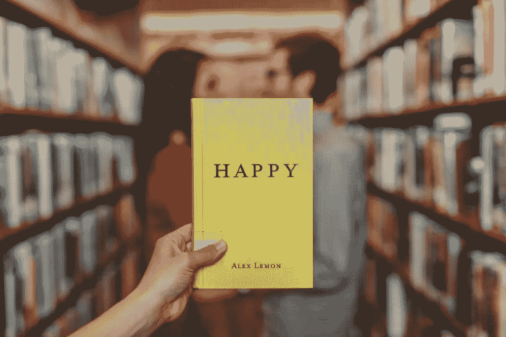
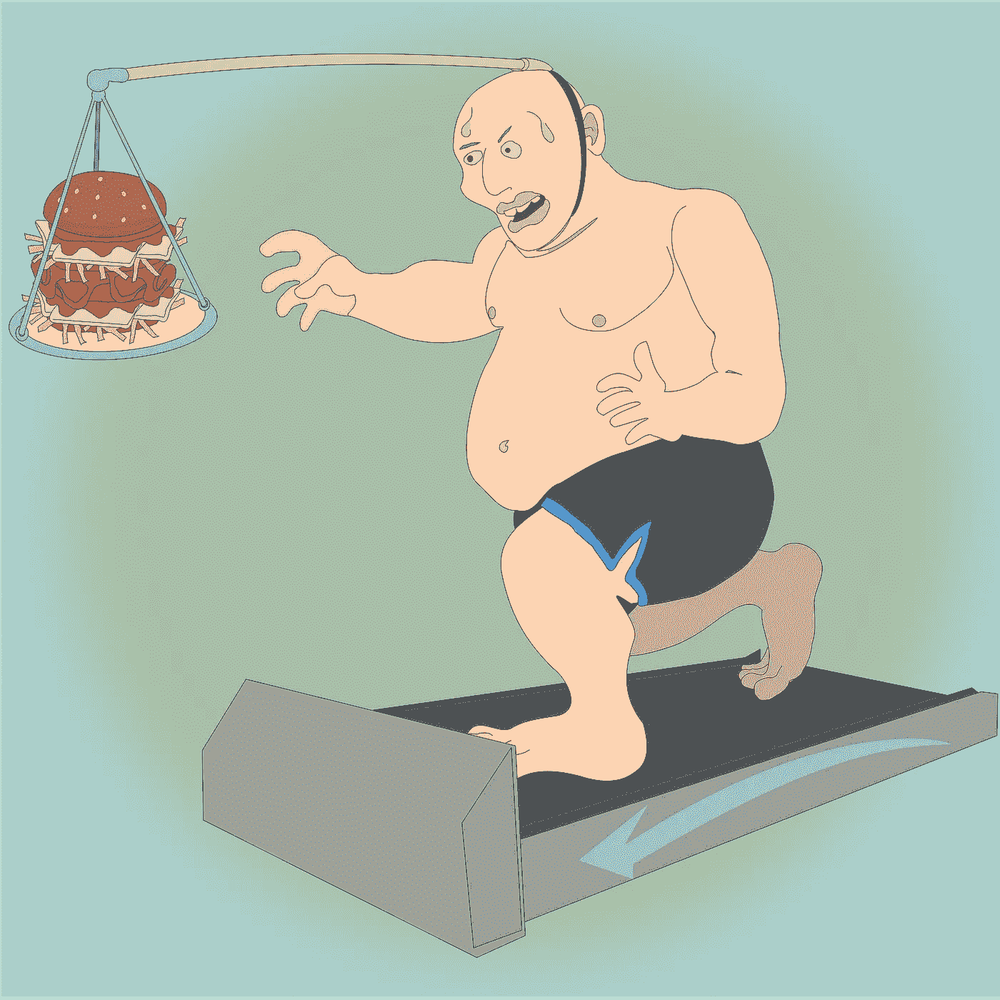

# 追逐导致贫穷生活的“成功”或“幸福”时要避免的最大陷阱

> 原文：<https://medium.com/swlh/an-honest-rant-on-success-and-happiness-ed34cfbd8d1d>

## 我已经吸取教训了

成功和幸福是自助书籍中经常被滥用的两个词。

我自己把它们放在类似于[如何知道你是否会在生活中成功](/the-mission/how-to-know-if-you-will-ever-succeed-in-life-2501b75f68d9)的帖子里。

但在你继续追逐“成功”或“幸福”之前，我希望你考虑以下几点。

你可以取得如此多的成就，但内心仍然感到空虚。同样的，你可以感到快乐，但仍然进行不健康或破坏性的活动。也可能导致被安顿或者对自己的能力一无所知。

成功意味着获得更多。幸福是对你所拥有的感到满足。

**欲望越少，痛苦越少。因此，你变得更快乐。**

**欲望越多，痛苦越多。但是，你可能会变得更加成功。**

那么你应该选择哪一个呢？

两个都可以选。

我们都以这样或那样的方式遭受痛苦。但问题是— ***你愿意为了什么而受苦？***

问题是大多数人一次渴望太多的东西。

你渴望的东西越多，你承受的痛苦就越多。

那么，有什么解决办法呢？

> 欲望少，但欲望强。

> 我们整天渴望得到一些东西，然后想知道为什么我们不快乐。所以，我喜欢意识到这一点，因为这样我就可以非常谨慎地选择我的欲望。在我的生活中，我尽量在任何时候都不要有一个以上的大欲望，我也认识到这是我痛苦的轴心。我意识到那是我选择不快乐的地方。
> 
> **—海军 Ravikant**

当我们渴望很多的时候，我们可能会对生活不满意。

原因是无论我们取得了什么成就，我们仍然有未满足的需求，这将阻止我们允许自己快乐。所以，我们一直不满足，不快乐。

即使你有一个巨大的遗愿清单，上面列有你想在死前做的事情，也只需要先检查其中的几项，而不是试图一次做完所有的事情。

仔细挑选你的优先事项和欲望，然后让它们成为你痛苦的来源。

从对你已经取得的成就的欣赏中获得快乐，然后强烈渴望一些东西。

一旦你得到了你想要的，花点时间去欣赏并继续你的下一个成就。

# 杀死死前的遗憾

遗憾要么来自对太多东西的渴望，要么来自没有勇气跟随你内心的声音。

> 你喜欢做什么？
> 
> **你愿意为了什么而奋斗？**
> 
> 你愿意做出什么牺牲？
> 
> 你希望如何被人记住？

这些是你必须回答的关键问题，以避免人生中最大的遗憾。

不要追逐成功对其他人意味着什么。定义成功对你意味着什么。

花时间定义你的价值观、核心愿望、更深层次的目标和愿景。

当你的日常行为反映出你是谁以及你想成为什么样的人时，你会感到平静和满足。一旦你实现了目标，你会感到无比的喜悦和感激。

成功之后，你必须重新调整并检查自己是否在朝着正确的方向前进。

即使实现了目标，与自己的错位也会让你不快乐。

> 正直让你在成功的道路上保持快乐。

你的决定和行动必须符合你的价值观。背叛价值观的那一刻，你会觉得不满足。

# 成功和幸福的替代品

> **与其追逐成功，不如追逐成长。与其追逐快乐，不如追逐平静。**

走上持续成长和充满激情的道路有助于你过上有意义的生活。

不要把幸福和目标捆绑在一起。追求持续增长的目标，而不是一个固定的目的地。

> 没有持续的成长和进步，进步、成就和成功这些词就没有任何意义。—本杰明·富兰克林

**在受苦的时候，你可能找不到成功或幸福。但是你总能在任何情况下找到成长和平静。**

成长与和平的结合带来了充实的生活。

所以，不要和解。改变生活中你不喜欢的事情，但也要接受你无法改变的事情。

> 成功可能涉及与他人的比较，而成长是与过去的自己的比较。快乐只是一种精神状态，而平静是一种生活方式。

人们认为推迟对未来成功的满足就是推迟幸福。但这不是真的。

如果你这样对待，延迟满足的行为会变得快乐。当你有内在动力时，奋斗就会变成快乐。

不断挑战自己的极限，花时间欣赏自己的成长。

对自己能成长和学习多少保持好奇。*(提示:没有限制)*

# 一个类比…

## 快乐跑步机

这是一场激烈的竞争，美好的时刻被遗忘，而现在是建立在痛苦之上的。这会导致精疲力竭，然后我们可能会找到不健康的方式让自己感觉更好。

## 艰苦跋涉

这是一条通往山顶的路。你可以回顾过去，欣赏你的成就。你可以感受当下的美好。你继续前进。你要专注于你的愿景。你有意为休息、放松和恢复留出时间。

在这种追求中，成功的滋味比在快乐的跑步机上获得成功要好得多。取得成功后，你会做什么？—你欣赏，前进。

> 跳过快乐的跑步机，去徒步旅行吧。

# 结论

苦难是不可避免的，对成功很重要。痛苦是当你因为错误的原因而受苦。

为正确的理由受苦，享受对成长与和平的追求。成功和幸福会随之而来。

保持感激，为真正对你重要的东西而奋斗。

# 成功是日常行动的结果…

为**高绩效和成功**设计你的每日清单。[点击这里下载](http://bit.ly/daily-success-list)你的免费拷贝。

[Get Your FREE Cheatsheet](http://bit.ly/daily-success-list)

## 这篇文章发表在《T4》杂志《创业》(The Startup)上，这是 Medium 最大的创业刊物，拥有 328，729 多名读者。

## 在这里订阅接收[我们的头条新闻](http://growthsupply.com/the-startup-newsletter/)。

