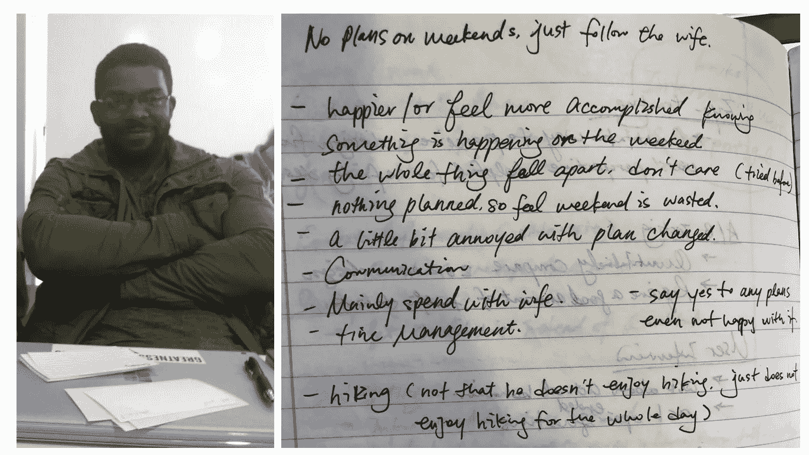
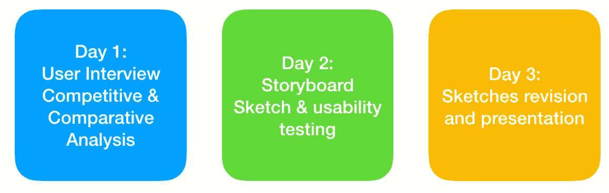
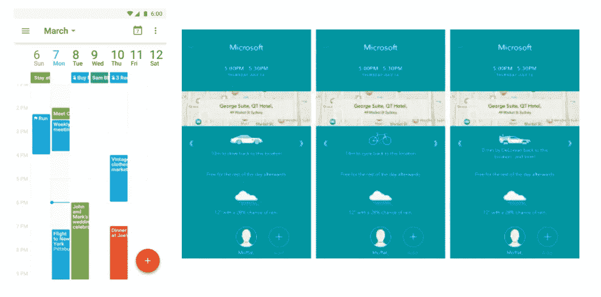
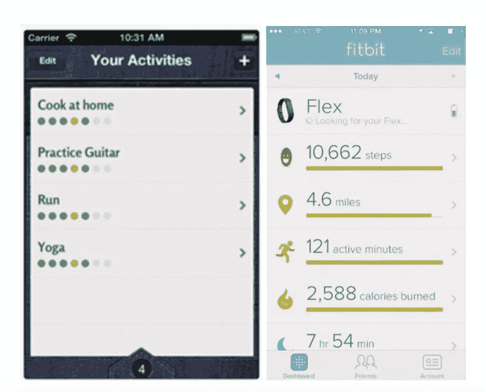
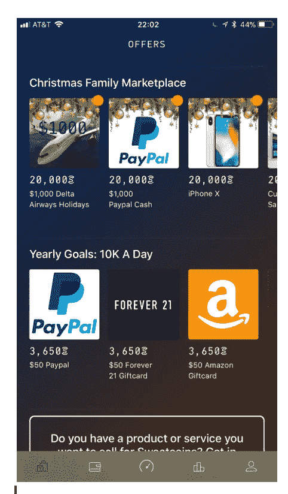
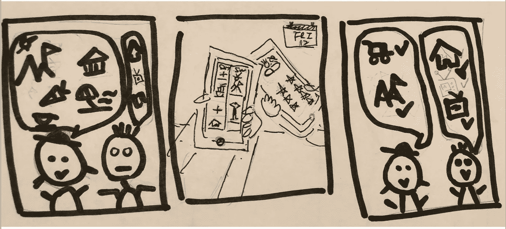
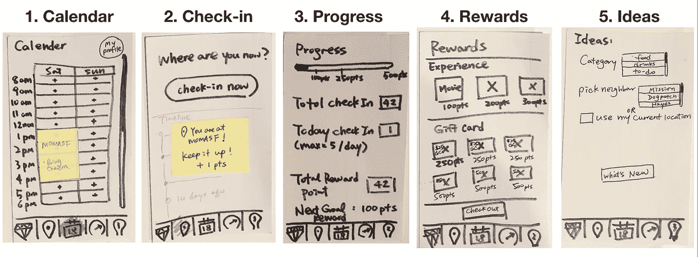
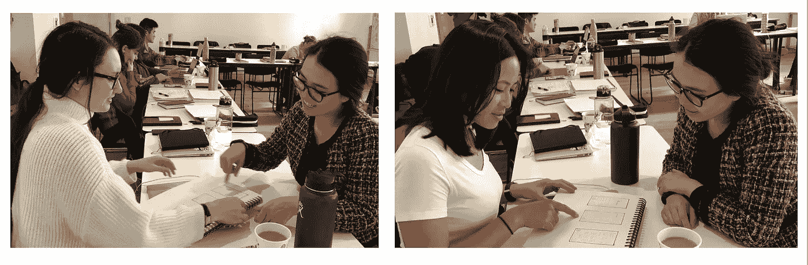
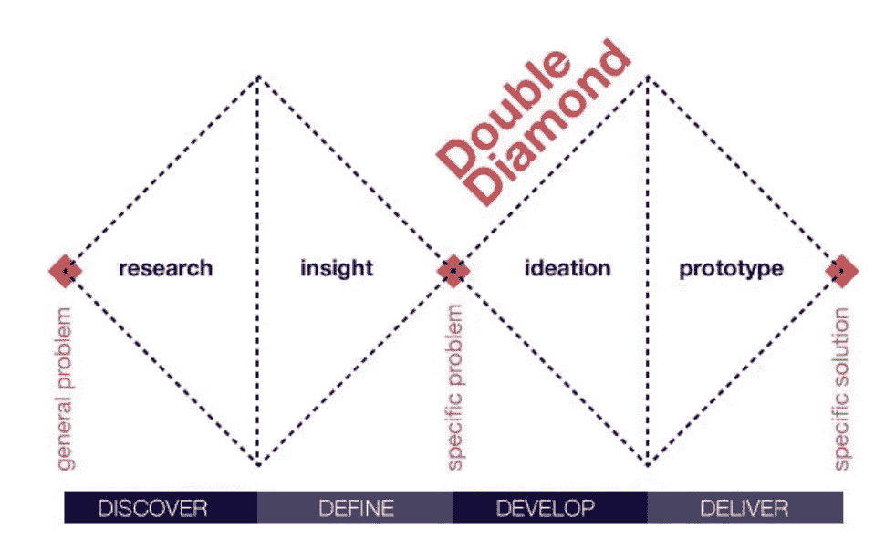

# 介绍 UX 设计，包括用户访谈、故事板和草图

> 原文：<https://medium.com/swlh/an-introduction-to-ux-design-with-user-interview-storyboard-sketching-85d276133fd5>

本文分为三个部分:用户访谈、过程和反思。

*用户访谈:*

Scott and my notes during the interview

我很高兴能和斯科特一起工作，并对他有所了解。我的第一个了解他的问题是“你通常在周末做什么？”

原来斯科特周末没有具体的计划，通常只是随波逐流(也就是配偶的想法)。结果，他可能没有时间做他喜欢的事情。

— —

一点不差地说:

艾娃:你们试过在日历上标记活动吗？

斯科特:是的，我们在谷歌日历上做了一些活动。

艾娃:那么这些事件发生了什么？

斯科特:但是你知道，发生了一些事情，我们不得不改变我们的计划，然后没有真正按照计划行事…

— —

考虑到这一点，我决定设计一个日历应用程序，鼓励情侣们制定周末计划，并激励他们坚持这个计划。这样，我希望情侣们可以更好地计划他们的周末时间，每个人都可以做他们喜欢的事情。

我知道，如果用户使用日历功能并签到以赚取积分，目标已经实现。

*流程*

Overview of the process

第一天:用户访谈、竞争分析和比较分析

与斯科特共进午餐时，我以“你周末通常做什么”这个问题开始。他告诉我他和他妻子周末是如何度过的。当我从他的声音中感觉到沮丧时，我会问他“为什么”？或者“这是如何发生的”来获得更多信息。

一旦我有了一个激发目标情侣的日历应用程序的想法，我就会对不同类别的应用程序进行研究:生产力、关系和动机。

竞争分析:谷歌日历，时间页面

Left: Google Calendar, Right: Moleskine Timepage App- both have clear layout. Timepage think in advance for the user and show user important and relevent information of transportation, map and weather

对比分析:美好的一天，fitbit，duolingo，sweatcoin，Strava，meetup，Foursquare

Motivation apps all show clear progress that can be compared to the set goal (left: wonderful day, right: fitbit)

Sweatcoin shows a clear and achievable point reward system

我已经将所有这些知识融入到对应用程序功能的考虑中。

我的日历将能够向用户提供天气，距离和积分信息。用户获得的入住积分对他们来说是有意义的，比如以清晰的方式传达的礼品卡。

第 2 天:故事板，另外 5 分钟，用户通过他的手机应用程序和可用性测试草图初稿的镜头来了解他们的生活方式(6 个用户 5 分钟的审查)

用 5 分钟时间查看斯科特手机上的应用程序，我对他的生活方式有了更多的了解。他对体育和娱乐非常感兴趣。这让我们开始了一场对话，也许会在应用程序中添加一些竞争力功能，可能会与其他夫妇一起进行。

故事板如图所示

From left to right: Current siutation, what the app can do, happy ending. I was thinking of what would happen to the couple on Friday night and set the scene of the storyboard.

素描:

Overview of the app

1.显示日历以及如何添加新活动的主页

2.第二次点击允许您在该位置登记

3.你还可以查看你的进度，以及下次奖励你有多自由，这对激励用户很重要。

4.我还包括一个奖励页面，让用户可以有一个明确的目标感。

5.让用户了解不同社区发生的事情的想法页面。

6 位用户的反馈:

Usability testing with Melissa and Genebie

*   大多数人都能够完成核心任务，包括在日历上添加新的活动，在地点签到，检查您的进度和兑换程序。
*   有一些实用的意见，包括使签到按钮看起来像一个按钮
*   大多数用户发现“定制你的日历”的概念令人困惑，非常喜欢谷歌日历类型的界面

第三天:修改草图，准备展示

*   演示准备迫使我回想用户的需求，以及我的解决方案如何帮助用户。

反思:

作为第一次来 UX 的设计师，我发现最令人兴奋的是 UX 的协作精神。没有一种处理事情或看待事情的方式，这是非常好的。这个项目让我有机会将第一个菱形中的原则——发现和定义应用到一个实际的用户项目中。

未来我会有哪些不同的做法:

*   对于我的故事板，我将学习如何在我的故事板中更好地捕捉情感和面部表情。熟能生巧！
*   对于用户访谈和可用性测试，我将不得不问更多的“为什么”。作为一名 UX 设计师，我需要抓住问题的核心，问为什么能让我更接近核心。

如果这个项目继续下去，我想对动机和 app 如何成功吸引用户一直回来做更多的研究。

## 这个故事发表在 [The Startup](https://medium.com/swlh) 上，这是 Medium 最大的创业刊物，有 290，182+人关注。

## 订阅接收[我们的头条](http://growthsupply.com/the-startup-newsletter/)。

