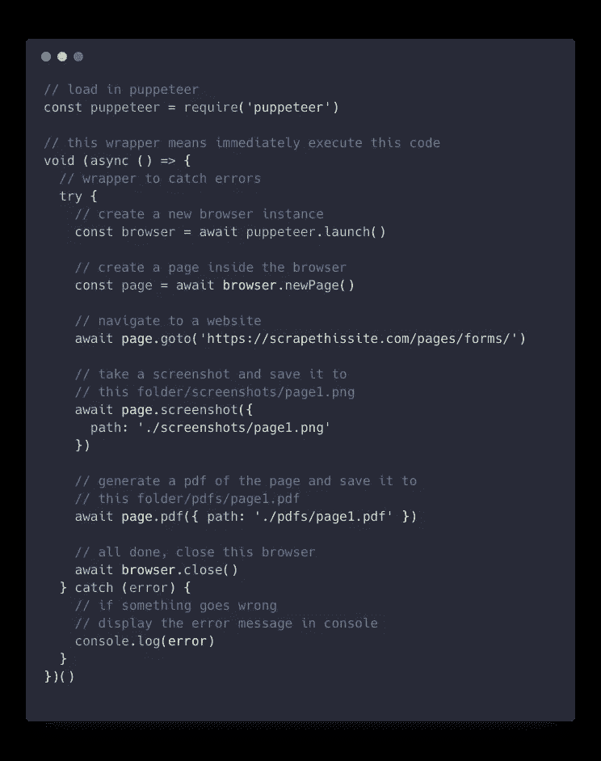
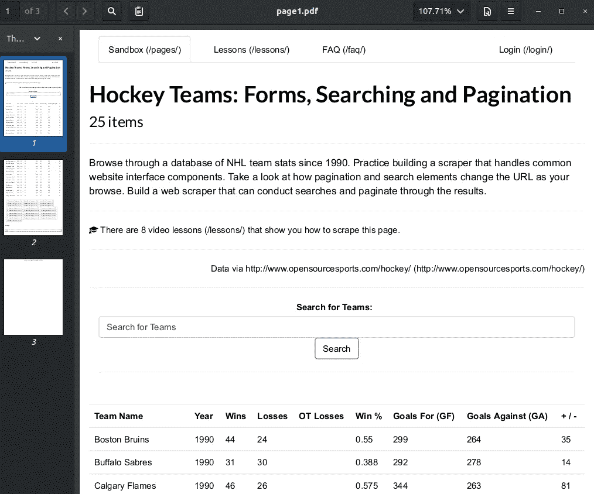
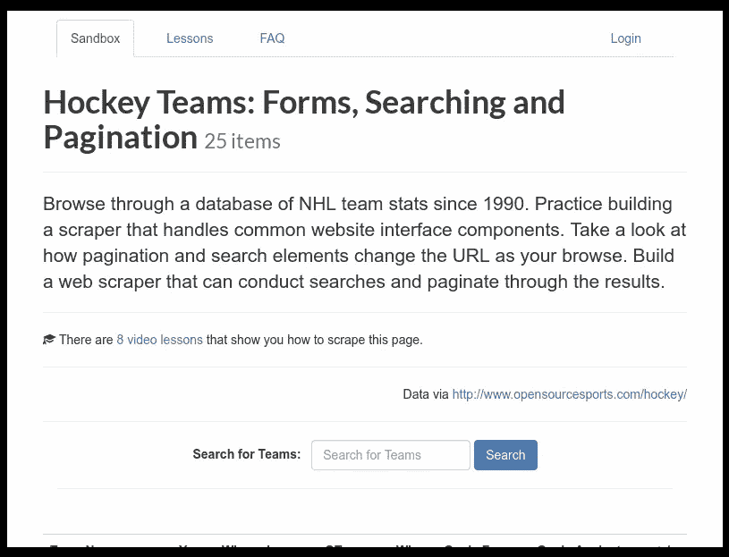
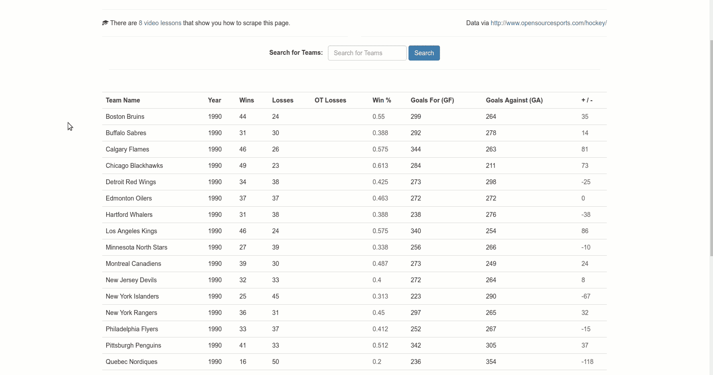
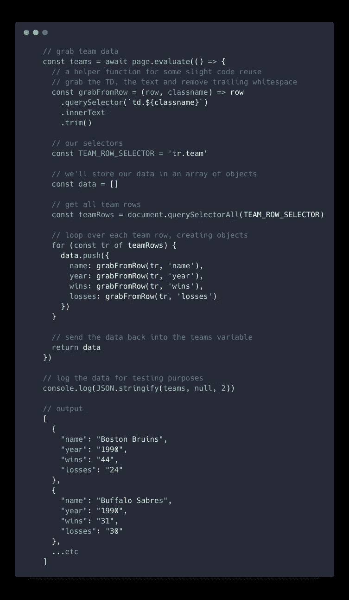
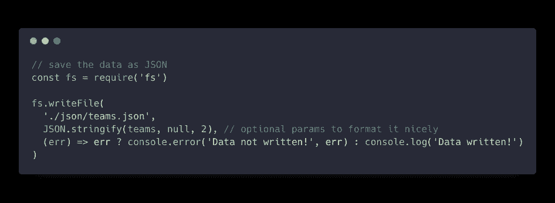

# 使用木偶师抓取网页的介绍

> 原文：<https://medium.com/swlh/an-introduction-to-web-scraping-with-puppeteer-3d35a51fdca0>

在这篇文章中跟我学木偶戏。

几天前我在 [DevTips](https://www.youtube.com/watch?v=pixfH6yyqZk) 上看到一个视频，他们试图使用木偶师，我自己从未使用过，觉得它看起来真的很酷。所以我尝试了一下，并在这里分享我所学到的东西。

# 目录

——[**先决条件**](/swlh/an-introduction-to-web-scraping-with-puppeteer-3d35a51fdca0#70b8)
——[**什么是木偶师？**](/swlh/an-introduction-to-web-scraping-with-puppeteer-3d35a51fdca0#2e46)
—[无头浏览器](/swlh/an-introduction-to-web-scraping-with-puppeteer-3d35a51fdca0#f789)
—[API](/swlh/an-introduction-to-web-scraping-with-puppeteer-3d35a51fdca0#1aa8)
—[**为什么要使用这些？**](/swlh/an-introduction-to-web-scraping-with-puppeteer-3d35a51fdca0#34c6)——
——[——**同上代码！**](/swlh/an-introduction-to-web-scraping-with-puppeteer-3d35a51fdca0#de0f)
—[先决条件](/swlh/an-introduction-to-web-scraping-with-puppeteer-3d35a51fdca0#8184)
—[项目设置](/swlh/an-introduction-to-web-scraping-with-puppeteer-3d35a51fdca0#c87d)
—[一个简单的例子](/swlh/an-introduction-to-web-scraping-with-puppeteer-3d35a51fdca0#6aaf)
—[抓取数据—准备](/swlh/an-introduction-to-web-scraping-with-puppeteer-3d35a51fdca0#8f71)
—[注意我要的数据](/swlh/an-introduction-to-web-scraping-with-puppeteer-3d35a51fdca0#26af)
—[我的选择器](/swlh/an-introduction-to-web-scraping-with-puppeteer-3d35a51fdca0#f1fe)
—[抓取数据—代码](/swlh/an-introduction-to-web-scraping-with-puppeteer-3d35a51fdca0#cce2)
—【中】

# 先决条件

本教程是初学者友好的，没有先进的代码知识是必需的。如果你跟随项目，那么更多的需求将在下面的代码部分列出。

所有代码都可以在 GitHub 的一个资源库中找到，链接如下。

 [## CodeDraken/木偶师-示例

### 我的木偶师教程的一个例子。为 CodeDraken/木偶师-示例开发创建一个帐户…

github.com](https://github.com/CodeDraken/puppeteer-example) 

# 什么是木偶师？

在我们深入研究代码之前，理解我们正在使用的技术是什么以及它为什么存在是很重要的。

## 无头浏览器

木偶师自带 Chromium，默认情况下“无头”运行。什么是无头浏览器？无头浏览器是用于机器的**浏览器。它没有用户界面，允许一个程序——通常称为抓取器或爬虫——读取并与之交互。**

## 一个 API

无头浏览器很棒，但有时使用起来很痛苦。然而，Puppeteer 提供了一个非常好的 API 或函数集来与之交互。

# 为什么要使用这些呢？

总的来说，你可以用木偶师和网络搜集做很多事情！

*   在真实的网页上进行自动化测试，
*   生成 pdf
*   截图
*   从网站获取数据并保存
*   自动化枯燥的任务
*   木偶戏也许是你可以使用的最好的工具

# 继续编码！

我们开始吧！

## 先决条件

如果你继续学习，你需要安装 [NodeJS](https://nodejs.org/en/) ，命令行的基本知识，JavaScript 知识和 DOM 知识。

**注意**:你的 scraper 代码不一定要完美。做自己的项目时，不要想太多。

## 项目设置

1.  制作一个文件夹(随便取什么名字)
2.  在终端/命令提示符下打开文件夹
3.  在您的终端运行中，`npm init -y`这将生成一个用于管理项目依赖关系的`package.json`。
4.  然后运行`npm install puppeteer`这将安装包含铬的木偶师，所以如果它很大也不要惊讶。
5.  最后，在您喜欢的代码编辑器中打开文件夹，创建一个`index.js`文件。您还需要这些文件夹；`screenshots`、`pdfs`和`json`，如果你完全按照我的例子做的话。

## 简单的例子

现在让我们尝试一些简单的东西(但真的很酷！)来验证我们的设置是否正常工作。我们将截取一个网页的屏幕截图，并生成一个 PDF 文件。(是的，这很容易做到)

对于我的大多数例子，我将使用 scrapethissite.com。你可以使用任何网站，只要他们允许你刮他们。搜索他们的政策并尝试查看`site/robots.txt`例如[https://medium.com/robots.txt](https://medium.com/robots.txt)

generate a screenshot and pdf

这是启动无头浏览器，导航到网页，然后截图并生成 pdf 所需的全部代码。

generated pdf file

generated screenshot

点击[此处](https://github.com/GoogleChrome/puppeteer/blob/v1.8.0/docs/api.md#pagescreenshotoptions)获取更多截图信息，点击[此处](https://github.com/GoogleChrome/puppeteer/blob/v1.8.0/docs/api.md#pagepdfoptions)获取更多 pdf 生成信息。

> 截图和 pdf 很有趣，但这如何帮助我更快地获取数据呢？

如果你特别想要 pdf 和截图，这些功能很好。当您想要获取并可能操作数据时，还有其他工具可供您使用。

## 获取数据—准备工作

使用上面例子中的同一个站点，我们将获取一些数据并保存到一个文件中。假设在这个场景中，我们只需要团队名称、年份、胜败。第一步是**创建一些选择器**。

一个**选择器只是一条通向数据**的路径。(想想 CSS 选择器)我们将通过使用浏览器的开发工具来得出这里的路径。打开浏览器菜单，寻找“开发者工具”，在页面上打开它们。我将使用 Chrome，你只需按下`CTRL + Shift + I`就可以打开它们。

在站点上，打开开发者工具中的元素选项卡，找到您想要获取的数据。记下它的结构、类别等。

inspecting the DOM ( click to enlarge )

如果你碰巧有一个你想要抓取的特定的独一无二的片段，那么你可以右击该节点并选择“复制选择器”。

## 我想要的数据的注释

*   它在一张桌子里面
*   有团队数据的行有一个名为`team`的类
*   在`tr.team`里面是多个`td`，它们的类名分别是`name`、`year`、`wins`和`losses`。这些包含我想要的数据。

## 我的选择器

我为这个例子想到的选择器是:

*   团队排:`tr.team`
*   数据:`teamRow > td.${dataName}` *(用名称替换$ { data name)*

[如果你不熟悉 CSS 选择器，在这里阅读更多关于 CSS 选择器的内容](https://developer.mozilla.org/en-US/docs/Web/CSS/CSS_Selectors)。

## 抓取数据——在代码中

是时候将这一点应用到我们的代码中了。

grabbing team data

这其中的主要部分是`page.evaluate()`这让我们**在浏览器中运行 JS 代码，并传回**我们想要的任何数据。这就是获取数据所需的全部内容。

您可能已经注意到，我们可以访问这里的 DOM 这是 Puppeteer 提供的非常好且熟悉的 API！

## 将数据保存到文件

最后，我们将把这些数据保存到一个文件中。在我的例子中，我想要 JSON 格式的数据，因为这最容易与 JS 一起使用。

1.  从节点加载文件系统模块
2.  用`JSON.stringify()`将数据转换成 JSON
3.  用`fs.writeFile()`写文件

save JSON data

 [## 文件系统| Node.js v10.11.0 文档

### 在 POSIX 系统上，对于每个进程，内核维护一个当前打开的文件和资源的表。每个打开的文件…

nodejs.org](https://nodejs.org/api/fs.html)  [## JSON.stringify()

### JSON.stringify()方法将 JavaScript 值转换为 JSON 字符串，如果替换符…

developer.mozilla.org](https://developer.mozilla.org/en-US/docs/Web/JavaScript/Reference/Global_Objects/JSON/stringify) 

# 更高级的刮削

Puppeteer 支持单页应用程序(SPA)、模拟输入、测试等等。它们超出了本教程的范围，但是您可以在木偶师文档(下面列出)和另一篇文章中找到例子。

# 参考和链接

 [## 无头 Chrome | Web | Google 开发者入门

### 无头 Chrome 入门

developers.google.com](https://developers.google.com/web/updates/2017/04/headless-chrome)  [## 谷歌色素/木偶师

### 无头 Chrome 节点 API。在 GitHub 上创建一个帐户，为 Google chrome/木偶师的发展做出贡献。

github.com](https://github.com/GoogleChrome/puppeteer) 

如果你觉得这篇文章太难，那么我会推荐这篇文章。它涵盖了同样的东西，但更详细。

感谢阅读！请在下面的评论中留下任何反馈或问题。

## 这篇文章发表在 [The Startup](https://medium.com/swlh) 上，这是 Medium 最大的创业刊物，拥有+ 375，985 名读者。

## 在此订阅接收[我们的头条新闻](http://growthsupply.com/the-startup-newsletter/)。

