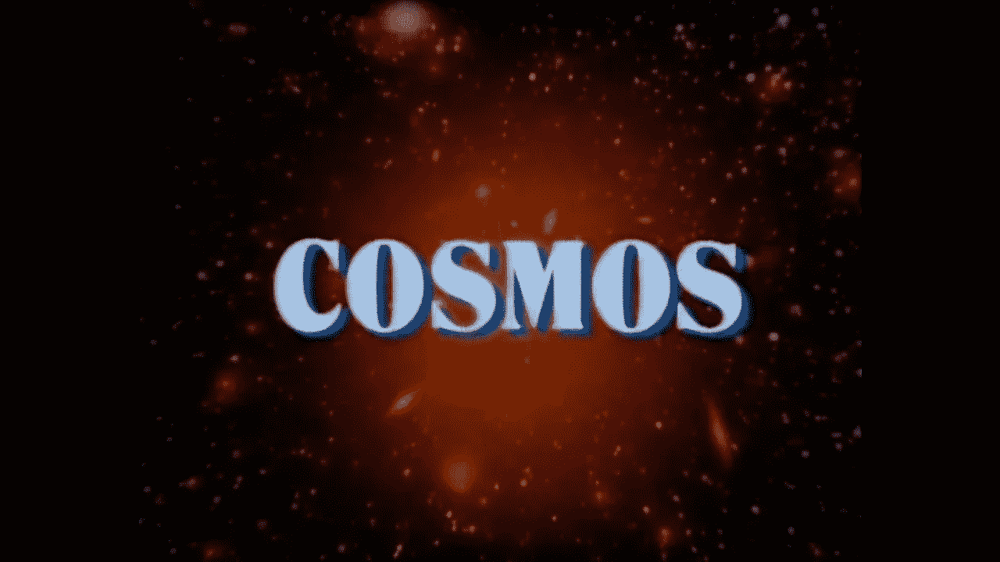

# 卡尔·萨根颂歌

> 原文：<https://medium.com/swlh/an-ode-to-carl-sagan-575f609a4b05>

根据维基百科，卡尔·萨根是美国天文学家、宇宙学家、天体物理学家和天体生物学家。作为一名科学家，萨根最出名的是他在寻找地外生命(SETI)方面的工作以及他对旅行者黄金记录的贡献——一个发射到太空的时间胶囊，旨在为外星人或未来的人类提供，包含代表地球生命的声音和图像。