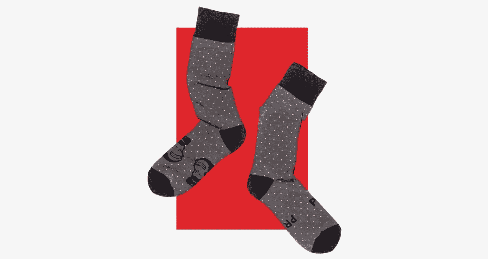
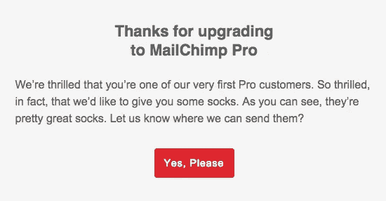

# 给 Mailchimp 的公开“情书”

> 原文：<https://medium.com/swlh/an-open-letter-to-mailchimp-8497318fc860>

6 年每月 1000 美元，你却给我寄袜子？

亲爱的 Mailchimp，

我们已经交往了五六年了，对吗？我想是时候对你直言不讳了。我每个周末都在想…他会求婚吗？我告诉自己，一定要在这个周末。我一直梦想着那些甜言蜜语:“Mikey，你愿意和我一起对你的 Mailchimp 列表进行像样的分析吗？”

就在我认为我们可能会更上一层楼，进行一些群组分析、留存分析，甚至是增长统计……你问我要不要袜子？不不，让我纠正我自己，你问我是不是想向*请求*袜子。有你头像的袜子？说真的，这有点奇怪。我们在一起 6 年了，你还发邮件给我袜子。我得填一张表格向你要袜子，你甚至不问我是几号的？

在我真正失去理智之前，我会提醒你我们的关系有多好。六年来我们一起做了很多事。我们已经发送了数百万封电子邮件，在全世界传播积极有用的信息。这么多美好的回忆。伟大的简讯打开率，点击率，这是令人难以置信的。但是说实话，有些事情困扰我已经有一段时间了…

我不想我们变成那种夫妻。周五晚上，复制一些旧的广告，发送给同样的老观众。我想我们的关系可能会变得更深，更独特，更有针对性，更个性化…

我一直在想办法让我们的生活更有情趣。我建议进行队列分析，你不感兴趣。我建议通过不同的细分市场或用户群来分析列表增长，你对此嗤之以鼻。我想根据用户的行为对他们进行分类，但是你让事情变得复杂了。我是认真的，这些事情很令人兴奋。我们正在努力增加我们的列表，让我们来分析一下。我们正在努力提高保留率，让我们跟踪它。很好玩！至少我是这么认为的。

似乎我想出的每一个想法都在推动我们前进…更好地了解我们一起建立的观众*…你就是不感兴趣。是我吗？我做错了什么吗？*

*我升级到一个专业帐户来引起你的注意，没有运气。穿着紧身迷你裙走来走去，向你扔钱，这还不够吗？我在你的网上聊天中与所有的技术人员调情，感觉如何？我知道他们已经告诉你了。但是你不在乎。他们喜欢我的想法，但我知道他们只是被扔进某个漏斗里，让你的技术团队垂涎三尺，永远不碰。我开始想知道他们是怎么打发时间的。*

*你为什么要这样？我只想和你一起做该死的队列分析！但是我不能。我厌倦了出口 csv 的和自己做一切的时间。我还能留住我的订户吗？我在增加清单方面做得好吗？拜托，这对我很重要。听着。*

*说实话，我开始货比三家了。一起发送电子邮件已经不是过去的样子了。我听说[对讲机。io](https://www.intercom.io/) 可以根据行为对用户进行分类…这有多令人兴奋？还有[customer . io](https://customer.io/)……这些天她们看起来相当性感。我知道你要说什么。“但是 mikey，你知道我不是 CRM，我从来没有向你承诺过那种承诺”。你猜怎么着，我的订户就是我的顾客。*

*我对这段感情投入越多，你得到的就越多。六年来每月 1000 美元，你却给我寄袜子。袜子！结束了。我们完了。你当然漂亮，你一直都很漂亮。但如你所知，内在才是最重要的。*

*跟踪这种保留。*

*米奇·豪*

*附注:袜子留着吧*