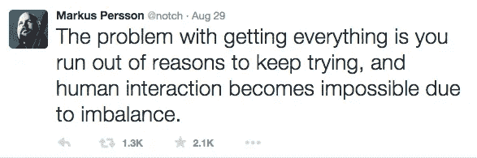
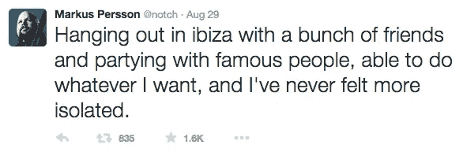
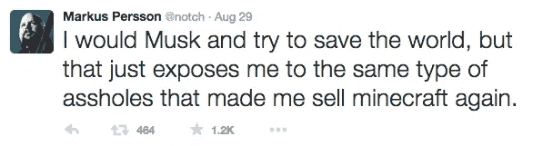
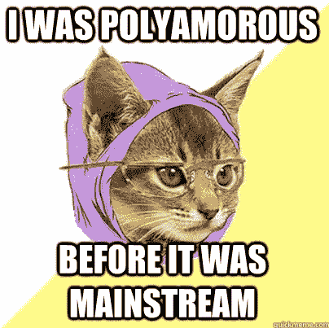
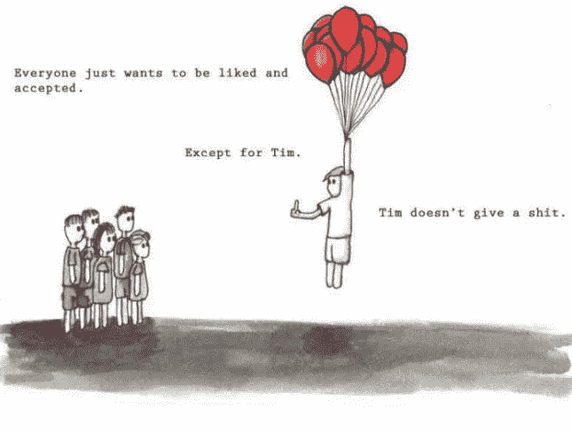

# 一封致 Notch 的公开信:建立非混蛋技术文化的挑战与回报

> 原文：<https://medium.com/swlh/an-open-letter-to-notch-the-challenges-rewards-of-building-a-non-asshole-tech-culture-d748f6dbf73b>

hall Markus/" Notch "，

我不会假装我认识你，也不会积极跟进你的故事。我从来没有玩过你的游戏，将来也可能不会。但是你最近关于孤立和关系困难的推文击中了要害。

我没有任何答案给你(其他人也没有)，但是我有几个问题和想法可以帮助你寻找你曾经感受到的快乐和归属感。

最近第一次看*美国丽人*。你看过吗？如果你不记得了，那就是有金发碧眼的凯文·史派西和玫瑰花瓣的那张。

今天早上醒来时，我特别想到了一个场景。那是当这位母亲，一位房地产经纪人，举办了一次开放日，在孤注一掷之后还是没能卖出去。

当最后一位客人离开房间时，她背对着摄像机，关上了滑动门，拉上了窗帘挡住了光线。当她转过身时，她的眼睛闭上了，脸因痛苦而扭曲。几秒钟过去了，没有一丝声音。她想哭，但是哭不出来。

突然，闸门打开了。她的嘴张开了，她哭得很厉害，像个孩子一样嚎啕大哭。她只是不得不发泄出来——压力、痛苦和失望。不仅是因为失去了销售，还因为她周围的破碎。

毫无征兆地，她给了自己一个耳光，说:“闭嘴！停下来！你这个巫婆，你这个宝贝！闭嘴！”她说了，然后就停下了。她定了定神，擦掉弄脏了的睫毛膏，带着平静自信的样子走出了现场。她的主线是“为了成功，一个人必须时刻展现成功的形象。”

周六晚上，你放声大哭。也许你只是过了糟糕的一天，或者你只是被评论了一个 twitter 趋势，不管怎样，你都发泄出来了。

我在网上看到一些 20 多岁的作家的文章，他们思考你的想法并为你提供解决方案。年轻人和老年人都表现得好像这是一个惊喜，不知道这是怎么回事？一个以 25 亿美元(对普通人来说是误导)把自己的公司卖给微软的人感到孤立。他一定有什么问题，对吗？

这些感觉当然没有错。你是人…你不是第一个，也不会是最后一个在大退出后有这种感觉的人。当普通人想到百万富翁身份时，他们相对想到的是如何让他们的生活变得更好或更容易。

我们说，“哦，哇，我再也不用担心账单了，我可以买一辆门可以侧向打开的超级跑车，我可以做 x，y 和 z，”他们只关注眼前的收益，没有理解新问题的基础。

人们追求的这种痴迷的超未来主义、投资、可扩展性、估值和硅谷崇拜的科技文化是一种幻觉。再说一次，普通人，甚至普通的初创公司创始人，都只关注现代科技文化的积极一面。

硅谷与好莱坞、华尔街或政界高层没有什么不同——它高层比底层更孤独。这种文化的真相不在科技小报的封面上——它就在你的推特上。

有一点我不能同意，那就是一旦你得到了你想要的一切，你就没有继续下去的理由了。首先，你没有得到你想要的一切。如果你知道，那你就不会发微博说你被孤立了。你已经得到了这种文化暗示你应该想要的一切，但没有马库斯·佩尔松那种深刻的个人欲望。

第二，总有有意义的问题需要解决。真正的快乐只来自解决有意义的问题和与他人的真实关系。

> “世界上很容易按照世界的意见生活；在孤独中，按照自己的方式生活是容易的；但伟大的人是在人群中保持完美的甜蜜的孤独的独立性。”——拉尔夫·瓦尔多·爱默生

我看了你 2013 年在深夜秀上的表现。克雷格·费格斯问你是否已经出卖了邪恶的公司。你说，“不，还没有。我们希望不会。基本上，我们的想法是，我们有一家公司，我们只是制作我们认为有趣的游戏。”

我和朋友们谈论的一个观点是詹姆斯·卡斯在他的书《有限和无限的游戏》中推广的。基本前提是有两种博弈，有限博弈和无限博弈。有限博弈的目标是赢，因此，它结束了。无限游戏的目标是一直玩下去。

从你的游戏来看，《我的世界》，你更像是一个无限游戏玩家。那你为什么不玩了？

在《《我的世界》》获得如此巨大的成功后，我敢肯定你感到了压力，要在你的新项目中赶上或超过它。但是，你看，这就是生活，你偶尔会遇到无法预测的黑天鹅事件。你复制这种成功的几率几乎为零。

为什么我们不能欣赏一部美丽的作品，而不去期待下一部会超越它。我想我们作为人类从来都不擅长希望和期望的事情。

你想开始一个新的有限或无限的游戏吗？

在周六晚上的前几条推特之后，你写了这个宝石。

我相信这种新科技文化主要是一群混蛋。他们常常能迷惑最时髦的人，让他们为了金钱和公司利益而出卖自己。我猜你已经发现了，他们卖的乌托邦就是一个简单的 VR 模拟。

当然，金钱是重要的，但是它应该被看作是在生活中提供选择和利益的一种工具。

Y Combinator，被广泛认为是世界上最好的创业加速器，刚刚公布了他们的最新数据。顶部统计数据显示，

> 所有 YC 公司的总“估值”:超过 650 亿美元

网站上还有其他八个数据。另一个非常有趣的是，YC 投资的公司数量是 940 家。那是很多公司。考虑到几乎所有人都有至少两个伴侣，那至少有 1880 人。你觉得他们中有多少人和你感觉一样，诺什？

几个星期以来，我一直试图让山姆·奥特曼(不是一个混蛋)在推特上回答这个问题，“YC 教育系统如何处理企业家受苦的话题？”

他没有理由看不到这个问题，因为这是对他发给我的回复的回应。他没有回答的原因是因为，*惊奇*，在这种文化中没有苦难的说法。如果你正在遭受痛苦，他们希望你吃一颗增强心智的药，和一天中的多配偶做爱，然后继续编码。

但是当性、毒品和摇滚失去效力时会发生什么呢？不幸的是，当他们需要硅谷所有的钱都买不到的东西时，**真正的人际联系**。

但事情并非没有希望，诺什。你说你想尝试拯救世界，但又担心这会让你暴露在类似的科技文化中。两年前，我会同意你的观点，但后来我遇到了 Exosphere 的人。

乍一看你看到外逸层口号，“扰乱宇宙”，心想，什么鬼？仔细观察，你会发现它出自艾略特的一首名为*的诗，是 j·阿尔弗雷德·普鲁弗洛克的情歌。*我推荐你[读一读](http://www.bartleby.com/198/1.html)，我想你会发现很多属于你自己的故事。

exo sphere[的使命是在人们所在的地方与他们见面，支持并鼓励他们过上有自己想法和愿望的生活。最关键的是，外圈并不是给人们答案，而是鼓励和帮助人们不断提出问题。](http://exosphe.re/)

但是让我告诉你，建立这种类型的文化是极其困难的。当你关心人们和他们的长期发展时，你不能在困难的时候抛弃他们。当他们的 MVP 失败或联合创始人退出时，你不能就这样把他们踢出去。但是相反，你必须投入更多的时间和精力来重建它们。

当你孵化的是人而不是创业公司时，估值并不重要，因此资金更难获得。精英人才库可以得到最高的钱，通常会去争取，所以支持演员不会是一个 SV 团队的标准技能水平。当建立这种类型的文化时，你不必接受每个人，但你必须接受任何举手说“我想成为其中一员”的人。只有这样，你才能通过观察他们日复一日在日常工作中的努力来确认他们的意志。

这是一条艰难的道路，永远不会变得容易。但也许这就是为什么所有外逸层参与者都被要求阅读 M·斯科特·派克的《少走的路》。这本书的前几行写道:

> “生活是艰难的。这是一个伟大的真理，最伟大的真理之一。这是一个伟大的真理，因为一旦我们真正看到这个真理，我们就超越了它。一旦我们真正知道生活是困难的——一旦我们真正理解并接受它——那么生活就不再困难。因为一旦接受了，生活艰难这个事实就不再重要了。”

有奖励。看到人们在你眼前转变，回应正能量和爱是一件大事。看到人们克服他们的恐惧，并开始朝着他们的梦想努力是一个。看到人们现在愿意进行艰难的对话来解决问题，而不是永远拖延，这是另一个问题。我可以继续说下去，但我想你明白这种奖励是无法用金钱买到的。

世界上有许多组织和公司正在改变现状，并通过非常规的方式做到这一点。他们在建造很酷的东西，并改变人们的生活。在这个过程中，他们绕过那些混蛋。

马库斯，我希望你能找到你要找的东西。但是无论如何，请不要像《T2》中的妈妈一样。不要压制内心的声音。不是你，你被卖的东西有问题。幸福不是来自成功，而是来自真正的关系和解决有意义的问题。

就像我之前说的，我没有任何答案给你。但我鼓励你，就像你说的“麝香”。不管你余生做什么，如果是有意义的事情，你至少要和一些试图破坏聚会的混蛋打交道。给自己找一群彼此忠诚的人，解决你觉得有意义的类似问题。别让那些混蛋赢了。

#NotchGoMusk

好事即将来临，

卢克·布莱克本

# 如果你喜欢这篇文章，请点赞并分享。我希望这个能达到标准。

*发表于* **创业、旅游癖和生活黑客**

-