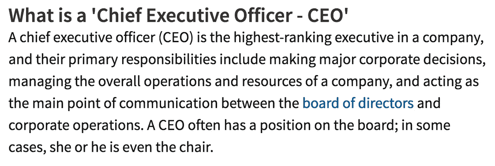

# 致下一任企业家的公开信

> 原文：<https://medium.com/swlh/an-open-letter-to-the-next-entrepreneur-9b823c299d14>

Photo courtesy of [Death To Stock](https://medium.com/u/d0db01bdbd7d?source=post_page-----9b823c299d14--------------------------------)

## 你可能有一家新的移动应用初创公司，但无论你多么渴望成为首席执行官，你可能都不是

我用我昨天 的 [**故事稍微搅了一下锅，所以我们不妨更进一步。**](/@rongibori/stop-pushing-your-job-title-and-go-do-something-b59bd987b2f)

# 你真的是 CEO 吗？

我们生活在这样一个时代，每个人都喜欢给自己一个宏大的头衔。也许是为了推销自己，或者让他们早上醒来时感觉良好。但是当我再深究一点，我发现大多数自称 CEO 的人真的就是不明白。

## **你真的知道首席执行官是什么吗？真的有人知道吗？**

根据定义，首席执行官是这样的:

[http://www.investopedia.com/terms/c/ceo.asp](http://www.investopedia.com/terms/c/ceo.asp)

你看到定义中是如何强调“董事会”的吗？这是关键。

我假设你在 Kickstarter 上运行的新 iPhone 应用程序概念还没有一个董事会，而你是董事会的负责人。

如果是这样，你就不是 CEO。现在就把它从你的 Twitter 和 Instagram 上删除吧。

# 相信我，我支持你的成功

我并不是说你不应该尝试做任何事情或者冒险，因为这个世界需要你。

我渴望看到谁能超越像优步这样改变生活的移动应用，或者谁能彻底改变我洗衣服的方式。不管是什么，总会有令人惊奇的事情发生，每个人都必须从某个地方开始。

但我如此热情地谈论职称和你如何推销自己的原因是，我希望你在未来尽可能地成功。

# 现在保护自己，将来会有回报

你不必在 23 岁就成为 CEO。这个标题被淡化了，以至于没有人再对它印象深刻。

每个人都是某个行业的首席执行官。

我最不希望你去参加面试，而你最引以为豪的事情是成为一家移动应用初创公司的首席执行官，在这家公司里，你连一个董事会成员的名字都叫不出来(因为它根本不存在)。

我永远不会鼓励某人走安全路线。去做一个新的移动应用程序创业是没问题的。我知道你成功的机会很小，但我鼓励你去追求它。

## **我希望这是一个警钟**

就像我在上一篇文章中说的，让别人给你一个头衔，而不是给你自己一个。

几乎所有的事情都是通过努力而不是口头表达来实现的，感觉会更好。

[*罗恩·吉博瑞*](https://www.linkedin.com/in/rongibori) *是*[*Idea Booth*](http://www.idea-booth.com/)*的创意主管，这是一家位于芝加哥的广告公司和智库，专门从事颠覆性创意和数字营销。*

FOLLOW ON QUORA

FOLLOW ON LINKEDIN

FOLLOW ON INSTAGRAM