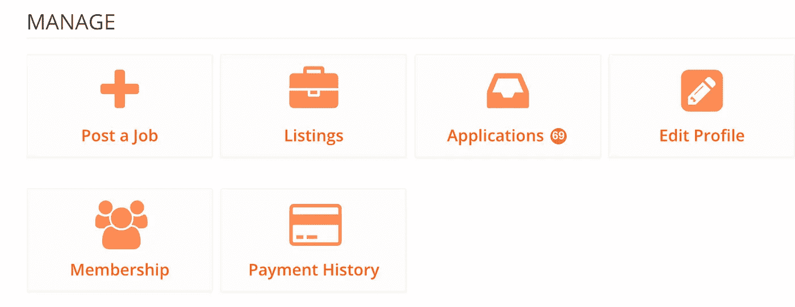
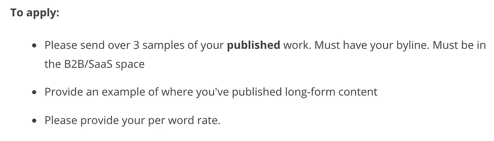
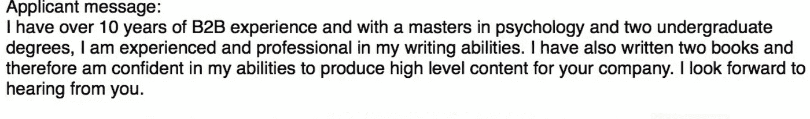

# 致“挣扎中”的自由职业者的公开信…

> 原文：<https://medium.com/swlh/an-open-letter-to-the-struggling-freelancer-24a13b6f0ef8>

我以前做过自由职业者，所以我明白。

我知道持续工作很难。

我知道试图从你的客户那里要求公平的报酬是很难的。

我知道它经常会变得非常孤独。

但是它也有好处。

想在沙滩上工作，喝着鸡尾酒，就像“大师”们那样吗？没问题，去做吧。

想花一整天看《网飞》,然后在最后期限前的晚上完成工作吗？没问题，去做吧。

想在不需要征得同意的情况下，尽可能多地抽出时间做自己喜欢的事情吗？没问题，去做吧。

# 是很难找到客户，还是你不够努力？

我最近贴出了一份招聘新作家加入我的团队的工作清单。

让我告诉你，我很惊讶有这么多申请人想和我一起工作。

69 people applied.

但是我感到震惊的是，很少有人花几分钟通读应用程序来遵循几个简单的步骤。

申请有 122 个单词。人们平均以每分钟 200 字的速度阅读。因此，大多数人可以在不到一分钟的时间内阅读并理解应用程序。

申请过程并不复杂。

我没有要求 17 个推荐人或者你从 12 岁开始写论文以来的全部工作经历。

我要求三件简单的事情:

当我收到这样的申请时，我感到非常震惊:(注意:任何敏感数据都被省略了。我在这里不是为了标记和拖拉，我只是想强调我所看到的零工经济的现状。

1.  很公平，你有 10 年的 B2B 经验。
2.  你有两个学位。
3.  但我要的是你作品的样本。
4.  在这个(非常)短的帖子里，我对你一无所知。我能确定你是否能生产高水平内容的唯一方法是因为你告诉了我。这是 s **怎么不说的经典案例。**

1.  首先，这个角色是内容营销者，而不是内容管理者。我在这里可能显得很迂腐，但是当你不得不通读 60 多份申请时，像这样的小细节真的会让你厌烦。
2.  第二，这份工作从来没有在 LinkedIn 上登过广告？？？？这是一个经典的剪切和粘贴案例，尽管如此，实际的剪切和粘贴应用程序甚至还不够好。

这看起来好像我在试图挑自由职业者的毛病，但事实并非如此。

在我收到的所有糟糕的申请中，有一小部分人:

1.  坚持简短
2.  看起来他们真的很适合

我想在这里澄清的是，对于你发送的每份申请，40 个人会发送一份比 T2 差得多的申请。

如果你按照简介去做，并不难脱颖而出，向他们展示为什么你是这份工作的合适人选，展示你对所有优点的热爱:不要复制粘贴你的申请。

因此，在你开始考虑你的自由职业生涯不顺利，或者你没有得到你想要的客户类型之前，认真考虑一下你在申请中投入了多少努力。

## 这篇文章发表在 [The Startup](https://medium.com/swlh) 上，这是 Medium 最大的创业刊物，有+392，714 人关注。

## 订阅接收[我们的头条](http://growthsupply.com/the-startup-newsletter/)。

