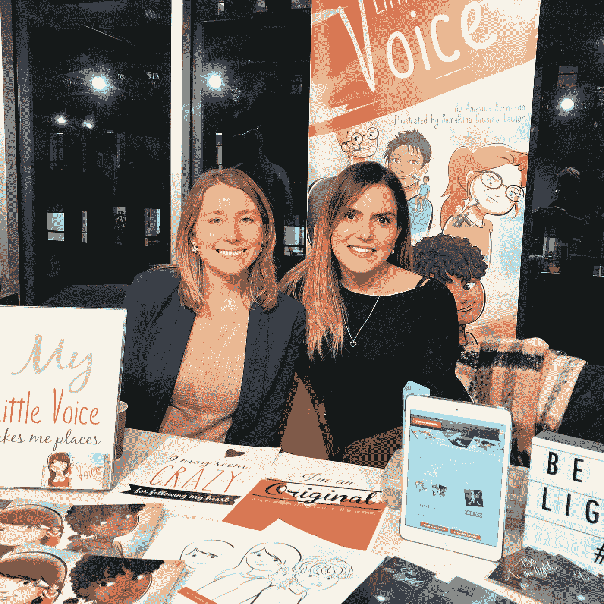

# 白天是分析师，晚上是图书出版商和作者

> 原文：<https://medium.com/swlh/analyst-by-day-book-publisher-and-author-by-night-8e90fd2c9059>

在这个系列中，我将讨论如何在朝九晚五之外找到你的创造性出路，通过采访那些正在这样做的人。我制作了 [*这个网络系列*](https://www.youtube.com/playlist?list=PLhxBW0Sj7XDsjGQ_qILVjPdKyiyr8bXmq) *，作为一名有抱负/业余艺术家的创意教练，我想继续展示那些想出如何实现他们艺术抱负的个人的故事。关于如何从有抱负的/业余爱好者变成专业人士的建议，请访问 amenjafri.com 并注册我的时事通讯。*

这是阿曼达·贝尔纳多。

Amanda Bernardo

她白天是财政委员会秘书处的分析师，晚上是“小声音图书”的共同所有者，也是一名儿童作家。每卖出一本书，Little Voice Books 都会向慈善活动和运动捐赠一部分。

**是什么让她开始的**

阿曼达形容自己从年轻时就对阅读和写作充满热情。她一直知道她想将这一点融入未来的职业生涯——问题是如何做到。

像大多数人一样，她一开始是有学位的，在卡尔顿大学学习英国文学和历史，希望能借此进入教学生涯。她很早就很清楚自己想做的不仅仅是教书。她走上了一条不同的道路，开始从事公共政策方面的工作，同时继续在渥太华教育网络(Ottawa Network for Education)从事志愿者工作，该网络将专业人士与小学生配对进行阅读。

当和学生们一起做志愿者时，阿曼达有了灵感。她注意到，读完之后，“……之后讨论的机会很少。没有机会强加智慧或建议，也没有机会探索孩子的想法或感受”，她说。

阅读会很快结束，孩子们会向她敞开心扉，讲述他们在学校的一天，以及他们所经历的感受和挑战。

阿曼达说，她的公司“小声音图书”诞生于 2014 年，旨在“……创造意识，激励下一代读者”。虽然最初她只想出版一本儿童书籍，但她意识到市场对她的想法有需求，这促使她成立了这家公司。

**作家之路**

一开始，阿曼达考虑去一家大型出版公司。她送来几封信和手稿供考虑。然而，她的最终目标不同于其他人，她打算创建一个社会意识平台。考虑到这一点，她决定走自助出版路线，她的第一个想法是谷歌如何。

她研究了作者可以利用的途径类型，并评估了利弊。自助出版的作者有很多不同的选择，但是阿曼达有出版一本书以外的雄心，所以她进一步分解了这个过程。

“为了出版我的书，我首先需要找一个插图画家来把我的文字变成现实。我记得在我的 LinkedIn 上看到了一个当地平面设计师的作品集，并联系她一起喝杯咖啡。我们的咖啡约会最终变成了商业伙伴关系，我们决定一起踏上这趟旅程，”阿曼达说。

花了一年时间完成文本、插图、格式和建立印刷合同。他们还与当地一家印刷公司合作。阿曼达的第一本书《小小的声音》于 2014 年底出版，在网上和当地分会都有售。

**花在朝九晚五之外的时间**

Amanda 管理着从客户关系、电子商务平台、社交媒体到合作伙伴关系的所有事务。这些大部分都可以通过虚拟方式完成，所以她在日常通勤中挤出时间，更新社交媒体，阅读电子邮件，在晚饭后探索增长和扩张的机会，然后在睡前写博客。

阿曼达还包装和准备书籍以便运输，有时每两天去一次邮局。在一些周末，她和她的商业伙伴会举办当地的签售会，或者在公司支持的组织中做志愿者。

**克服技术挑战**

Amanda 的公司面临的挑战之一是向渥太华以外扩张，以及作为官方出版商进入市场。

“与此相关的一个技术挑战是配送。大型发行公司通常希望与拥有五种或更多图书的知名出版公司合作。虽然一些发行公司确实为像我们这样的小型出版公司提供了机会，但发行成本超出了我们目前的预算，这再次对我们的增长构成了挑战，”Amanda 说。

**克服不安全感**

虽然我一直梦想着出版自己的书，但我也一直害怕与他人分享我的作品。写作对我来说一直是非常私人的事情。它成了分享我的想法和感受的一个出口，并最终成为我写下我不能说的话的一种手段。考虑到这一点，当要和别人分享我的话时，我犹豫了。我害怕暴露，害怕被评判，害怕自己不够好”，阿曼达说。

她的第一本书开始是一首给自己的诗，一首迫使她倾听自己内心声音的诗，一首鼓励她追逐梦想并抛开阻碍她如此之久的恐惧的诗。

阿曼达的第二本书《灯塔》更具挑战性。它教导孩子们心理健康，她敏锐地意识到这个话题的重要性和解决这个问题所需的敏感性。为了解决这个问题，她和精神健康倡导者一起工作。

成为一名作家也需要公开演讲。

“虽然我对任何规模的观众都能自如应对，但当被要求谈论我的出版公司的某些方面时，我突然感到喉咙里有一只青蛙；尤其是我为支持老年痴呆症和心理健康所做的筹款和志愿者工作。

阿曼达再也不能躲在纸和笔后面谈论深刻的个人话题，她训练自己去完成，尽管这个过程仍然不容易。在 2015 年 6 月的一次活动中，她召集了 150 名女性，并在开场白中分享了《小小有声读物》背后的故事。

“……在 150 名妇女面前，我突然泪流满面。当我第一次因为逃避自己而感到被情感出卖时，我突然拥抱了它们，并意识到我的痛苦是我的故事的一部分，就像我的事业的其他方面一样。这种痛苦突然帮助其他人理解了我的公司存在的理由，以及为什么回报对我来说如此重要。

**为它腾出时间**

阿曼达的待办事项是待办清单。她还利用休息和停机时间，并认识到有些周末，小声音必须让位于其他优先事项。

阿曼达说:“管理一份白天的工作和一份兼职可能很有挑战性，也很耗时，但你必须找到一个最适合你的灵活的日常工作。”。“订单是我总是优先考虑的事情，因为我们突然与读者达成了交付产品的承诺，但我确实在业务的其他方面找到了更多的灵活性，以确保我自己的心理健康得到考虑”。

她还试图每月与她的商业伙伴联系一次，概述他们今年的目标和优先事项。

**外卖**

如果你对某件事充满热情，但不确定如何将它融入你的日常生活，不要放弃它。坚持不懈，你会找到机会实现它。它可能不会马上发生，但要一直记在心里。

自助出版和走自己动手的路线是从头开始把你的项目掌握在自己手中的强有力的方法。它不会使你的项目比传统出版商的项目更不可行或更不合法。这也给了你一个超越传统媒体所能提供的机会。

作为一个创造者，公开你的恐惧和弱点是可以的。把你分享这些的能力看作是一种优势，而不是潜在的弱点，不利于你的抱负。

明智地为你的兼职安排时间，但要认识到你也是人，总有需要休息的日子——工作仍然会在那里，并且会在一天结束时完成。

我希望这篇文章对你有用。如果你有任何关于在日常工作之外管理创意渠道的建议，请在下面的评论中告诉我，如果你想成为这个系列的主角，请[联系我](mailto:amen.jehan@gmail.com)！

## 这篇文章发表在[《创业](https://medium.com/swlh)》上，这是 Medium 最大的创业刊物，有 284，454+人关注。

## 订阅接收[我们的头条新闻](http://growthsupply.com/the-startup-newsletter/)。

