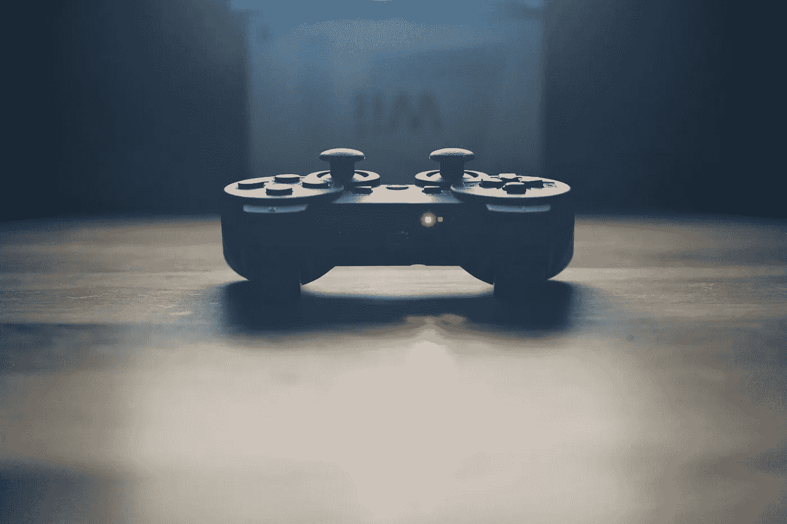

# 分析一下你是如何度过时间的，你会意识到有很多空闲时间

> 原文：<https://medium.com/swlh/analyze-how-you-spend-your-time-and-you-will-realize-there-is-plenty-of-free-time-4822adfc0659>

Photo by [@pawelkadysz](https://unsplash.com/@pawelkadysz): [https://unsplash.com/photos/CuFYW1c97w8](https://unsplash.com/photos/CuFYW1c97w8)

昨晚，我六个月来第一次见到了我的一个兄弟。和他聊天真的很愉快。

在我们家，我们一直是在玩电子游戏中长大的，所以没过多久我们就开始谈论我们都拥有的任天堂 Switch。

切换的好处是，他可以在他的大屏幕电视上玩，我可以在手持模式下玩，我们获得了“相同”的体验。因此，即使在旅行时，我仍然设法赶上我的视频游戏时间。

他已经用了两个月了，他已经玩了 50 个小时的马里奥奥德赛，135 个小时的马里奥赛车和 20 个小时的塞尔达。

他有一份全职工作，他的女朋友，他的侄子在隔壁，他也经常画画，所以他并不是不做其他事情。

如果我们计算一下，比如说，8 周内有 205 个小时的游戏时间。也就是每周 25 小时多一点。

如果这对你来说听起来很多，也许分析你如何度过你的空闲时间会是一个有趣的练习。

# 分析你的空闲时间

我经常在媒体上发布我详细而疯狂的时间表。我很清楚我每天是如何度过时间的。当你分析你的空闲时间时，你不必那么有条理。

玩视频游戏很容易，因为大多数平台会记录你花的时间。

如果你看网飞的电视节目，简单的算术就是把你看过的所有剧集加上节目时长。

我们都知道每部电影的时长，所以把它们加起来也很容易。

体育和其他身体活动通常很容易计算。

一定要把通勤时间算作自由时间。这可能是最大的时间下沉。几乎没有通勤时间，你就有更多的时间花在你想做的事情上，而不是你必须做的事情上。

# 但是为什么要分析呢？

很多人都很忙。他们受到时间的压力，因为忙而拒绝做事。然而，当你分析他们如何度过时间时，他们肯定会抽出一些空闲时间做其他事情。

我痴迷于时间。在我们离开之前，我们都有有限的时间。

我昨天又经历了一次，当我和我妈妈去看兽医时，她告诉我妈妈，如果她不想让她的猫受苦的话，很可能不得不尽快实施安乐死。

人生苦短。我们都必须在某一点上离开。

我个人喜欢知道我已经尽我所能在这里度过了我的时间。

我非常喜欢学习，所以我花很多空闲时间学习新技能。

明天我要去看我的祖父母。他们老了。我把自己放在他们的位置上，我想在那个时候我自己不会后悔。至少我是如何度过我的时间的。我想说我已经尽我所能过上了最好的生活。

首先要知道我是如何度过我宝贵的时间的。

# 结论

我们确实有很多空闲时间。我们没那么忙。

当我们分析如何度过时间时，我们意识到有更好的方式来度过时间。

用你想用的方式花掉它。不要成为你坏习惯的奴隶。

你能做到的！

**感谢阅读和分享！:)**

**如果你喜欢这个故事，请随意**👏👏👏**几次(最多五十次。说真的)。想要获得自我提升的额外帮助和更多，请查看******。****

****

## **这个故事发表在 [The Startup](https://medium.com/swlh) 上，这是 Medium 最大的企业家出版物，拥有 298，432+人。**

## **在此订阅接收[我们的头条新闻](http://growthsupply.com/the-startup-newsletter/)。**

****