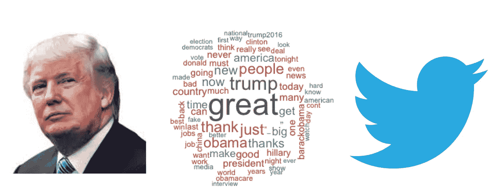

# 分析特朗普的推文

> 原文：<https://medium.com/swlh/analyzing-trumps-tweets-5368528d2c90>

## 基于数据的特朗普推特语言分析

Word Cloud of Trump’s Tweets

唐纳德·特朗普总统代表了许多第一。在我看来，其中最重要的，也是将在未来几年改变政治的，是他对社交媒体的使用。

从来没有一位在任总统上过推特。在过去的几代人里，很难找出什么是最强大的…