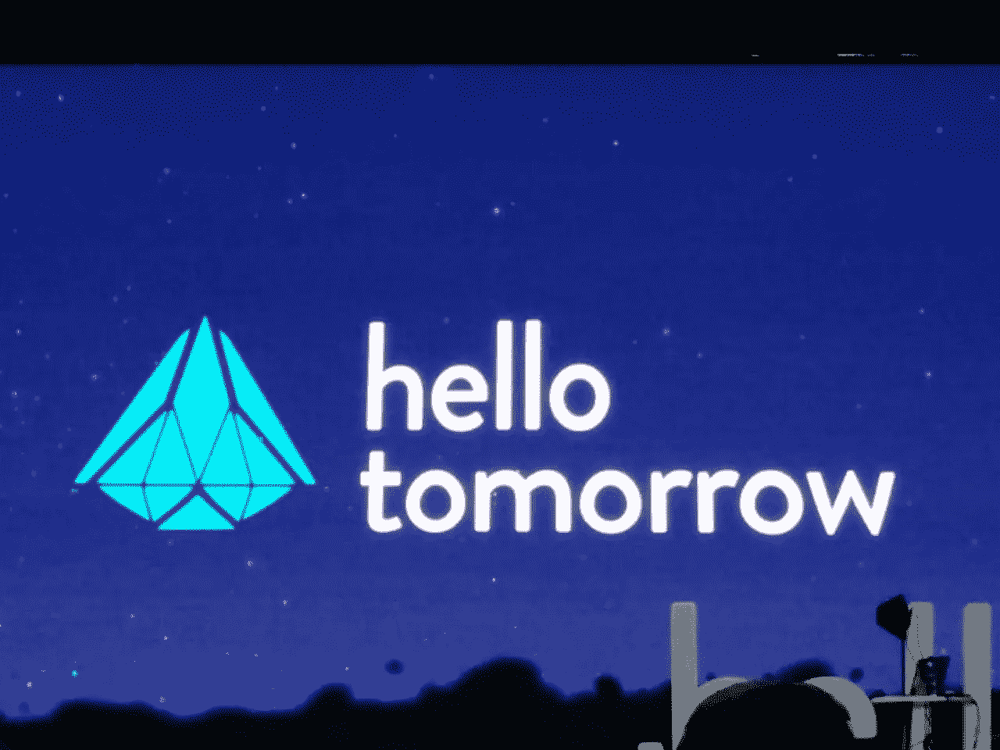

# 然后，接下来呢？

> 原文：<https://medium.com/swlh/and-then-whats-next-6605beb6913>

拿一些机器学习，对物联网的热情，撒上区块链，摇一摇(不要搅拌)，这就是下一次颠覆，让世界变得更美好。如此简单！

跟踪技术趋势可能意味着开发新产品实际上就是这么简单。事实上，现在每个人都可以更快地获得免费的开源软件和硬件来制作原型和部署，3D 打印足够负担得起来动态地构建定制设备，从机械零件到房屋和建筑。然后，类人机器人行走和[烹饪](http://www.moley.com)完美变得普遍，区块链作为继个人电脑和互联网之后的第三次重大数字革命进入每个人的脑海，以确保高价值资产的直接交换，预计到 2020 年(仅两年)将有 500 亿台联网设备协助你的日常生活，增强现实将变成现实和虚拟的混合。

我们是幸福的一群，生活在那个繁忙的时代，通过智能绿色技术，一切似乎都有可能给人类带来更美好的未来。

希望它会发生。想想 20 世纪初，当物理学取得重大发现时，当最先进的发明在巴黎万国博览会上亮相时，当自然科学的发现动摇了人们对地球上生命的理解时，知识分子的欢欣鼓舞。与此同时，像通用电气和 IBM 这样的公司是由有远见的科学家和工业家创立的，他们用电力应用和计算机来彻底改变消费者的生活。

这种精神引领创新直到今天。现在，在我们获得完全可操作的自动驾驶汽车(甚至[自动驾驶商用飞机](http://www.independent.co.uk/life-style/gadgets-and-tech/news/boeing-start-testing-self-flying-planes-autonomous-aircraft-no-pilot-artificial-intelligence-a7798901.html))之前，还需要一些时间。是完善技术的时候了，也是我们适应和信任它的时候了。

有趣的是，这引出了一个问题:接下来会发生什么？就像一个世纪前，一个天才头脑正在建设未来的可持续产业，发射火箭往返，设计前所未有的交通网络。然后是深度科技创业运动，其旗舰会议 [Hello Tomorrow](https://hello-tomorrow.org/) ，利用科学为这个资源日益减少的消费社会的未来食品、健康和流动性构建解决方案。

等待这部科幻小说成为现实，人类将会发生精神上的转变，用一个巨大的燃烧人来庆祝这个机器人正在做工作的新世界。

Hello Tomorrow conference (photo by F. Javid)

## 这篇文章发表在《创业公司》杂志上，这是 Medium 最大的创业刊物，有 315，628 人关注。

## 订阅接收[我们的头条](http://growthsupply.com/the-startup-newsletter/)。

