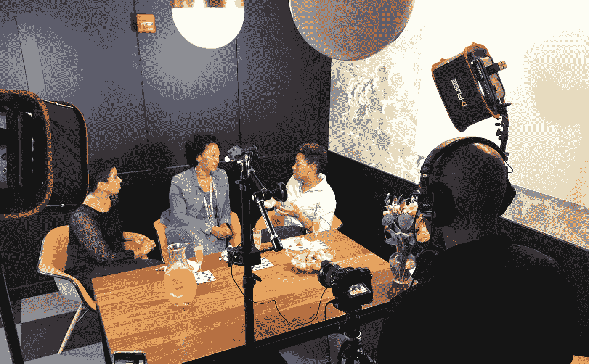

# 对于女性科技创业者来说，曝光率和融资一样是个大问题

> 原文：<https://medium.com/swlh/andtech-d591c21a5d3a>

最近，我一直在探索如何利用我作为沟通策略师的才能和技能来帮助填补女性科技创始人的空缺。有这么多的组织和倡议涌现出来，但资金和退出的差距仍然存在。

我不认为我们缺少了不起的女性，她们正在开发创新技术来改善我们的日常生活方式。我们在外面！我认为问题是，**没有人知道我们的存在。**也许没人在找我们，或者他们不知道去哪里找我们。不管怎样，**曝光都是一个障碍**。

我通过最近推出的 [Beauty + Tech](http://www.beautyandtech.co/) 测试了这一理论，这是一个为新兴的女性领导的美容科技企业创建的数字社区，旨在参与、合作和展示。这个概念受到了极大的热情——仅在第一天，就有大约 50 家美容科技初创公司提交了在网站和社交媒体上的特写。一些创始人已经在顶级出版物上获得了国家媒体的报道，但仍在努力保持知名度和获得资金。

有趣的是，大多数提交特写的女性并没有关注美容+科技社交媒体页面或加入脸书小组，因为现实是，每个特殊兴趣都有大量的亲和小组。相反，他们的主要焦点是宣传。

同样显而易见的是，这些创始人不仅很难找到推广业务的方法，他们还努力以令人信服的方式描述自己的企业。

除了需要资金和指导之外，女性科技创业者通常还需要帮助来讲述她们的故事。因此，我与我的实际#BFF，一位资深记者合作，拓宽了***+科技*** 的概念，以促进更多高质量的新兴女性领导的、**特定行业的**科技企业。

我们推出了**美容+科技**、**健身+科技、**和**妈妈+科技**。目标是在网站、社交媒体和专门的博客上聚焦选定的企业。此外，我们最近拍摄了**+科技电视**的前几集，这是一个每周一次的在线“客厅聊天”系列，将与最好和最坏的新兴创始人、有影响力的人和投资者进行对话。

Beauty + Tech TV Shoot. Delia Goncalves (WUSA9 News Washington, DC-left); Shani Blount (Founder, [CurlMatch](http://www.curlmatch.com/)-middle); Dr. Kristian Henderson (Founder, [BLK+GRN](https://www.forbes.com/sites/macaelamackenzie/2018/06/29/why-dr-kristian-henderson-created-a-clean-beauty-platform-for-black-entrepreneurs/#5450268eb273))

***+Tech*** (目前)不收费，但这笔交易不会永远持续下去。将来，将收取象征性的订阅费。

我们知道，我们没有解决世界饥饿问题。但是，我们确实在帮助全世界的女性科技创业者创造公平的竞争环境，为她们提供了另一个被发现的平台。

一定要在社交媒体上关注 [***+Tech***](http://www.instagram.com/andtechfounders) ，在你的旅程中分享其他创始人的故事。

如果您有问题或对合作感兴趣，请发电子邮件给 Ayanna@beautyandtech.co |[**联系**](https://www.linkedin.com/in/dcpublicist/)**艾安娜·史密斯。**

**[**www.beautyandtech.co**](http://www.beautyandtech.co/)|[www.andtech.co](http://www.andtech.co/)(2018 年 9 月 24 日上线)**

****

## **这篇文章发表在 [The Startup](https://medium.com/swlh) 上，这是 Medium 最大的创业刊物，拥有+ 370，437 名读者。**

## **在这里订阅接收[我们的头条新闻](http://growthsupply.com/the-startup-newsletter/)。**

****