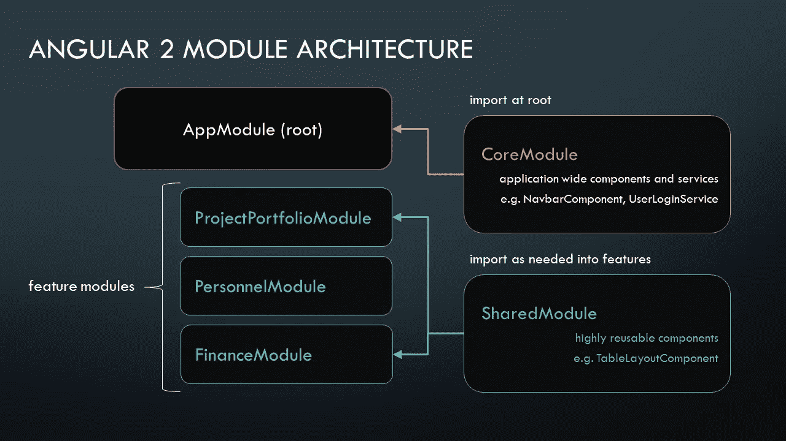
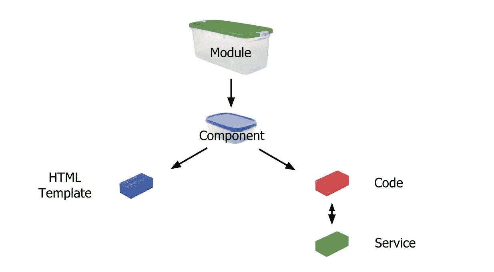

# 组件和模块之间的角度差异

> 原文：<https://medium.com/swlh/angular-component-vs-module-b8c7347c604e>

# 组件

**NgModule** 是你用 Angular 编写 app 时最先遇到的基本结构之一，但也是最复杂的，因为**不同的作用域**。

每个 Angular app 都有一个名为`AppModule`的*根模块*，它提供了启动应用的机制。

NgModules 可以从其他 NgModules 导入功能，并允许其他 NgModules 导出和使用自己的功能。

NgModules 是 Angular 应用程序中可共享(独立)的单元。我们有不同类型的模块:

*   系统(路由器等)
*   其他模块
*   自定义模块
*   第三方模块(ngrx、rxjs 等)。

Angular 中的模块可以延迟加载，这意味着它们在需要的时候加载，而不是总是加载！延迟加载显著提高了 Angular 应用的性能。

Angular 文档有一个关于 NgModules 的 [FAQ。](https://angular.io/guide/ngmodule-faq)

# 成分

一个**组件**控制一个叫做*视图的屏幕补丁。*

它是 Angular 应用程序中 UI 最基本的构建块。它是一个带有特殊装饰器(@Component)和模板的指令。

Component decorator 允许您将一个类标记为 Angular 组件，并提供额外的元数据来确定在运行时应该如何处理、实例化和使用组件。

# **模块** *vs* **组件**

***模块*** 可以认为是*组件*、指令、服务、管道、助手等的集合。

每个 ***组件*** 可以使用其他*组件*，在同一个*模块*中声明。要使用在其他*模块*中声明的组件，它们需要从那个*模块*中导出，而*模块*需要被导入到我们需要该功能的*模块*中。

许多*模块*中的一个组合起来形成一个**应用**。

# 提示:

将您的代码组织成:

*   不同的功能模块，
*   智能/非智能-可重用组件

帮助管理复杂应用程序的开发。

对于那些想要更详细解释的人，Toptal 上有一个很棒的帖子，在这里查看。