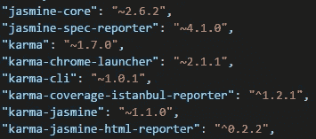
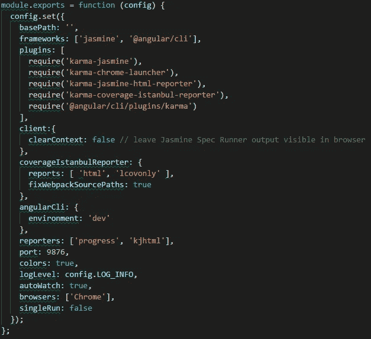
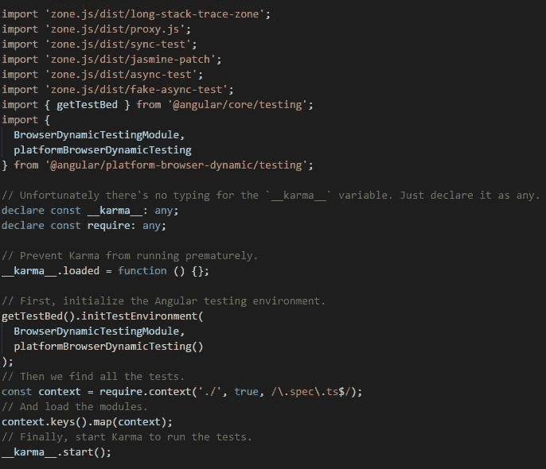
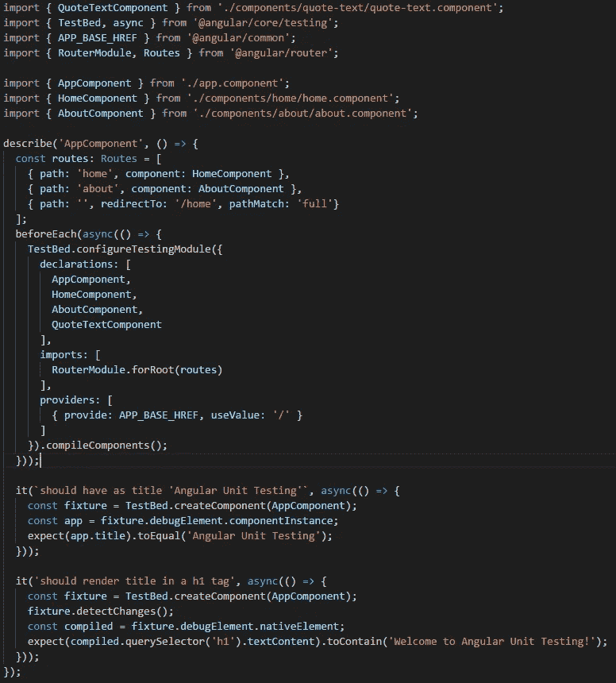
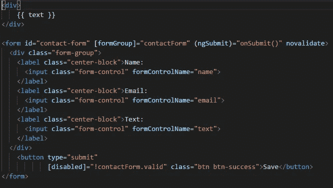
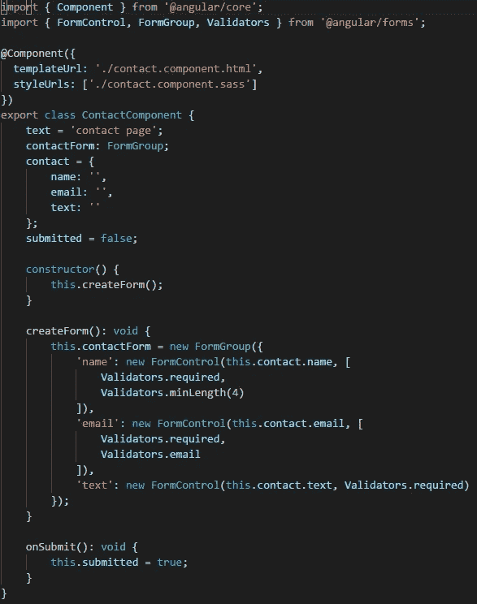
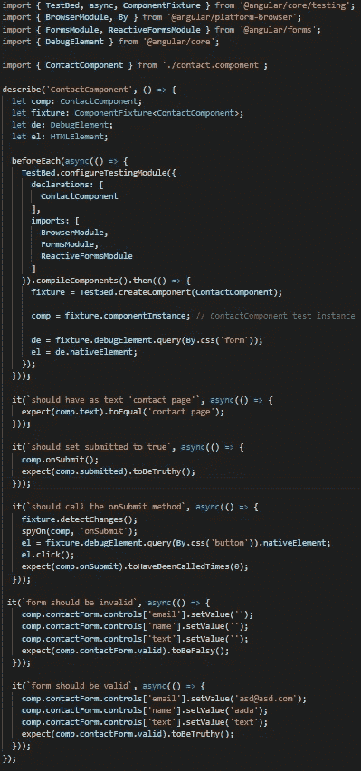
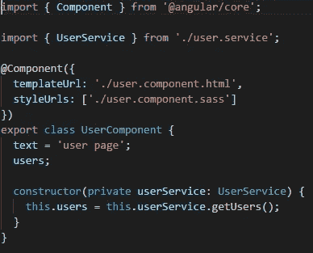
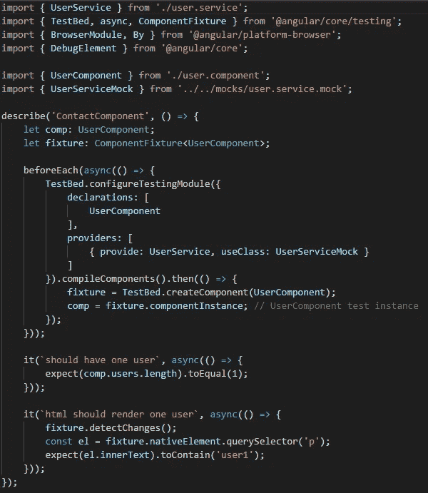

# Angular:单元测试 Jasmine，Karma(循序渐进)

> 原文：<https://medium.com/swlh/angular-unit-testing-jasmine-karma-step-by-step-e3376d110ab4>

在任何至少试图严肃对待的项目中使用单元测试是必须的，不管你是否选择使用 TDD(测试驱动开发)方法，使用它都会有很多好处。

在本文中，我们将首先简要介绍单元测试的好处，然后我们将使用 jasmine 和 karma 创建一个完整的角度单元测试示例，解释过程的每一步。

## 单元测试的好处

让我们先来看看我认为在你的解决方案中使用单元测试的主要原因…

*   **改进实现的设计。**
    在开发人员中，不经过深思熟虑就开始编写一个特性是非常常见的错误。使用单元测试会迫使你思考和重新思考设计，如果你使用 TDD，影响会更大。
*   **允许重构。**
    既然你已经有了确保一切按预期运行的测试，你可以很容易地对代码进行修改，并确信你没有添加任何错误。
*   在不破坏任何东西的情况下添加新功能。当你添加一个新特性时，你可以运行测试来确保你没有破坏应用程序的任何其他部分。

还有很多，但这三个已经是任何项目中的一个巨大胜利，对我来说是交易的达成者。但是如果你还不相信，让我们再提几个。

*   测试是很好的文档。
*   测试让开发人员对他们的工作更有信心。

> 你可以说他们所有的好处都是以极大的代价换来的:时间，但这是完全错误的。当你引入新的特性或者进行任何重构的时候，使用单元测试所花费的时间与它们为你节省的时间相比是很少的。花费在解决 bug 上的时间将会比不使用单元测试时大大减少。

让我们找点乐子……我们将使用 Angular、Jasmine 和 Karma 创建一个小而完整的应用程序示例。

这些是我们将要谈论的一些事情:

*   解释一下工具 karma 和 jasmine。
*   解释一下 karma 配置。
*   解释测试条目文件。
*   创建第一个简单的测试。介绍 jasmine 和角度测试功能。
*   测试角形。介绍 jasmine 和角度测试功能。
*   用服务测试组件。介绍角度测试功能。

## 用茉莉和业力创造一个有棱角的项目

正如 angular 团队建议的那样，我们将使用 [angular-cli](https://cli.angular.io/) 来创建我们的应用程序。通过这样做，茉莉和业力的结构就为我们解决了。

安装 angular-cli 并创建一个新项目:

1.  npm 安装-g @angular/cli
2.  ng 新角度单位测试

当您创建项目时，所有的依赖项都被安装在其中，这是您创建测试所需要的一切。

在上图中，您可以看到为测试目的而安装的所有依赖项。让我们来看看更重要的。

*   **茉莉花芯。** [Jasmine](https://jasmine.github.io/) 是我们将要用来创建测试的框架。它有很多功能，允许我们编写不同类型的测试。
*   **因果报应。** [Karma](https://karma-runner.github.io/1.0/index.html) 是我们测试的任务运行器。它使用一个配置文件来设置启动文件、报告器、测试框架、浏览器等等。
*   其余的依赖项主要是我们测试的报告器、使用 karma 和 jasmine 的工具以及浏览器启动器。

要运行测试，您只需运行命令“ng test”。这个命令将执行测试，打开浏览器，显示控制台和浏览器报告，同样重要的是，让测试的执行处于观察模式。

## Karma 配置

我们来看看 angular-cli 创建的 karma 配置文件。

您可能已经猜到了这些配置属性的用途，但是让我们来看看其中的一些。

*   框架:这是 jasmine 被设置为测试框架的地方。如果你想使用另一个框架，这是一个好地方。
*   **记者**:这里是你设置记者的地方。您可以更改它们或添加新的。
*   **自动观察**:如果设置为真，测试以观察模式运行。如果您更改了任何测试并保存了文件，测试将重新构建并重新运行。
*   **浏览器:**这是您设置运行测试的浏览器的地方。默认情况下，它是 chrome 浏览器，但你可以安装和使用其他浏览器。

## 测试入口文件

karma 的 angular-cli 配置使用文件“test.ts”作为应用程序测试的入口点。让我们看看那个文件。

我们这里有很多事情要做。你可能永远不需要修改这个文件，但是让我们来讨论一些正在发生的事情；

*   正在使用文件开头的所有导入创建一个运行角度测试的环境。
*   TestBed 是 angular 提供的一个强大的单元测试工具，它在这个文件中初始化。
*   最后，karma 加载应用程序的所有测试文件，根据正则表达式匹配它们的名称。我们的应用程序文件夹中所有名称中带有“spec.ts”的文件都被视为测试。

## 我们的第一个测试

让我们创建我们的第一个测试。让我们对我们的 app.component.ts 这样做。这个组件只有一个值为“Angular Unit Testing”的属性“text ”,它呈现在 HTML 中的“h1”标记内，它还包含路由根元素和一些路由链接。让我们创建一个测试文件来检查组件是否真的具有那个属性，并且真的在 HTML 中呈现。

让我们看看这里发生的一切；

*   我们导入所有将要使用的角度测试工具。
*   我们导入该组件的所有依赖项。
*   我们使用一个“describe”来开始我们的测试块，其标题与被测试的组件名称相匹配。
*   我们在每个之前使用一个异步。异步的目的是让所有可能的异步代码在继续之前完成。

在 angular 中运行任何测试之前，您需要配置一个 angular testbed。这允许您为正在测试的组件创建一个角度环境。测试组件需要的任何模块、组件或服务都必须包含在测试床中。最后，在设置配置之后，调用编译组件函数。

对于 app.component，我们需要配置一个虚拟路由模块，并使用一个提供程序来设置基本 href，如果没有这个，测试将不会编译，因为我们正在设置路由模块，它需要一个基本 href。

最后，我们有两个测试。我们先来看第一个。

*   在第一个测试中，我们检查组件是否在“title”属性中包含了预期的文本。
*   首先，我们需要有一个 app.component 的实例，为此，我们使用 angular testbed 的 create component 函数，结果，我们得到一个 fixture 对象，它将允许我们创建该组件的实例。
*   现在我们有了 app.component 的实例，我们可以检查 text 属性中的值，并使 jasmine expect 等于预期值。

第二个测试做了一些类似的事情，但是它检查 dom 是否呈现了“text”属性。

*   首先，它执行与其他测试相同的操作，获取 app.component fixture，然后执行 detect changes 函数，该函数将组件更改应用于 HTML(在本例中，我们将插值应用于“text”组件属性的 DOM)。
*   然后获取编译后 HTML 的原生元素(组件呈现的 HTML)。
*   最后，我们选择包含“文本”值的“h1 ”,并期望所选的 HTML 包含预期的值。

## 测试表单

现在让我们看看如何测试一个角形。我们先来看 contact.component HTML

这很简单，不需要任何解释。这只是一个使用窗体控件的规则角形。如果表单无效，提交按钮将被禁用。

现在让我们看看，contact.component

这个组件也很容易理解。提交时函数只是将提交的属性更改为 true。联系人表单有三个带有验证的控件。

现在让我们看看，这个组件的测试；

与我们之前看到的测试相比，这次测试有许多不同之处，不要担心，我们将逐一讨论。

*   首先，我们有 import 部分，这里没有什么奇怪的，除了我们引入了“By ”,它允许我们从 DOM 中选择元素。
*   我们用要测试的组件的名称来声明测试块。
*   我们将创建一些测试范围的对象，我们将在不同的测试中使用它们，这些测试将在“beforeEach”中初始化。
*   “beforeEach”的第一部分是设置启动测试模块所需的所有依赖项。我们已经提到了“异步”的原因。
*   在这个例子中，我们使用“compileComponents”函数返回的承诺。当承诺被解决时，我们给每个变量赋值，我们在开始时声明。
*   第一个测试只是期望组件实例具有“text”属性的预期值。
*   第二个测试期望当调用“onSubmit”函数时，组件“submitted”的属性为真。
*   第三个测试使用“fixture”对象的函数“detectChanges”将组件状态应用于 HTML，然后从 DOM 获取提交按钮并触发 click 事件。在这之前，我们在组件的“onSubmit”函数上创建一个 jasmine“spy”。最后，我们希望不要执行 spied 函数，因为表单无效，按钮应该被禁用。
*   第四个测试为组件表单设置了无效值，并期望表单有效属性为 false。
*   最后，在第五个测试中，我们为表单设置了有效值，并期望表单 valid 属性为 true。

在结束这篇文章之前，让我们再看一样东西。我们将看到当我们测试的组件使用服务时，如何处理服务。

## 用服务测试组件

正如我们已经看到的，当您要用服务测试一个组件时，您需要将提供者添加到在“beforeEach”中创建的测试模块中。问题是，你可能不想使用实际的服务，而是一个模拟版本，所以让我们看看如何做到这一点…

首先，让我们看看组件的实现；

这是一个从服务中获取用户列表的简单组件。

实际的服务实现并不重要，它可以从任何地方获取用户，但是让我们看看如何为模拟服务实现的组件创建测试。

这个测试类似于我们之前看到的例子，有一个主要的区别，在测试模块的提供者声明中，我们告诉模块，当服务“UserService”被注入时，它应该使用“UserServiceMock”来代替。“UserServiceMock”是我们创建的一个虚拟服务，它返回虚拟数据来运行组件的测试。仅此而已，这就是你在测试一个组件时应该如何模拟你的服务。

## 结论

我们讨论了一系列特性和示例，试图解释如何测试角度元件，正如您所见，这非常简单，您可以执行任何不同类型的测试。我希望这篇文章能帮助你更好地理解如何使用这些工具来测试 angular。

[GitHub 链接](https://github.com/SantiagoGdaR/angular4-unit-test)