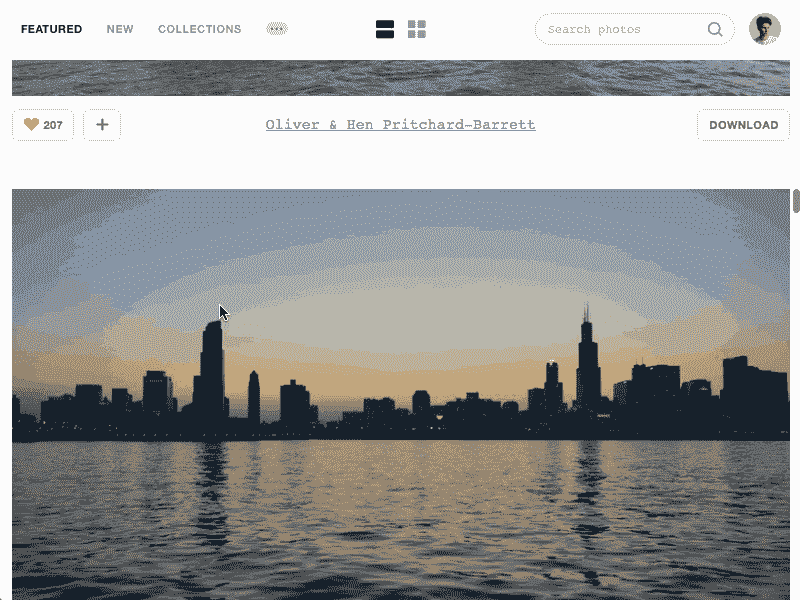
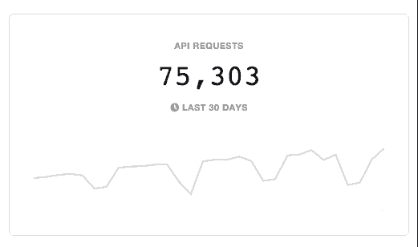

# 宣布 Unsplash 4.0

> 原文：<https://medium.com/swlh/announcing-unsplash-4-0-3421b47d8f88>

今天是真正的大日子。比圣诞节还大吗？值得商榷。你父母的纪念日？看情况。但是确定无疑的是，这是一个月中最重要的一天…一年中最重要的星期四…也是*有史以来最棒的 2 月 25 日！* —至少对于 Unsplash 的粉丝来说是这样。

原因如下:

*   **Unsplash 系列**
*   **Unsplash API**
*   **Unsplash 喜欢**
*   **去飞溅搜索**

F 首先，一点背景故事……今年，我们不起眼的小网站 [Unsplash](https://unsplash.com/) 成为了世界第三大摄影网站，同时也是有史以来发展最快的摄影网站的亚军(领先的团队是[pretttty solid](https://www.instagram.com/))。

然而，你可能不知道的是，与大多数大型摄影网站不同，Unsplash 并不是以一个雄心勃勃的初创公司开始的——它是从一个 Tumblr 账户开始的，有一个简单的前提:每 10 天 10 张新策划的照片，但有一个超级特殊的秘密成分:每张照片都可以 100%免费使用****。****

**事实证明，给人们自由使用漂亮的照片做他们想做的任何事情(个人项目？公司网站？专辑封面？杂志视觉效果？)肯定会让这些照片像野火一样传播开来。**

**我们知道“病毒式”这个词经常被提起——但毫无疑问:Unsplash 是世界上最具病毒式的摄影平台。Unsplash 上的照片比出现在**纽约时报的头版、**时代杂志的封面、或者**金·卡戴珊的 Instagram** 上的照片被浏览的次数更多。照片出现在 Unsplash 上后，会出现在各种随机的地方——广告牌、苹果商店、Buzzfeed 文章、网站、应用程序、 [Twitter 账户](https://twitter.com/words)——左边、右边和中间。它们被重新想象和混合成电影、海报和其他我们从未预见到的形式。**

************

**The Billboard 100; Adobe keynotes; Pinterest homepage: just some of the places where we’ve seen Unsplash photos pop up**

**今天，Unsplash 的社区有 40，000 名摄影师，他们的照片每月被观看超过 6 亿次。不体面的散居者甚至更多。**

**正如你可能正确推测的那样，当你进入“数亿张照片”的领域时，技术要求变得更加令人望而生畏，所以我们不得不为 Unsplash 建立大量基础设施，因为我们很久以前还是 Tumblr 博客。但是除了拥有一个速度惊人的网站之外，我们也一直在努力开发新的方法来使 Unsplash 体验更好。我们不仅仅是指添加更多的[猫](https://unsplash.com/search?utf8=✓&keyword=cats)的照片。**

**今天，我们很高兴为我们的社区推出 4 个(大)新功能:**

# **1.0 Unsplash 系列**

**Unsplash 的特别之处在于，你在我们网站上看到的每一张照片都绝对、完全、*惊人地*美丽。我们收到了成千上万的照片，这些照片是由各种经验水平的摄影师拍摄的——从 iPhone 业余爱好者到专业摄影师，再到像 [NASA](https://unsplash.com/nasa) 这样的名人。整理这些照片可不是闹着玩的。**

**当流行的照片网站让你看到你的朋友的照片时，人们来 Unsplash 是为了看照片。为了确保每张 Unsplash 的特色照片都是十分之一，我们招募了一群策展人来挖掘我们的档案，并决定哪些照片将出现在 Unsplash 的主页上。**

**之前的策展人有[马特·莫楞威格](https://medium.com/u/45af3b7db7a9?source=post_page-----3421b47d8f88--------------------------------)(WordPress 创始人)[许荣](https://medium.com/u/d4eee21866a1?source=post_page-----3421b47d8f88--------------------------------) (NYT 设计总监)[盖伊·川崎](https://medium.com/u/48f43b52b6dd?source=post_page-----3421b47d8f88--------------------------------)(苹果成名)[杰弗里·泽尔德曼](https://medium.com/u/355cb93fe914?source=post_page-----3421b47d8f88--------------------------------)、[丹恩·佩蒂](https://medium.com/u/11f703142c25?source=post_page-----3421b47d8f88--------------------------------)、[布里特·莫兰](https://medium.com/u/1b0d42df30d4?source=post_page-----3421b47d8f88--------------------------------)、[戴夫·莫兰](https://medium.com/u/652de9fe92e3?source=post_page-----3421b47d8f88--------------------------------)、[托拜厄斯·吕特克](https://medium.com/u/5c66c5fed63e?source=post_page-----3421b47d8f88--------------------------------)、[奥姆·马利克](https://medium.com/u/7fdfc2c95a10?source=post_page-----3421b47d8f88--------------------------------)、[克里斯·梅西纳](https://medium.com/u/2229dec1a44f?source=post_page-----3421b47d8f88--------------------------------)**

**但不一定要出名才有好品味。这就是为什么我们为 Unsplash 社区打造了一个全新的体验，让你可以策划你自己的 Unsplash 照片集。我们一直在大力测试这项功能(从我们的名人朋友开始)，今天我们很自豪地与您分享。看看这个:**

****

# **2.0 Unsplash API**

**感谢我们的摄影师和策展人，我们帮助建立了互联网上最大的(也是最漂亮的)可重复使用的照片数据库。虽然这本身就是一个壮举，但我们希望让其他人更容易在他们的项目中使用 Unsplash 照片。**

**在幕后，我们已经创建了 [Unsplash API](https://source.unsplash.com/) ，这是一个强大的工具，允许开发者用 Unsplash 数据库中的内容填充他们的应用程序和网站。**

****

**所以现在，除了处理我们的*自己的*网站上的所有照片请求，我们的 API 现在还处理数千种其他应用程序和工具的照片请求。以下是候选名单:**

*   **[帕布罗通过缓冲器](https://www.producthunt.com/tech/pablo-2-0-by-buffer)**
*   **[隐形飞船](https://www.producthunt.com/tech/craft-by-invision)**
*   **[Imgix 的餐垫](https://www.producthunt.com/tech/placemat)**
*   **[超过](https://www.producthunt.com/tech/over-3)**
*   **[Irvue](https://www.producthunt.com/tech/irvue)**
*   **[Meld](https://www.producthunt.com/tech/meld-2)**
*   **[slash.photo for Slack](https://www.producthunt.com/tech/slash-photo)**
*   **[草图插件](https://www.producthunt.com/tech/unsplash-sketch-plugin)**
*   **[去飞溅瞬间](https://www.producthunt.com/tech/unsplash-instant-2)**
*   **[描绘](https://www.producthunt.com/tech/depict)**
*   **弗劳恩**
*   **[重力](https://www.producthunt.com/tech/gravit)**

**以及一堆其他不使用正式 API 的 app(像[这个](https://www.producthunt.com/tech/imgix-sandbox)和[这个](https://www.producthunt.com/tech/human-6)和[这个](https://www.producthunt.com/tech/wallcat)还有其他几百个)。**

**我们总是对人们发现的不清晰照片的新奇用例感到惊讶。由于 Unsplash API，数百万人将能够在其他应用程序中欣赏 Unsplash 照片——甚至不知道他们是 Unsplash 照片！我们迫不及待地想看到我们的开发人员社区在未来几个月里推出的智能工具。**

# **3.0 Unsplash 喜欢**

**这个世界充满了按钮。衬衫的纽扣。电梯按钮。本杰明·巴顿斯。**

**不起眼的纽扣有着悠久而传奇的历史。但是按钮幸福的果实还没有降临到 Unsplash 的居民身上。直到现在。**

**没错:我们的野蛮时代结束了。Unsplash 终于扣上了。**

****

**是的，好吧——‘像纽扣’已经存在十年了。但请相信我们:我们是加拿大人。消息传到这里很慢。**

**经过几个月的严格测试(以及成千上万的赞)，我们认为这是值得正式宣布的:**

**在每张未刷过的照片旁边，你会发现一颗红色多汁的大心脏。你可以随心所欲地贴上许多照片。只需点击按钮来喜欢照片…或取消点击不喜欢它。因为你怎么处理你的纽扣是你的事，伙计。**

**在您的 [Unsplash 个人资料](https://unsplash.com/join)中，您可以看到所有您喜欢过的照片。如果你查一下任何一个不帅的摄影师的简介，你也能看到他们喜欢什么。**

****

**使用“喜欢”按钮为照片添加书签以获取灵感。用它来告诉你最喜欢的摄影师你认为他们很棒。或者，如果你喜欢我们的会计师克里斯，你可以用它来[喜欢每一张里面有菠萝的未刷照片](https://unsplash.com/chrisliverani/likes)。**

**因为你怎么处理你的纽扣是你的事，伙计…**

**(要加入我们这个紧密团结的按钮爱好者社区，在这里建立一个 Unsplash 个人资料[。我们希望你和我们一样喜欢喜欢。)](https://unsplash.com/join)**

# **4.0 Unsplash 搜索**

**是的，没错。好像从脸书的剧本里偷还不够…我们还从拉里和谢尔盖的剧本里偷了一本。**

****

**这个已经在烤箱里有一段时间了，但我们最近达到了一个重要的里程碑: **3，000，000 个可搜索标签**，由活生生的人创建。(不是机器人。)**

**Unsplash Search 现在是最强大、用户友好的照片搜索引擎之一，这都要归功于 Unsplash 社区不懈的努力。**

**四大功能:收藏、API、喜欢、搜索。因此，无论您是在管理、喜欢、应用还是标记照片，我们都希望您会喜欢我们的团队在 Unsplash 4.0 中的更新。**

# **没有你，这是不可能的，❤**

**所以请给你们自己一点掌声。**

****

****PS:我们要出版一本** [**的书**](http://book.unsplash.com/) **。****

**[Unsplash 2016。不保留任何权利。](https://unsplash.com)**