# 使用 Rapidminer 和 Python 进行异常检测

> 原文：<https://medium.com/swlh/anomaly-detection-using-rapidminer-and-python-9a83508460a5>

我一直觉得异常检测可能是机器学习的一个非常有趣的应用。我能想到几个可以使用这种技术的场景。

在本文中，我将描述我用 Kaggle 的信用卡欺诈检测数据集进行的一些实验。该数据集包含欧洲持卡人在 2013 年 9 月两天内的信用卡交易。在总共 284，807 个例子中，有 492 个是欺诈。因此，数据集是高度不平衡的，正类(欺诈)仅占所有交易的 0.172%。您可以想象任何这样的数据集都将是高度不平衡的，因为预期的欺诈或异常案例仅占总交易的一小部分。

我分两部分进行分析。首先，我在 Python 中对数据集进行了欠采样，保留了所有欺诈案例，并随机选择了一些非欺诈案例，这样在最终数据集中欺诈案例就有了很好的代表性。在第二部分中，我使用 Rapidminer 开发模型来预测异常情况。Rapidminer 是一个基于 GUI 的机器学习平台，使您能够设计用于构建和评估模型的流程和工作流。你甚至可以在没有编码背景的情况下做到这一点，所以我认为它对于那些想要快速应用这些技术并实现价值而不必通过过度编码来奋斗的管理者来说是一个非常有用的工具。

原始数据集本身可以通过下面的链接从 Kaggle 下载

[](https://www.kaggle.com/dalpozz/creditcardfraud) [## 信用卡欺诈检测

### 标记为欺诈或真实的匿名信用卡交易

www.kaggle.com](https://www.kaggle.com/dalpozz/creditcardfraud) 

由于是金融数据，数据集中的要素是原始要素的 PCA 变换。所以你看到的只是没有背景信息的数值，交易是完全匿名的。第一列是从第一次开始的每个事务的时间(以秒为单位),我在分析中丢弃了这一列。然后有 28 个数字特征以及一个金额特征列，即交易金额。**最后一列是 1 代表欺诈案例的类别。**这是我们希望模型学习并能够预测新交易的列。

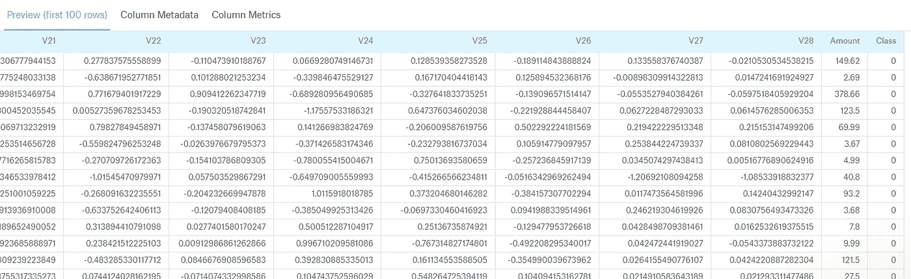

Dataset preview

现在这种不平衡数据集中的问题是类列中的 1 很少。这些是我们希望能够学习和预测的欺诈案例。然而，如果您的模型只是简单地预测所有的 0，您仍然会获得非常高的准确率> 99%，因为大多数交易无论如何都不是欺诈，但您将不会检测到任何异常。

因此，我没有使用完整的数据集，而是创建了原始数据集的一个子集，将欺诈案例很好地表示为新数据集中案例的总体百分比。这是用 Python 完成的，如下所述。

```
*# load required libraries*
from numpy import concatenate
from pandas import read_csv
from pandas import DataFrame
from sklearn.preprocessing import MinMaxScaler
import pandas as pd
import numpy as np

num_features = 30 *#Number of features in the dataset*
label_feature = 'Class' *#The column in dataset that model is being built to predict*
```

上面的库是这段代码所必需的

```
*# Reading in the dataset which is in .csv format, has column headings and has an index column*
dataset = read_csv("creditcard2.csv", header = 0, index_col = 0, squeeze = True, usecols = (i for i in range(0, num_features+1)))
```

然后是原作。读取 Kaggle 数据集的 csv 文件时，第一个包含时间数据的列被视为索引列。该列只包含数据集中第一个事务的时间信息，因此我认为它不是一个可用于预测的有用特性。

```
scaler = MinMaxScaler(feature_range=(-1, 1))
dataset['normAmount'] = scaler.fit_transform(dataset['Amount'].reshape(-1, 1))
dataset = dataset.drop(['Amount'],axis=1)
```

然后，我使用了 MinMaxScaler 来规范化 Amount 列，否则与其他列相比，它的值范围会非常不同。在使用数据进行机器学习之前，这是一般的良好做法。保留这个新的规范化金额列，删除原始金额列。

```
# Move label column to the end of dataset
cols_at_end = [label_feature]
dataset = dataset[[c for c in dataset if c not in cols_at_end] + [c for c in cols_at_end if c in dataset]]
```

我通常使用上面的代码将标签列移动到数据集的末尾，这样便于阅读并在需要时将其分离出来。在这种情况下，它已经在末尾，所以上面的代码没有变化。

```
*# Number of datapoints belonging to the minority class*
number_fraud = len(dataset[dataset.Class == 1])

fraud_indices = np.array(dataset[dataset.Class == 1].index)

*# Finding out the indices of the normal class*
normal_indices = dataset[dataset.Class == 0].index

*# Out of the normal indices, randomly select fraud number of occurences*
random_normal_indices = np.random.choice(normal_indices, number_fraud, replace = False)

random_normal_indices = np.array(random_normal_indices)

*# Appending the 2 sets of indices*
under_sample_indices = np.concatenate([fraud_indices, random_normal_indices])

*# Under sample dataset from the selected indices*
under_sample_data = dataset.loc[under_sample_indices,:]
```

上面的代码获取原始数据集中欺诈案例的数量，然后随机选择相同数量的非欺诈案例来构建一个 50:50 的欠采样数据集。如果你仔细观察，上面的代码有一个错误。这与……有关。loc 操作数，它不完全执行我们想要的，我无法解决这个问题。但我仍然得到了一个欠采样数据集，其中有近 28%的欺诈案件，所以我继续前进。也许在未来的某个时刻，我可以解决这个错误。

```
under_sample_data.to_csv('Undersampled.csv', encoding='utf-8', index=False)
```

最后，我们将欠采样数据集导出为. csv 文件，该文件将在 Rapidminer 中用于剩余的分析。所以从现在开始，我们在 Rapidminer 工作室工作。

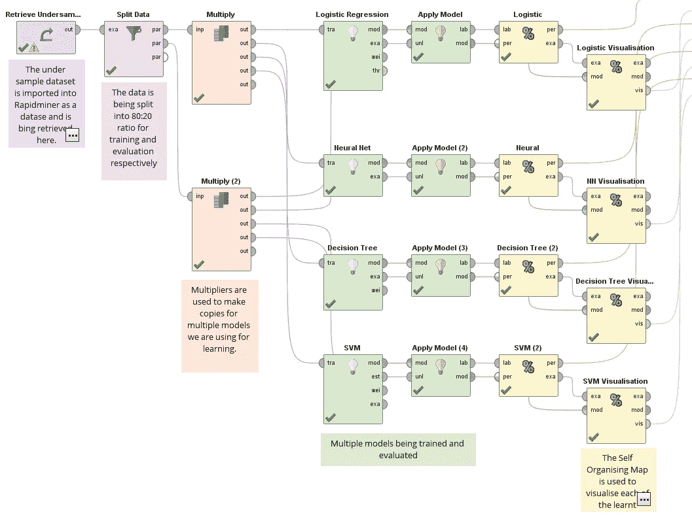

Rapidminer Process Flow

上面显示了在 Rapidminer 中实现的过程。使用 Rapidminer 界面，很容易看到和理解正在发生的事情。上面使用的操作符是拖放操作，因此非常容易实现。我们通过洗牌对欠采样数据集进行 80:20 分割，并使用其多个副本来训练多个预测器。将每个学习模型应用于 20%验证分割，并获得结果。我还使用了可视化操作的自组织映射(SOM)来实际可视化学习到的模型。

我比较了 4 种技术:逻辑回归，这是这种二项式分类任务的默认选择，神经网络，决策树和支持向量机。该过程运行不到一分钟，结果如下:

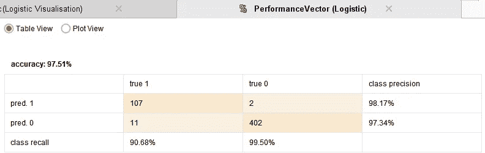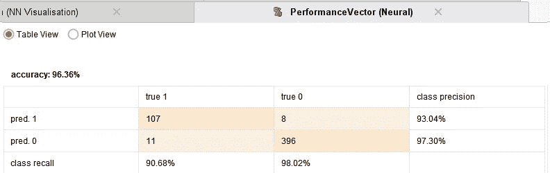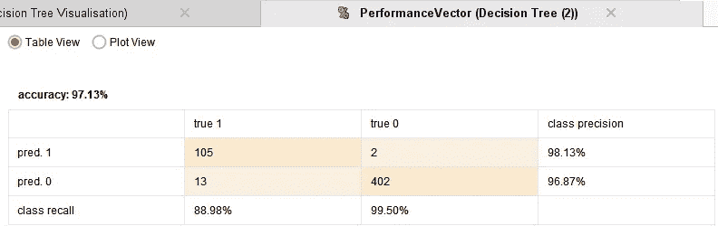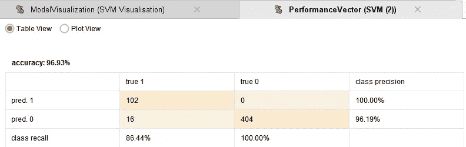

从上面的结果可以看出，每个模型都做了很好的预测。准确度相当不错。逻辑回归是最好的表现。所以建立一个异常检测系统真的很简单！一些欺诈案例被遗漏，可能需要进一步微调。

可视化算子的自组织映射通过将学习到的模型缩减到二维空间来帮助可视化它们。下面显示了四个可视化的摘要，每个点代表预测的类。可以清楚地观察到边界，显示所学的分类。你也可以观察到亮橙色或浅蓝色的点，这是少数错误预测的情况。

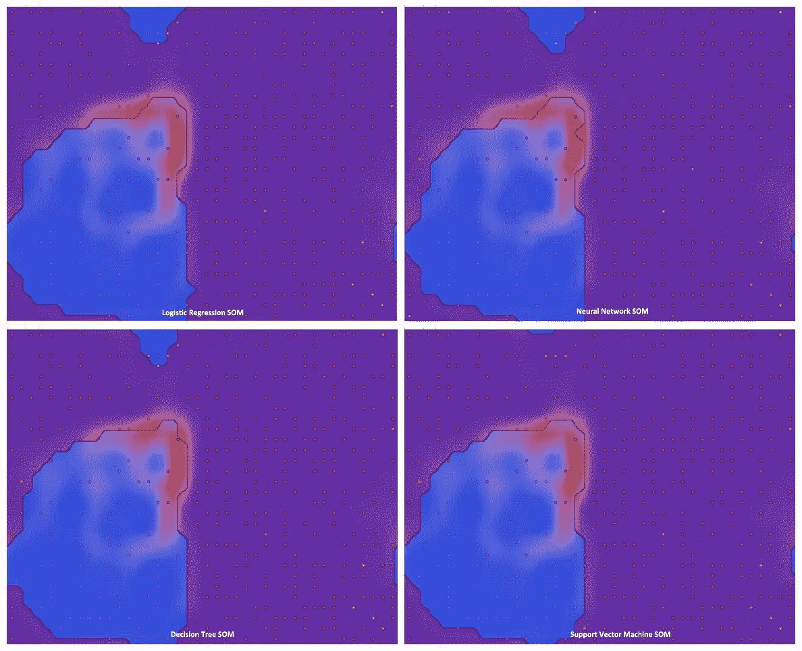

SOM visualizations

这样，还有最后一步要完成，那就是使用整个数据集，应用学习到的模型，并观察它对完整数据的表现。该过程类似于上面显示的 Rapidminer 过程，只是您使用的是原始数据集，而不是 20%分割数据副本。工作室版本只能处理 10，000 个数据点，但应该足够了。获得的结果如下。

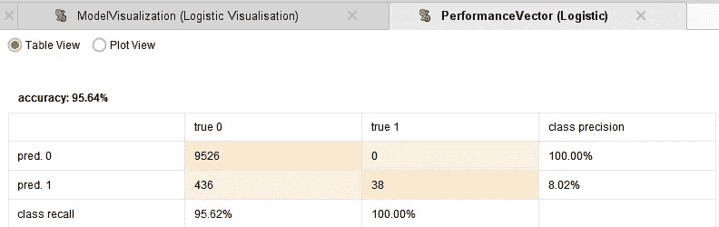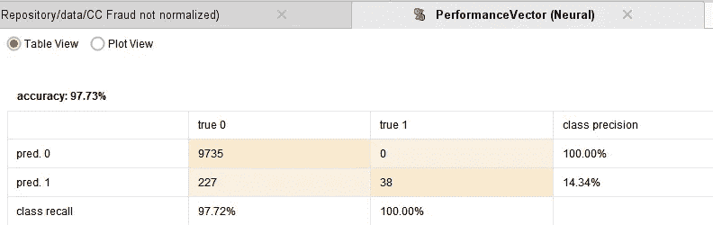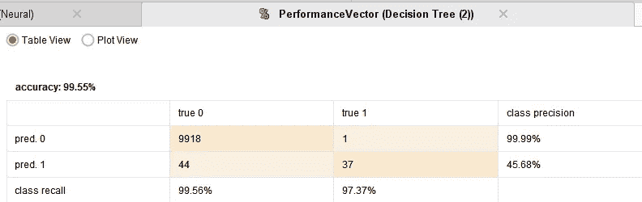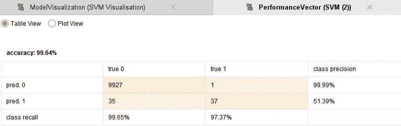

可以看出，虽然逻辑回归和神经网络模型捕获所有欺诈案件，但是它们也预测假阳性，这可能导致大量非欺诈案件的调查。虽然决策树和 SVM 模型做出的假阳性预测要少得多，但它们也确实遗漏了一个实际的欺诈案例。人们必须根据这些结果决定使用哪种模型。也许可以根据交易金额进行调查，或者可以使用一组模型进行预测。

这种技术可以应用于其他领域—保险的异常应用、异常清单填写等。真正的困难在于捕获正确的数据，这些数据可以作为用于训练的数据集的一部分，这就是需要规划和创造力的地方。

希望这篇文章是一个有趣的阅读！


## 这个故事发表在 [The Startup](https://medium.com/swlh) 上，这是 Medium 最大的创业刊物，有 295，232+人关注。

## 订阅接收[我们的头条](http://growthsupply.com/the-startup-newsletter/)。

