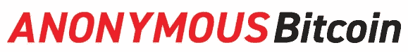
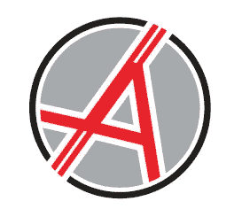
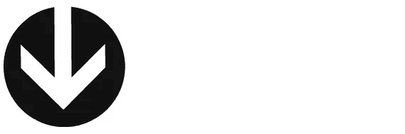
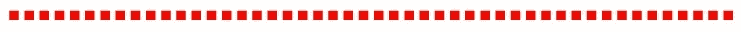

# 匿名比特币(ANON)官方悬赏活动

> 原文：<https://medium.com/swlh/anonymous-bitcoin-anon-official-bounty-campaign-7ea01c3bc4b>

# 官方悬赏活动

匿名比特币**(“ANON”)**是比特币和 ZClassic 区块链通过两种加密货币的联合发展而取得的技术进步。我们正在引入社区认为重要的区分因素，这些因素使我们有别于以前的分叉。其中的一些因素包括通过使用主节点、增加块大小和透明的开发过程来进行堆栈。开发团队将不断分享更新。**fork 将向 z classic(“ZCL”)和比特币(“BTC”)的所有持有人提供 1:1 比例的匿名比特币(“ANON”)**。

我们目前正致力于在多个交易所上市，同时引入一整套隐私和长期效用。匿名比特币旨在改善加密社区利用隐私的方式，并彻底改变“无创造者”看待加密的方式。由于有效的沟通是大规模采用的关键，我们的营销策略旨在触及那些尚未涉足密码领域的人。

# [网站](https://www.anonymousbitcoin.io/) | [执行摘要](https://www.anonymousbitcoin.io/executive_summary) | [白皮书](https://www.anonymousbitcoin.io/whitepaper)

叉日期:2018 年 9 月 10 日

# $ANON

## 我们匿名比特币公司(Anonymous Bitcoin，简称“ANON”)激动地宣布，我们将启动官方赏金活动！我们的计划旨在奖励在更大的加密社区中帮助提高意识和传播匿名消息的支持者。活动的重点是高质量的内容创作和社区参与，每个人都可以通过各种方式做出贡献。

## 赏金基金:

**5500 ZCL**
*大约。截至 2018 年 6 月 17 日，55，000 美元

## 时机:

**10 周**
2018 年 6 月 18 日—2018 年 8 月 26 日

## 分发:

**活动结束后 1 周**

## 分配:

**→内容创作:35% (1950 年 ZCL)
→社交媒体:32% (1750 年 ZCL)
→签名:15% (800 年 ZCL)
→参与度:8% (450 年 ZCL)
→翻译:5% (300 年 ZCL)
→优秀储备:5% (250 年 ZCL)**

## 一般交易条件

*   赏金计划于世界协调时 2018 年 6 月 20 日下午 12:00(12:00)开始，于世界协调时 2018 年 8 月 26 日上午 3:59(3:59)结束
*   您必须在 2018 年 6 月 20 日之前年满 18 岁，才能参加奖金活动。
*   每人只允许一个参与账户。如果我们注意到多个帐户，我们保留终止参与和撤销所有奖励的权利。
*   作弊，使用机器人，垃圾邮件等。将不会被容忍，并会导致所有赢得的奖励没收。
*   我们保留自行决定将用户从任何活动中移除的权利，并放弃所有奖励，无需解释。
*   我们保留随时调整赏金活动条件的权利。
*   您需要继续访问您在注册时指定的 ZCL 钱包。您将无法在发布时更改它。
*   与赏金有关的问题和顾虑必须在专用的 [**赏金计划电报**](https://t.me/AnonymousBitcoinBounty) 中表达。
*   在主要的匿名社交渠道中重复出现与奖金相关的问题和顾虑将导致禁止/终止该计划并没收奖金。

## 为了参与，用户必须关注 ANON 的 4 个社交账户，并在注册时进行确认:

★ **无名氏** [**电报**](https://t.me/anonymousbitcoin)
★ **无名氏** [**不和**](https://discord.gg/2yTdK6s)
★ **无名氏** [**推特**](https://twitter.com/ANON_BTC)
★ **无名氏**[**Youtube**](https://www.youtube.com/channel/UCU-BMMTH8z0ow0xHjWZHRUg)
★**无名氏** [**中**](https://medium.com/anonymous-bitcoin)

## 请注意:

奖励货币是[**【ZCLASSIC】****($ ZCL)**](https://coinmarketcap.com/currencies/zclassic/)你需要在注册前获取一个 ZCL 钱包地址。ZCL 目前正在 Bittrex 和 Cryptopia 上交易。

# →→ [在这里注册](https://docs.google.com/forms/d/e/1FAIpQLScwSBJYDCQ2gOU_oGq8CHPfaJZwuH1t7FBuea629_tGYn8VQw/viewform)↓↓

# 活动 1:内容创建

旨在让匿名社区“创建者”有机会开发各种媒体格式的优质内容，以传播关于匿名比特币的消息和兴奋。

## 文章/博客
本次活动仅限 100 篇文章。

费率:

*   1 条= **5 条 ZCL**
*   双重 **(2x)** 卓越/高度参与奖
*   匿名团队成员投票选出的前 5 名将获得 **25 ZCL 奖金**

## 规则:

*   每人最多 5 张
*   文章必须写得好，被认为是高质量的。
*   必须用英语书写
*   最少 500 字
*   必须是原创素材。
*   必须公开发表。
*   不接受重复相同或非常相似的材料。
*   发布的平台/论坛必须是 crypto & ANON 的适当受众
*   网站/博客/论坛必须有现有的观众，而不是全新的。
*   必须有一个链接或引用回到一个匿名网站/资源/社会(如果允许发布)。
*   ZCL 将在活动结束时分发。
*   我们保留权利认为任何物品不合格，没有理由。

## 参与:

*   **在此提交文章**
*   ****跟踪您的参与** [**此处**](https://docs.google.com/spreadsheets/d/1o47Pw5arMNsxXZ1qnGVZS-imHVea9w7U4bI5AT9Lj20/edit#gid=1117002964)**

## **视频
本次活动仅限 100 个视频。

费率:**

*   **1 视频= **5 ZCL****
*   **双 **(2x)** 卓越/高度参与奖**
*   **由匿名团队成员投票选出的前 5 名将获得 **25 ZCL 奖金****

## **规则:**

*   **每人最多 5 张**
*   **视频必须是高分辨率(+720p)**
*   **视频必须最小。长度为 2 分钟，或 30 秒的高质量动画。**
*   **内容必须是原创的，被项目经理认为是高质量的**
*   **必须公开发表。**
*   **必须在评论中链接到匿名网站/资源/社交网站(如果允许发布)。**
*   **ZCL 将在活动结束时分发。**
*   **我们保留权利认为任何视频不合格，没有理由。**

## **参与:**

*   ****提交视频** [**此处**](https://docs.google.com/forms/d/e/1FAIpQLSfcQHRxwZXZseukTN3OjqGGAztBP0QU1bmsfYidMfx7NMtKrw/viewform)**
*   ****跟踪您的参与情况** [**此处**](https://docs.google.com/spreadsheets/d/1o47Pw5arMNsxXZ1qnGVZS-imHVea9w7U4bI5AT9Lj20/edit#gid=1053513651)**

## **信息图表
本次活动仅限 100 张图片。

费率:**

*   **1 图像= **3 ZCL****
*   **双 **(2x)** 优秀和参与潜力奖**
*   **由匿名团队成员投票选出的前 5 名将获得 **20 ZCL 奖金****

## **规则:**

*   **每人最多 3 个**
*   **图像必须是高分辨率的。**
*   **必须是高质量的信息图表或宣传材料。**
*   **模因一般不被接受，除非有特别的质量和病毒潜力。**
*   **目标是在社交媒体上有效传播的图像，以提高兴奋度和认知度。**
*   **内容必须是原创的，被项目经理认为是高质量的**
*   **ZCL 将在活动结束时分发。**
*   **我们保留权利认为任何图像不合格，没有理由。**

## **参与:**

**给我发一个有以下信息的 Bitcointalk 或在 [**电报**](https://t.me/NytmareCrypto) **)****

*   ****您的 PM 标题应为**“匿名图像提交”**
*   ****内容应包括:****

**1.)Bitcointalk 用户名:**

**2.)Twitter 句柄:**

**3.)电报手柄:**

**4.)ZCL 钱包地址:**

**5.)提交的图像副本:**

****跟踪您的参与** [**此处**](https://docs.google.com/spreadsheets/d/1o47Pw5arMNsxXZ1qnGVZS-imHVea9w7U4bI5AT9Lj20/edit#gid=2085846306)**

****

# **活动 2:社交媒体**

**使核心支持者和关键影响者能够通过利用其社交网络的力量来扩大 ANON 的影响范围。**

## **Twitter
本次活动仅限 150 名参与者

费率:**

*   ****1 ZCL** 每周 x **10** 可能周数 **(10 ZCL)****
*   **由匿名团队成员投票选出的前 10 名客户(高质量/高参与度)将获得 **25 ZCL 奖金****

## **规则:**

*   **至少 300 多名关注者**
*   **配置文件必须是公共的。**
*   **帐户必须至少存在 3 个月。**
*   **帐户必须是真实的。不活跃，垃圾邮件，机器人或自动跟踪的帐户将不被接受。**
*   **不允许加入多个帐户。**
*   **每周至少要发 5 次推特或转发。**
*   **至少 1 条推文必须是原创的(非转发推文)。**
*   **材料必须是积极和适当的。**
*   **推文将在一周内传播，而不是在一天内发送。**
*   **每周活动的验证在周日进行。**
*   **ZCL 将在活动结束时分发。**
*   **我们保留无理由认为任何推文或账户不合格的权利。**

## **参与:**

*   ****在这里** 注册 Twitter 活动**
*   ******跟踪你的参与** [**这里**](https://docs.google.com/spreadsheets/d/1o47Pw5arMNsxXZ1qnGVZS-imHVea9w7U4bI5AT9Lj20/edit#gid=376771937)****

********

# ****运动 3:签名****

****允许 Bitcointalk 的主要大使倡导 ANON 并在主要的区块链社区论坛中传播意识。****

## ****比特币对话
本次活动仅限 40 名参与者

费率:****

*   ******每周 2 ZCL**x**10**可能周数( **20 ZCL** )****
*   ******10 ZCL 最佳创意签名奖******

## ****规则:****

*   ****必须有 Jr 会员或以上等级才能参加。****
*   ****不允许负信任的用户。****
*   ****必须创建一个匿名资产和网站和社交链接的创意签名。****
*   ****必须每周至少 10 个职位。****
*   ****只有建设性的和相关的职位将有资格获得 10 个职位的目标。夸大帖子数量的帖子将不会被计算在内。****
*   ****帖子必须至少有 50 个字符，才能计入每周目标。****
*   ****帖子将被分散在一周的过程中，而不是在一天内垃圾邮件。****
*   ****验证周活动发生在星期日。****
*   ****ZCL 将在活动结束时分发。****
*   ****我们保留无理由认为任何推文或账户不合格的权利。****

## ****参与:****

*   ******在这里** 注册签名活动****
*   ********跟踪你的参与** [**这里**](https://docs.google.com/spreadsheets/d/1o47Pw5arMNsxXZ1qnGVZS-imHVea9w7U4bI5AT9Lj20/edit#gid=1995106569)******

********

# ****运动 4:社区参与****

****通过奖励和表彰那些在我们的社交渠道中做出卓越贡献的人，培养一个专注而充满激情的 ANON 社区。****

## ****电报
价格:****

*   ****(2) **25 ZCL** 奖励**每月******
*   ****根据匿名团队成员的投票结果，每月授予**前 2 名**电报撰稿人****
*   ****贡献、活动、参与、建设性、有益性等因素。****

## ****规则:****

*   ****加入我们的官方电报[https://t.me/anonymousbitcoin](https://t.me/anonymousbitcoin)****
*   ****每周积极参与。****
*   ****积极贡献匿名电报社区，遵守社区规则和准则。****
*   ****不要给频道发垃圾邮件——投稿的质量将是投票的主要因素。****
*   ****我们保留权利认为任何用户没有资格，没有理由。****

## ****参与:****

*   ******跟踪您的参与** [**此处**](https://docs.google.com/spreadsheets/d/1o47Pw5arMNsxXZ1qnGVZS-imHVea9w7U4bI5AT9Lj20/edit#gid=761111482)****

##  ****不和谐
率:****

*   ****(2) **每月 25 个 ZCL** 奖项****
*   ******由匿名团队成员投票，每月授予**前 2 名**不和谐贡献者******
*   ****贡献、活动、参与、建设性、有益性等因素。****

## ****规则:****

*   ****加入我们的官方不和[https://discord.gg/2yTdK6s](https://discord.gg/2yTdK6s)****
*   ****每周积极参与。****
*   ****积极参与 ANON Discord 社区，遵守社区规则和准则。****
*   ****不要给频道发垃圾邮件——投稿的质量将是投票的主要因素。****
*   ****我们保留权利认为任何用户没有资格，没有理由。****

## ****参与:****

*   ******跟踪您的参与** [**此处**](https://docs.google.com/spreadsheets/d/1o47Pw5arMNsxXZ1qnGVZS-imHVea9w7U4bI5AT9Lj20/edit#gid=761111482)****

## ****最佳评论

评分:****

*   ****(3) **每周 3 次 ZCL** 奖**奖******
*   ****由匿名团队成员投票选出的 **Reddit、Twitter 和 YouTube**每周最佳评论(各 1 名获奖者)****
*   ****洞察力、热情、高参与度、幽默、建设性等因素。****

## ****规则:****

*   ****通过在官方匿名社交渠道上发表评论来积极参与。****
*   ****积极贡献并遵守社区规则和准则。****
*   ****不合适的岗位会导致取消资格。****
*   ****我们保留权利认为任何用户没有资格，没有理由。****

## ****参与:****

*   ******跟踪你的参与** [**这里**](https://docs.google.com/spreadsheets/d/1o47Pw5arMNsxXZ1qnGVZS-imHVea9w7U4bI5AT9Lj20/edit#gid=1056168721)****

## ****支持者赞赏

比率:****

*   ******(2)件**非品牌商品**周**(衬衫、帽子等)。)****
*   ****由匿名团队成员投票决定的自由奖****
*   ****热情、社区参与、参与度等因素。****

## ****规则:****

*   ****积极参与匿名电报和不和谐。****
*   ****积极贡献并遵守社区规则和准则。****
*   ****我们保留权利认为任何用户没有资格，没有理由。****

## ****参与:****

*   ******跟踪你的参与** [**这里**](https://docs.google.com/spreadsheets/d/1o47Pw5arMNsxXZ1qnGVZS-imHVea9w7U4bI5AT9Lj20/edit#gid=1173401666)****

********

# ****活动 5:翻译****

****利用机构群体的专业知识，为表现出强烈兴趣的国际机构群体提供多语言资源。****

## ****费率:****

*   ****白皮书= **20 ZCL******
*   ****网址= **10 ZCL******

## ****规则:****

*   ****翻译必须亲自完成——不允许使用谷歌翻译等翻译工具。****
*   ****翻译必须是高质量的——并且将由母语为该语言的人来评判。****
*   ****要预订一种语言，请张贴您的兴趣和相关翻译工作的链接。****
*   ****我们将联系您确认批准，以便您可以开始翻译。****
*   ****我们保留权利认为任何用户没有资格，没有理由。****

******已经完成的语言** 
**网站:**阿拉伯语、捷克语、荷兰语、法语、俄语
**白皮书:**无****

## ****参与:****

*   ******跟踪您的参与** [**此处**](https://docs.google.com/spreadsheets/d/1o47Pw5arMNsxXZ1qnGVZS-imHVea9w7U4bI5AT9Lj20/edit#gid=140514058)****

********

# ****活动 6:卓越储备****

****承认伟大和成就****

## ****250 ZCL 保护区将由 ANON 团队自行决定用于奖励、激励和庆祝 ANON 社区在奖金活动中的杰出表现。****

****准备金分配的触发示例:****

*   ****创建了高质量的内容，提高了标准****
*   ****广泛的视野/参与度/读者群****
*   ****开发一种特别有用的工具、见解或方法****

******如有疑问、帮助或关注请加入 ANON 赏金计划电报:**[**https://t.me/AnonymousBitcoinBounty**](https://t.me/AnonymousBitcoinBounty)****

********

## ****这篇文章发表在《T21》杂志的《创业》(T22)上，这是 Medium 最大的创业刊物，拥有 336，210 多名读者。****

## ****在这里订阅接收[我们的头条新闻](http://growthsupply.com/the-startup-newsletter/)。****

********