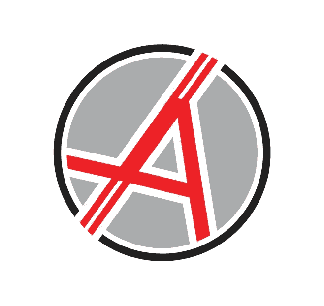
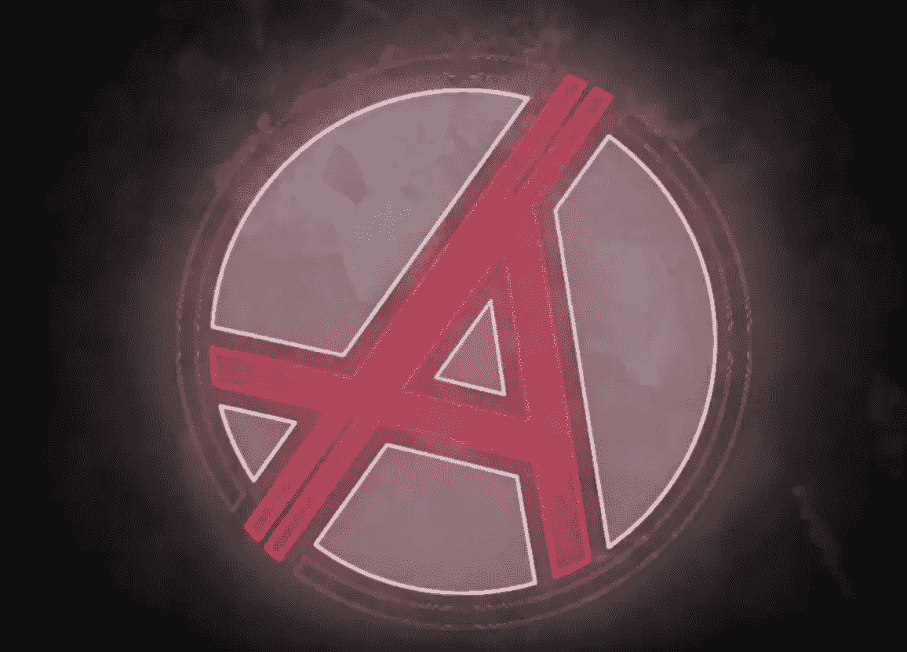

# 来自透明团队的匿名比特币“ANON”更新 2018 年 6 月 22 日

> 原文：<https://medium.com/swlh/anonymous-bitcoin-anon-update-from-a-transparent-team-6-22-2018-dac0a0ce01f>

**重大更新:**

ANON 和 ZCL 将于 2018 年 6 月 26 日与一家区块链相关企业宣布合作。

[ANON 的社区建设参与计划](https://redd.it/8rybhg)现已上线！5000+ZCL 将赠送给社区！在这里阅读^.

美国消费者新闻与商业频道密码交易员 Ran Neu-Ner 加入 ANON 的顾问团队，成为另一名顶级成员。

创始人杰克·格林鲍姆(Jake green Baum)([密码之王](https://twitter.com/jbthecryptoking?lang=en)))将继续在旧金山、巴黎和拉斯维加斯(更多城市即将到来)进行“会议之旅”。

ANON 的主要开发人员提前完成了计划，并正在讨论提前分叉日期。

交易所外展已经开始，许多交易量最大的交易所正计划在上海和 ZCL 上市。

2 个成熟的开发团队，ZClassic Blue 和 ZClassic Community Devs 已经向 BTCP 提交了正式接管 ZCL GitHub 和 Twitter 账户的提案。

o ZCL 的 Twitter 目前由 BTCP 掌控，ZCL 社区非常希望 BTCP 加快将控制权移交给 ZClassic Twitter 和 GitHub 的进程。BTCP 不再对 ZCL 的成功感兴趣，因此应该让一个对其未来感兴趣的团队来控制 Twitter 和 GitHub。

ZCL 的未来是合作的，而不是争斗的。ANON 很高兴为 ZCL 的未来与 ZClassic Blue 和 ZClassic Community Devs 合作。

在不久的将来，我们将公布一位亚洲顾问！

Testnet live 于 8 月 10 日(或更早)发布。

交易所公告 2018 年 8 月 15 日。

叉快照 2018 年 9 月 10 日。

**社交**

★ **ANON** [**电报**](https://t.me/anonymousbitcoin)★★**ANON**[**不和**](https://discord.gg/2yTdK6s)★★**ANON**[**推特**](https://twitter.com/ANON_BTC) ★

★**ANON**[**Youtube**](https://www.youtube.com/channel/UCU-BMMTH8z0ow0xHjWZHRUg)★**ANON**[**Reddit**](https://www.reddit.com/r/AnonymousBitcoin/)★**ANON**[**Medium**](https://medium.com/anonymous-bitcoin)★

**团队**

ANON 的团队由一群出色的顾问和创始人领导。从像[史蒂文·奈拉约夫](https://twitter.com/stevennerayoff?ref_src=twsrc%5Egoogle%7Ctwcamp%5Eserp%7Ctwgr%5Eauthor)和[冉·纽纳](https://twitter.com/cryptomanran?ref_src=twsrc%5Egoogle%7Ctwcamp%5Eserp%7Ctwgr%5Eauthor)这样塑造了加密货币格局的个人，到像[肖娅·马尔瓦](/@shauryamalwa)和[杰克·格林鲍姆](https://twitter.com/jbthecryptoking?lang=en)这样的区块链和科技领域的作家。ANON 团队最重要的组成部分，即开发人员，由 [Sam Abbassi](https://www.linkedin.com/in/samabbassi/) 和 [Christopher Arguello](https://www.linkedin.com/in/christopherarguello/) 领导。首席开发人员管理着一个由近 10 名初级开发人员组成的团队，他们夜以继日地改进 ANON 的未来代码。

ANON 的团队由区块链领域众多顶级顾问组成。ANON 的核心团队有区块链专家、建筑师、编码员、密码爱好者、经济学家、律师，甚至还有一两个无政府主义者。

不可能有一个更好的团队来有效地领导 ANON 通过成功的分叉努力和未来，将继续建立一个巨大的和专门的社区。

**无名氏的未来**

ANON 的未来越来越明朗。当前的 ZCL 开发团队正在合作和支持 ANON fork。随着大型交易所上市的出现，加上主要的合作伙伴和新的顾问，未来几个月对 ZCL 和 ANON 来说都非常重要。

ANON 的一位高级顾问发表了一篇尖锐的评论，这篇文章的作者将永远铭记在心。

“在加密中，你要么是前十名，要么慢慢地被遗忘。不久，我们将建成一个排名前 10 的密码。如果我没有这样的期望，我就不会参加这个项目了。”

ANON 的团队希望 fork 透明，同时为未来如何处理 fork 设定标准。不再有匿名团队，即使是匿名硬币。透明将统治区块链，即使是在隐私硬币的世界里。

未来就在这里，而我们就在这里。

*要阅读国王的事先或者直接接触国王，可以在推特上(@JbtheCryptoKing)或者* [*Reddit*](https://redd.it/81hj5q) *(每日报道)。*

## 这篇文章发表在 [The Startup](https://medium.com/swlh) 上，这是 Medium 最大的创业刊物，拥有 337，320 多名读者。

## 在此订阅接收[我们的头条新闻](http://growthsupply.com/the-startup-newsletter/)。

