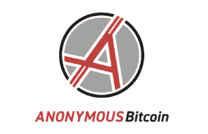

# 匿名比特币的“ANON”:顾问，白皮书，夏季路线图公布。

> 原文：<https://medium.com/swlh/anonymous-bitcoins-anon-advisor-whitepaper-summer-roadmap-unveiled-9c655ef6bf0e>

# 我们在一起是匿名的。

ANON 团队花了无数时间参加从迈阿密到纽约、洛杉矶、柏林的会议并建立联系，今年夏天还参加了东京、首尔和巴黎的会议。开发团队已经会见了最臭名昭著的隐私硬币的开发人员，并继续提前为我们的 9 月 10 日叉日期。如果他们继续领先于计划，ANON 将自豪地宣布加密货币历史上第一批将被提前的最后期限之一。

今天 ANON 很高兴分享我们的白皮书，可以在我们的网站上看到: [Anonymousbitcoin.io](http://bitcoinist.com/anonymous-bitcoins-anon-advisor-whitepaper-summer-roadmap-unveiled/anonymousbitcoin.io)

我们白皮书中的几个主要亮点包括:

*   2019 年 1 月 1 日之前无人认领的所有 ANON 将被烧毁。这将大大减少与不知情的个人、交易所以及“Satoshi”和“Mt. Gox”钱包相关的流通供应。
*   将按照 1:1 的比例为拍摄快照时持有的每个 BTC 和 ZCL 提供 ANON。(如果你拥有 2.4 BTC 和 8 ZCL，你将获得 10.4 ANON)。
*   一个由匿名团队成员和普通公众共同出资管理加密货币钱包的信托基金将于 7 月 1 日在 ZCL 公开，起价为 10 万美元。钱包的支出将由 masternode 投票(兑换、广告等)决定。).
*   ANON 的开发团队(武士道实验室)已签约一年后叉区块链支持。这将允许继续发展和维护的 ANON 区块链。匿名信托将不会用于这些费用，因为该承诺已经得到巩固。
*   Testnets 将在 2018 年 9 月 10 日快照发布前大约一个月上线。
*   交易所公告将在 8 月中旬发布，因为最重要的交易所将监控测试网和钱包以确保安全。
*   今天我们有 1 位顾问要宣布，6 月份还有 2 位要宣布！

希望白皮书给你留下深刻印象，请提供反馈，因为我们对社区开放，并实施了我们被要求的大部分内容。

**ANON 很荣幸地宣布我们的新顾问是 Ran Neu-Ner，他是美国消费者新闻与商业频道加密交易商最有影响力的个人之一(Twitter: @cryptomanran** )

我们在迈阿密参加我们的第一次会议时偶然发现了 Neu-Ner 先生(加密领域 20 位最有影响力的人之一),并从此巩固了牢固的关系。当 ANON 团队看到 Ran at Consensus 时，他明确表示我们没有“重大新闻”,并且在我们发布白皮书或重大新闻之前，对后续报道不感兴趣。几个星期后，在柏林，Ran 看到我们的创始人与的一个社区开发人员讨论 ASIC 阻抗，当时白皮书刚刚发布。经过多次积极的互动，并获得了大量的智慧之言，ANON 团队决定 Ran 是完美的人选。

他在加密领域的专业知识是无止境的，我们期待着他能给 ANON 团队带来所有的才能和智慧。在我们未来的整个过程中，ANON 将定期寻求他的建议和指导。在 Ran NeuNer 和 Steven Nerayoff 等顾问的帮助下，ANON 将自己定位为 2018 年夏天最受关注的隐私硬币和最受关注的项目之一。

# 今年夏天即将到来

六月和七月仍然令人兴奋，因为我们带来了新的顾问(至少 2 名，一名来自亚洲，一名来自欧洲)，并参加了三大洲的会议。该网站已被翻译成多种语言，现在是时候建立 ANON 社区了。ANON 的主要开发者将在全国各地的大学演讲，从迈阿密到麻省理工学院(没错，就是麻省理工学院)。请继续关注该团队的更多视频，这些视频透明地展示了从头开始构建加密货币和社区需要什么。

我们请求当前 ANON 社区成员的帮助来分享关于 ANON 的信息！

请分享白皮书！分享我们关于透明度和会议采访的视频！分享我们的美国消费者新闻与商业频道访谈！

是时候让全世界知道 ANON 是一个合法透明的叉子了。请加入我们的社交媒体渠道，首先了解更新信息:

**无名氏的电报:**[T3【https://t.me/anonymousbitcoin】](https://t.me/anonymousbitcoin)

**ANON 的推特:** [**@ANON_BTC**](https://twitter.com/ANON_BTC)

**无名氏的不和:**[**https://discord.gg/J6yWHtx**](https://discord.gg/J6yWHtx)

**ANON ' s Reddit:**[【https://www.reddit.com/r/AnonymousBitcoin/】T21](https://www.reddit.com/r/AnonymousBitcoin/)

ANON 团队可以发展，可以旅行，可以联网和传播意识。然而，没有 ANON 社区，我们什么都不是。

我们在一起是匿名的。

*图片由 Shutterstock 提供*

## 这篇文章发表在《创业公司》杂志上，这是 Medium 最大的创业刊物，有 331，853 人关注。

## 订阅接收[我们的头条](http://growthsupply.com/the-startup-newsletter/)。

