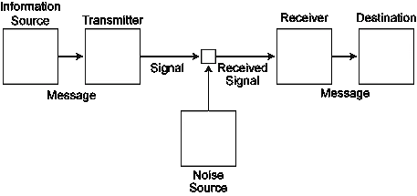
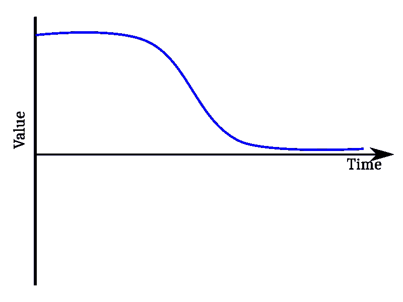
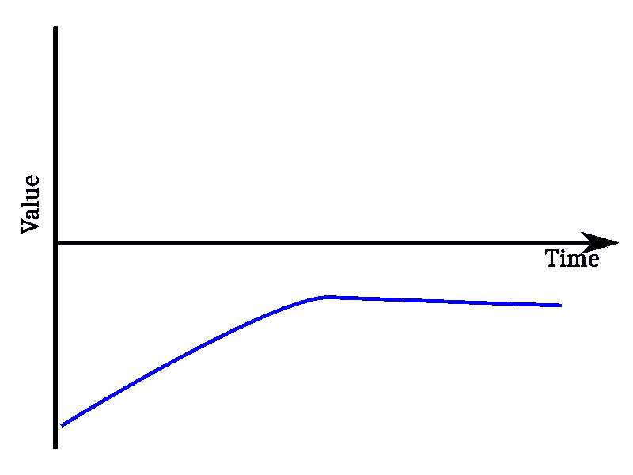
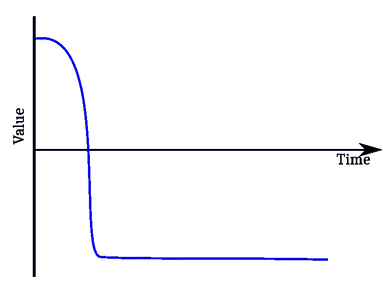

# 另一种交流模式

> 原文：<https://medium.com/swlh/another-model-for-communication-6dd9fdf60239>

Photo by [Wynand van Poortvliet](https://unsplash.com/photos/4AmyOdXZAQc?utm_source=unsplash&utm_medium=referral&utm_content=creditCopyText) on [Unsplash](https://unsplash.com/?utm_source=unsplash&utm_medium=referral&utm_content=creditCopyText)

试图为现代网络时代建立通信模型，以及它如何对设计平台有用。

1948 年，克劳德·香农发表了关于传播理论的论文。它包括一个交流模型。这个模型的元素有:源、消息、发送器、信号、噪声源、接收器、目的地。

By en:User:Wanderingstan, User:Stannered — en:Image:Shannon communication system.png, Public Domain, [https://commons.wikimedia.org/w/index.php?curid=3573566](https://commons.wikimedia.org/w/index.php?curid=3573566)

此后，它被批评为过于简单，并且提出了其他模型，这些模型考虑了反馈、心理因素、社会学因素……然而，由于其固有的简单性，它仍然是尝试建立沟通模型的良好起点。

# 让我们试着为现代互联网时代建立一个模型。

与香农的模型相比，今天的系统(网络平台、电视……)的主要区别似乎是有**许多来源和目的地**，它们之间的关系形成了一个图表。并且，在现实生活中，当通信的目的地是人类时，信息的**值**不仅仅是熵度量。

**首先让我们尝试定义一下信息的价值**。什么是信息？通过我们的感官影响我们的东西。这里我们将只关注由其他人产生的信息。

**信息如何影响我们？让我们将我们的大脑/智力视为包含个人本体(事物的类别以及它们之间的关系，类别的实例)。这就是我们的世界观，或者说我们的记忆。新信息改变了我们的个人本体论:给它添加新的东西，改变关系，改变事物的实例，改变事物的相对权重。例如，如果有人告诉我有些鸟是蓝色的，而我以前并不知道，那么在我的世界观中,“鸟”和蓝色之间就有了联系。取决于是谁说的，取决于上下文……这种联系可能是微弱的，也可能是强烈的。**

但是我们的世界观不仅仅受外界刺激的影响。我们有不完美的记忆，所以一些事情被遗忘，“抹去”，或者在背景中褪色，并且由于我们自己的思考，我们的个人本体论发生了变化。

**我们的个人本体有什么用途？它们是我们一些情绪的基础(知道我的侄子通过了考试让我很高兴)，也是我们逻辑思维的基础，因此也是我们许多决策的基础。知道政客 X 赞成自行车道，既会对我产生情感上的影响，也会在我决定投票给谁的时候，用于我的逻辑思维。**

现在，在一般情况下，精确描述对我们个人本体的影响或信息(像在神经网络中的某种价值传播，但具有概念和实例)，似乎实际上是不可能的，因为每个人都是不同的，每个人都有自己的个人本体。给定一个信息，有些人会有不同的反应。一个信息会对一些人很重要，对另一些人没用。

但是，我们可以注意到，当我们接收信息并在我们的本体中消化它时和当它被“用于”情感或决策时之间的**时间**是变化的，并使我们能够将信息分类成广泛的类别。以这种方式，每一类信息都有一个(为了简单起见)**【价值】**随时间变化，这个“价值”是时间 t 时信息对决策的重要性和时间 t 时信息对我们情绪的有益或有害的复合(也是为了简单)。它没有精确的测量单位，因为每个人都不同，但随时间的相对变化是可定义的。

**让我们来看看这些可能的信息类别，以及价值如何随时间变化。**

Entertainment

Learning

Trolling

Fake news

与香农模型的另一个主要区别是，沟通不是一对一的关系。信息源多，目的地多。

这里的限制因素不是源可以产生什么，也不是可以传输什么，而是(人类)目的地可以接收的信息量。我们的时间和注意力有限，我们无法同时拿着三部手机，看 15 个电视频道和阅读一本书。

一个源可以同时与许多目的地交流(就像名人与他们的 twitter 追随者交流一样)，但一个目的地可以一次从一个源吸收信息(你依次阅读推文)。

**因此，从目的地开始，必然有一个选择他/她将接收的通信的过程。**

*这一过程基于所接收信息的感知价值。*

感知价值的一部分来自信息的感知内在价值。正如我们在上面看到的，信息的价值随着时间而变化。在通信之前或期间，在 t=0 或负 t 时确定感知值。但一个问题是，尽管人类是聪明的动物，但他们倾向于给予短期**比长期**更多的重视(这就是为什么我们仍然在灾难性的全球变暖的道路上……)。另一个问题是，**强化我们的世界观的信息**给予积极的情绪，所以它被视为高价值，所以我们倾向于寻求它。

另一部分感知价值来自源头。作为获取信息本身价值的捷径，我们倾向于为来源分配一个**信任值。这来自于我们与信息源的历史(信息源通常给出“好的”信息吗？)这也来源于别人给的信息。如果我信任信任 B 的 A，我会倾向于信任 B。这也来自于想要传达该信息的**来源**的数量，以及如果**信息被重复**。每个人都在谈论皇家婚礼，所以它一定很重要…这位政治家一直在谈论移民，所以它一定是一个紧迫的话题…**

现代通信系统超越了香农和电话一对一的通信模式，在帮助人们选择信息来源，以及帮助人们对未来的通信赋予可感知的价值方面发挥着不可或缺的作用。

有**个不同的参数**，通信系统可以对这些参数产生影响。

一个良好的信任或声誉系统，同时不会过度利用已建立的来源。

对长期价值信息的偏好。

对羊群效应和强化我们世界观的信息的偏见。

减少“钓鱼”的系统(直接的高影响力但长期的负面价值信息，导致人们做出反应，从而产生反馈)。

另一个现象是病毒式传播。如上所述，由多个来源共享的通信自然受到高度重视。但是，由于现在通信目的地成为相同信息的来源是微不足道的，信息传播非常迅速…尤其是短期价值高/长期价值低的信息。比如引发即时情绪和决定重新分享的新闻。这可能导致低长期价值的新闻充斥整个空间，使高长期价值的新闻更难找到。一些信息被许多人共享的事实，在某些情况下仍然是其“价值”的良好指标。但是有了现代通信系统，正反馈效应应该被抑制，以免我们被淹没在“病毒式”的东西中。

还有许多其他方式来影响信息的发现和选择。第一步是识别影响沟通模式的参数，然后选择和调整“好的”参数，或者将一些选择留给作为沟通目的地的人。

**在源端，我们可以问自己，传播的目标是什么？**

可能有**内在原因**，比如财务激励(付费的巨魔，一些假新闻，但更积极的是职业记者、作家、演员……)，获得认可，被钦佩……

可以有**外部原因**，主要是改变目的地上的一些东西:影响他们的世界观或者本体。这可能是出于“好”或“坏”的潜在原因，取决于一个人的核心价值观…

我们应该非常警惕那些仅仅因为内部原因而交流的信息来源，而不关心它对接受信息的人有什么影响，没有道德规范。现代通信系统在这里也不是中立的。当能够调查新闻或娱乐电影或书籍时，以某种方式将信息货币化是好的。当它同时帮助了只关心钱的消息来源时，这是不好的。现代货币化系统经常让一些优质资源苦苦挣扎，同时让劣质资源变得富有。事情应该在几个方面有所改变。第一种方式是使用少得多的广告和受众措施来为信息融资。这些奖励了没有长期价值的即时满足信息(见上图)。订阅系统或延期奖励(例如，在月底，你选择 3 个你本月读过的最重要的媒体报道，这 3 个将会给你订阅的钱)可能是一个开始。

更一般地说，我们必须找到奖励那些关心他人(希望以某种方式改变他们)的交流的方法，而不是那些完全赚钱或自我满足的交流，这些交流没有什么价值。因为我们的系统不可能是“中立”的。

**这些是从事多对多通信系统的公司可以尝试的一些方法，以理论化和理解人们在他们的平台上做什么的核心属性，以及通信系统本身如何塑造在其中谈论的内容。**

## 这篇文章发表在《T4》杂志《创业》(The Startup)上，这是 Medium 最大的创业刊物，有 327，829 人关注。

## 在这里订阅接收[我们的头条新闻](http://growthsupply.com/the-startup-newsletter/)。

