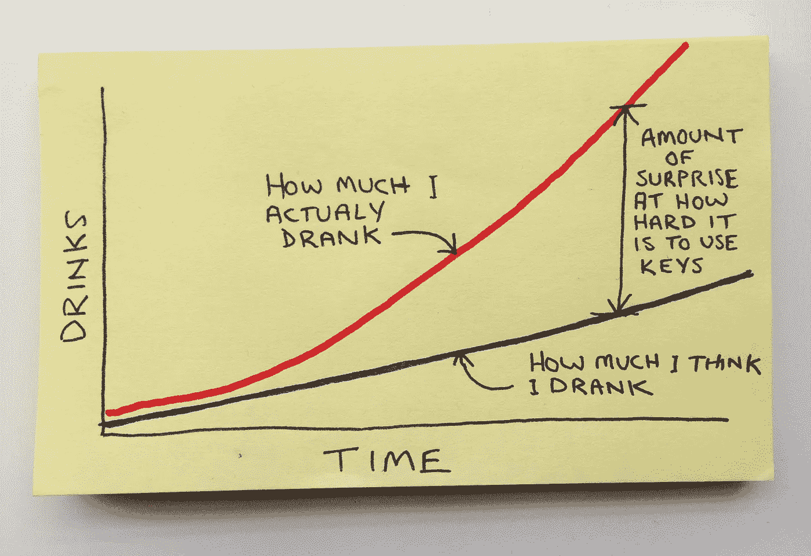

# 通过便利贴解释的另一系列观察。

> 原文：<https://medium.com/swlh/another-series-of-observations-via-post-it-notes-76d114dc956b>

## 工作流程。

## 做笔记。

## 面对拒绝。

## 通货膨胀将如何影响你的孩子。

## 超出预期。

暂时就这样了。更多基于图表的废话，请访问 InstaChaaz。或者在推特上关注我[。](https://twitter.com/chazhutton)

你也可以在这里找到第一部分[。](/@chazhutton/a-series-of-observations-explained-via-port-it-notes-976067e52f2)

*发表于* **创业、旅游癖和生活黑客**

-