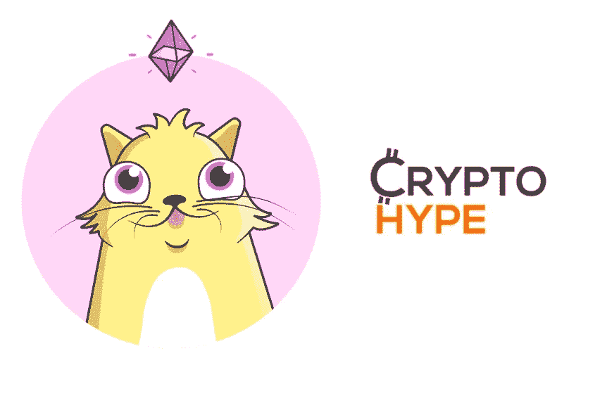
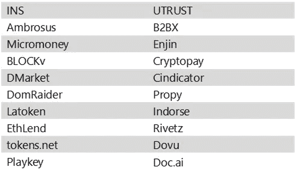
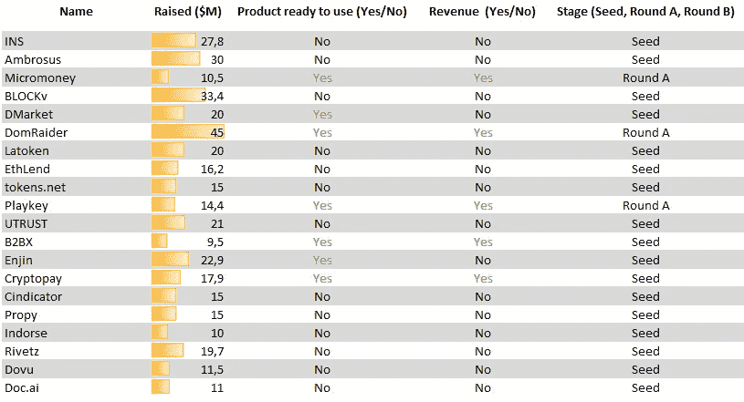
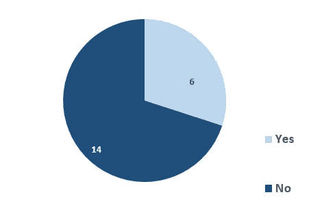
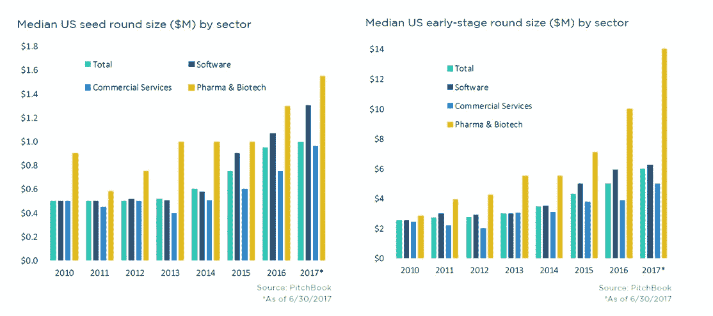
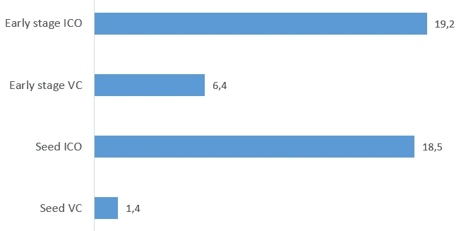
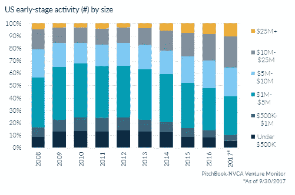
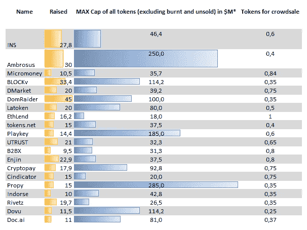
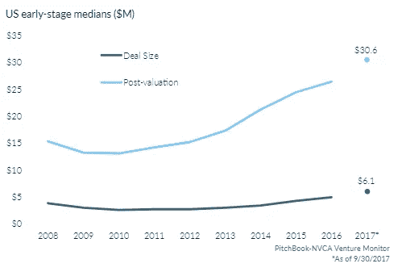

# 反炒作方法:就风险投资融资而言，ICO 是什么？

> 原文：<https://medium.com/swlh/anti-hype-approach-what-is-ico-in-terms-of-venture-capital-financing-4c7d31a0a87c>

在 [**ICOscoring**](https://icoscoring.com/) 的运行过程中，其团队收集了大量的统计信息。通过处理这些数据，我们了解到，绝大多数 ico 的最关键风险属于“财务指标”类别。详细的调查揭示了**看似五星级项目的真正受益者**——管理层、ICO 安排者、**而非 tokensale 投资者。**

本文涉及到 ICO 项目估值的问题，旨在比较 ICO 的财务参数和风险投资(VC)市场的汇总数据。

# **研究用 ICO 项目选择**

我们**随机**从[**coin schedule list**](https://www.coinschedule.com/icos.php)中**选择了** **25 个项目**结束日期在**2017 年 Q3-Q4**。与中值大相径庭的 ico，加密基金，矿业公司和基础设施项目已经被事先剔除，如[Kin(9700 万美元)](http://www.kinecosystem.org/)，[Filecoin(2.57 亿美元)](https://filecoin.io/)，[Paragon(1.83 亿美元)](https://paragoncoin.com/login)等。总列表仅包括软件行业**的项目**。****

**The list of selected projects**

# **大多数成功的 ico 都没有任何销量，甚至没有原型**

任何创业项目的第一阶段都是开发产品/服务原型。当一个想法演变成一个产品时，初创企业正在转型、扩张和成长。

成功创业的最终目的是卖给大公司或保持独立业绩。此外，还有一个选择——首次公开发行股票，并以尽可能高的价格出售股票(IPO)。

一个旨在吸引风险投资的项目正在经历几个关键阶段，需要投入巨大的努力。

遵循 ***密歇根罗斯商学院*** 的方法论，这些阶段合计占**风险价值链**的五个一致阶段中可能描述的:

***(商业理念和最低可行产品；**预播种*****

******推出*** (验证价值主张，证明市场；**种子*****

******缩放*** (缩放和生长；**早期阶段*****

******提炼*** (永续经营阶段)***

******收获*** (IPO…或 M&A…或摇钱树)***

***为了更好地做出决策，投资者必须减少与市场、项目、产品/想法和团队管理技能相关的不确定性。***

***由于**年度阶段被认为是高风险的**，尤其是投资者无法收回投资，整个**投资过程被分为几个阶段，或几轮融资**。达到发展的重要里程碑项目降低了投资者的风险，并证明了其可持续性。然后投资人决定是否参与下一轮。***

*****绝大多数 ICO 项目选择了完全不同的方式:**只设定一轮，既没有认可的市场需求，也没有原型。***

************

*****Had the product been ready for entering market*****

***正如我们所见 **65%的项目**在 ICO 之前没有现成的产品，其中 **75%没有首次销售**。***

***因此，考虑到**风险价值链**模型和其他风险行业标准**，85%的分析项目处于种子前期和种子期。*****

***此外，每个项目平均筹集资金 1900 万美元。因此，这一金额远远高于美国风险资本市场种子期的平均融资额，也高于早期融资额。***

******

***Median US seed/early-stage round size ($M)***

***问题是这是一场遵循 [**概念的流行病还是一场旨在筹集尽可能多资金的加密货币炒作？**](https://techcrunch.com/2010/05/25/lean-vs-fat-startups-the-disrupt-debate/)***

***没有人说在一轮中快速筹集大量资金不利于未来的发展，但是**精益创业**理念**似乎更加理性**。在缺乏爆炸性项目开发的情况下，大规模的回合以及因此令牌池的高起始价格破坏了价格的进一步飙升。***

# ***ICO 筹集的平均资金是风险资本市场平均资金的 3 倍***

*****这里我们比较了 VC 和 ICO 的平均投资额(取决于一个阶段)**。风险投资平均值的来源是 **Pitchbook 风险投资估值报告(2017 1H)** 。***

******

*****Median round size (VC vc ICO, $M)*****

******

*****US early-stage activity (#) by size*****

***结果表明 **ICO 项目比使用风险投资融资的可比项目筹集了更多的资金** (ICO 轮次筹集的资金超过美国风险投资早期可比项目的 25%)。***

*****只有 10%的被选 ico 通过路线图里程碑和财务模型和**说明了所需资金**，只有 50%** 的 ico**明确说明了其软上限**，忽略了**未使用剩余资金会降低投资者回报的事实。*****

# *****VC 和 ICO 估值对比:令牌池估值中的资本化等值*****

***除了**股权价值衡量所有已发行的股份**之外，我们认为 ICO 分析必须包括整个代币池的**价值和**而不仅仅是流通中的代币**。*****

***目前，在分析时考虑整个令牌池的价值是一种罕见的情况，尽管该指标能够将看似有利可图的投资转变为有害的投资。***

******

*******Max cap is calculated dividing Hard cap by token circulation supply rate (excluding tokens burnt and unsold). ETH price: 456$ BTC price: 15500******

***我们决定**将此类资产池的价值与风险投资可比项目**(美国市场、软件、A 轮)的后期资金估值进行比较。**ico 的令牌池中值资本为 4460 万美元，比在更高级阶段使用 VC 融资的可比项目****(80%的早期项目有产品和收入)的平均事后估值高 50%。*****

**********

*******US early-stage medians ($M)*******

# *******结论*******

*****我们的结果清楚地展示了 ICO 众筹的核心细节:*****

*******即使是拥有运营产品并准备进入市场的五星级 ICO 项目，也宁愿对披露高质量的财务信息视而不见:预计收入没有指标支持，所需投资没有财务模型和路线图支持，有时软上限也没有说明。*******

*****超过 1000 万美元的 ICO 项目中，有 60%还没有初始销售额，甚至连一个产品都没有开发出来。*****

*****平均 ICO 募集的资金是同类风投项目的 3 倍。*****

*******考虑到所分析的 ICO 项目的发展阶段，其代币池资本化似乎被高估，是可比风险投资项目的平均事后估值的 1.5 倍。*******

*****突出的事实证明 **ICO 市场仍然表现出高度的非理性**，既要求法律程序升级，也要求披露高质量的财务信息。目前的趋势是越来越多的项目**达不到硬封顶**。这可能是一个信号，要么是倾向于设定过高的硬上限水平，要么是**降低炒作**并声明**对 ICO 投资采取更加务实的方法**。*****

**********

## *****这篇文章发表在 [The Startup](https://medium.com/swlh) 上，这是 Medium 最大的创业刊物，拥有 277，994+读者。*****

## *****在这里订阅接收[我们的头条新闻](http://growthsupply.com/the-startup-newsletter/)。*****

**********