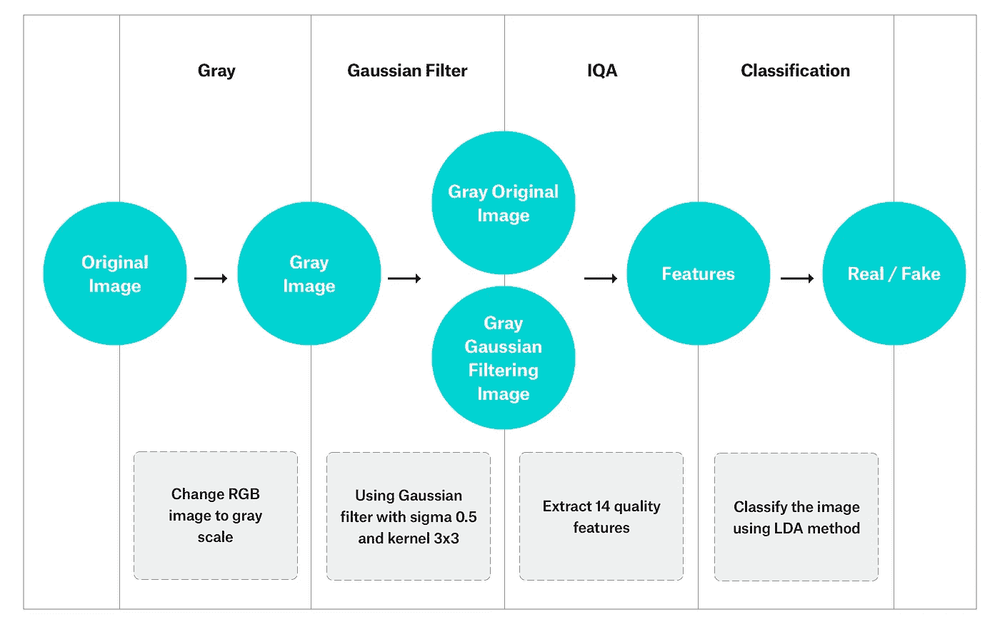

# 基于 DNN 的人脸识别反欺骗机制

> 原文：<https://medium.com/swlh/anti-spoofing-mechanisms-in-face-recognition-based-on-dnn-586011ccc416>

想象一下，只用你的脸就能解锁你的手机，不需要指纹扫描或触摸。它会自动运行，没有任何用户干预。那不是很好吗？

好吧，你猜怎么着…有人已经让这一切发生了。它叫做 iPhone X，你可能已经在用了。但更好的是:使用人脸识别进行用户认证的潜力比这大得多！在不久的将来，我们将有望通过展示我们独特的面部特征来租车、签署法律文件以及做其他一切事情。

我们已经开始在某些需要身份验证的服务中看到这种情况(如银行和其他类型的交易系统)。在这种情况下，所提供的合法数据会与 ID 上的数据进行交叉检查，并且会将文档上的面部图像与所有者的面部进行比较。然而，与大多数新技术一样，它也带来了新的违规可能性。欺骗人脸识别机制的最流行的方法之一是“人脸欺骗”攻击。

**欺骗攻击**是指试图通过使用照片、视频或不同的替代物来获取他人的特权或访问权限。想到的一些攻击示例:

*   **打印攻击:****攻击者使用某人的照片。图像被打印或显示在数字设备上。**
*   ****重放/视频攻击:**一种更复杂的欺骗系统的方法，通常需要受害者面部的循环视频。与拿着某人的照片相比，这种方法可以确保行为和面部动作看起来更“自然”。**
*   ****3D 面具攻击**:在这种类型的攻击中，面具被用作欺骗的首选工具。这是一种比播放面部视频更复杂的攻击。除了自然的面部运动，它还可以欺骗一些额外的保护层，如深度传感器。**

# **欺骗检测方法**

**某种形式的安全应该成为所有基于面部识别的系统的标准。有许多不同的方法来应对这一挑战。最受欢迎的反电子欺骗先进解决方案包括:**

*   ****人脸活跃度检测**:一种基于测试人脸活跃度分析的机制。这通常是通过检查眼睛运动来完成的，比如眨眼和面部运动。**
*   ****上下文信息技术**:通过调查图像的周围环境，我们可以尝试检测扫描区域中是否有数码设备或相纸。**
*   ****纹理分析**:这里探测输入图像的小纹理部分，以便在欺骗和真实图像中找到图案。**
*   ****用户交互**:通过要求用户执行一个动作(向左/向右转头、微笑、眨眼)，机器可以检测该动作是否以类似人类交互的自然方式执行。**

**当然，我们不能忽视房间里的大象，iPhone X 上的 FaceID。在最新的硬件迭代中，苹果公司引入了先进的深度映射和 3D 传感技术，能够以前所未有的准确性检测欺骗。然而，由于这种高端硬件在不久的将来不会在大多数消费设备上提供，我们认为在现有的 2D 相机上加倍努力是有意义的。**

**事实上，在我们的研究和实现过程中，我们发现使用中等质量的 2D 相机可以实现极高水平的实时电子欺骗检测。秘密？使用带有定制神经网络的深度学习解决方案。**

**我们通过与现有的、记录在案的方法进行交叉检查来验证我们的方法。**

## ****交叉检查 1:图像质量评估****

**该解决方案基于将原始图像与经过高斯滤波处理的图像进行比较。这篇论文的作者[1]正在证明，假图像与真图像之间的差异是不同的，并且可以自动检测出来。为了做到这一点，我们提取了 14 个常见的图像质量特征，如均方误差、平均差异或总边缘/角差异。下一步是将它们发送到分类器，以确定这是“真”脸还是“假”脸。**

****

**Figure 1\. IQA classifying process flow: converting the image to grayscale, using Gaussian filter, extracting 14 features from the difference between original and filtered image, passing features to the classifier.**

## ****交叉验证 2:图像失真分析****

**发送四种不同的特征(镜面反射、模糊度、色矩和颜色多样性)用于分类。该分类器由多个模型构建而成，每个模型针对不同类型的欺骗攻击向量进行训练。**

****

**Figure 2\. IDA classifying process flow: extract 4 distortion features, pass them into a group of classifiers, pass results into classifier responsible for spoofing/not-spoofing decision**

## ****最终方法:深度神经网络模型****

**这是基于用 CNN(卷积神经网络，图像分析中最流行的神经网络)建立的模型。一张裁剪过的人脸图像被传入神经网络，然后通过神经层进行处理，以将其分类为真/假。**

****

**Figure 3\. DNN classifying process flow: pass face image into CNN**

# **训练系统**

**上面给出的所有解决方案都包含需要监督学习以返回正确结果的模型。训练集是由站在摄像机前或拿着一个设备的人的图像构建而成的，设备上显示着他们的脸。所有的脸都被裁剪并分成两组:真的和假的。这些图像是由中等分辨率的 800 万像素相机拍摄的，这是工业应用中常用的型号。所有三种方法都使用相同的训练集。**

****

**Training set examples**

# **比较结果**

**对于性能测量，我们使用简单的精确度、召回率和 F1 分数。所有三个实验的结果如下表所示。**

****

**Accuracy & performance summary**

****

**Spoofing example**

# **下一步是什么？**

**所提出的最先进的解决方案仅适用于 2D 重放/视频攻击。为了提高对更多类型攻击的抵抗力，DNN 模型可以通过用纸质攻击实例扩展训练数据来进行调整。此外，3D 欺骗尝试可以由额外的传感器(例如深度)来处理。**

**安全性是一个不断发展的问题，因为一旦引入新的保护方法，攻击者就会不断寻找新的方法来破坏系统。但是我们认为，我们独特的方法已经可以应用于所有涉及自动(或半自动)KYC 验证的过程，以减少欺诈账户的数量，或者至少减少所需的人工劳动(最终验证)的数量。**

**好奇想自己尝试一下吗？如果你是 iPhone 用户，你可以[下载](https://itunes.apple.com/us/app/facesecure/id1386808970?mt=8)我们的 facespoofing 应用并尝试一下！**

****更新 03/19** :我们目前正在开发一个基于云的解决方案，一旦我们需要测试版测试人员，我们就会更新这篇博客。敬请期待！**

***这篇文章由尼基·杰基·戴尔芬&阿图尔·巴马加撰写，他是 YND 的人工智能专家之一。拥有 6 年多 Python 经验的 Artur 是 YND***的一名 ML/Python 开发人员。他领导人工智能驱动的项目，如* [*汽车检测*](/swlh/car-detection-recognition-using-dnn-networks-3ac7603d2e9b)*&*[*智能条*](/swlh/started-from-the-bottom-now-theres-beer-15ff4e2a4be4) *。需要一些脑力吗？请通过*[*hello@ynd.co*](http://hello@ynd.co)*联系我们，咨询您关于 ML/AI 项目的问题。****

***参考资料:***

***`¹` [基于通用图像质量评估的人脸反欺骗，贾维尔·加尔巴利，塞巴斯蒂安·马塞尔](http://citeseerx.ist.psu.edu/viewdoc/download?doi=10.1.1.646.2807&rep=rep1&type=pdf)***

***`²` [人脸恶搞检测与图像失真分析，文帝、胡汉、安尼尔·k·贾恩](http://vipl.ict.ac.cn/uploadfile/upload/2017020711092984.pdf)***

***`³` [生物识别反垃圾邮件方法:人脸识别调查，贾维尔·加尔巴利，塞巴斯蒂安·马塞尔，朱利安·菲尔雷斯](http://ieeexplore.ieee.org/stamp/stamp.jsp?arnumber=6990726)***

******

## ***这篇文章发表在《创业公司》杂志上，这是 Medium 最大的创业刊物，拥有 306，072 名读者。***

## ***订阅接收[我们的头条新闻](http://growthsupply.com/the-startup-newsletter/)。***

******