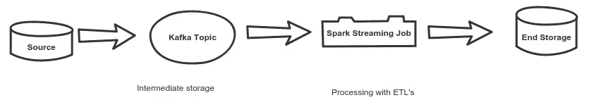
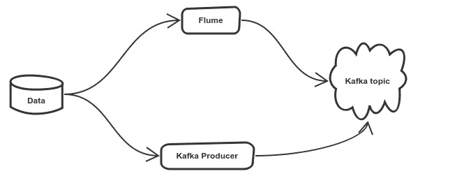

# 简化的 Apache Spark 流

> 原文：<https://medium.com/swlh/apache-spark-streaming-simplified-3107f1580b30>



A typical spark streaming data pipeline.

上述数据流描述了用于流数据分析的典型流数据管道。好吧，让我们把它分开，你需要一个源，在这个例子中，我将使用一个分隔文件作为 Kafka 主题的源。我们可以通过多种方式向卡夫卡发送数据。你可以写一个 Kafka 生产者或者使用一个像 Flume 这样的服务，source 作为文件，sink 作为 Kafka。



下面显示了一个使用 java API 的示例 Kafka 生成器，它读取文件并将数据作为消息逐行发送到 Kafka 中预定义的主题。

```
import java.io.BufferedReader;
import java.io.IOException;
import java.io.FileReader;
import java.util.Properties;
import java.util.concurrent.ExecutionException;
import org.apache.kafka.clients.producer.KafkaProducer;
import org.apache.kafka.clients.producer.ProducerRecord;public class KafkaProducerFile {public static void main(String[] args) throws InterruptedException,
   ExecutionException {
  final String fileName = "/resources/SalesJan.csv";
  String line;
  String topicName = test;
  final KafkaProducer<String, String> kafkaProducer;
  Properties properties = new Properties();
  properties.put("bootstrap.servers", "localhost:9092");
  properties.put("client.id", "KafkaFileProducer");
  properties.put("key.serializer",
    "org.apache.kafka.common.serialization.StringSerializer");
  properties.put("value.serializer",
    "org.apache.kafka.common.serialization.StringSerializer");
  kafkaProducer = new KafkaProducer<String, String>(properties);
  int count = 0;
  try (BufferedReader bufferedReader = new BufferedReader(new FileReader(
    fileName))) {while ((line = bufferedReader.readLine()) != null) {
    count++;
    kafkaProducer.send(new ProducerRecord<String, String>(
      topicName, Integer.toString(count), line));
   }} catch (IOException e) {
   e.printStackTrace();
  }
 }}
```

因此，现在我们的 Kafka 主题中有了数据，如果我们打开一个控制台消费程序，它应该会开始将文件内容显示为 Kafka 消息。

> bin/Kafka-console-consumer . sh—bootstrap-server localhost:9092—主题测试

现在，我们将看看如何使用 spark 流来消费这些数据。

```
import java.util.Collections;
import java.util.HashMap;
import java.util.Map;
import java.util.Set;
import kafka.serializer.StringDecoder;
import org.apache.spark.SparkConf;
import org.apache.spark.api.java.JavaSparkContext;
import org.apache.spark.api.java.function.Function;
import org.apache.spark.streaming.Duration;
import org.apache.spark.streaming.api.java.JavaDStream;
import org.apache.spark.streaming.api.java.JavaPairInputDStream;
import org.apache.spark.streaming.api.java.JavaStreamingContext;
import org.apache.spark.streaming.kafka.KafkaUtils;
import scala.Tuple2;public class KafkaSparkStream {public static void main(String[] args) throws InterruptedException {SparkConf sparkConf = new SparkConf().setAppName("kafkaSparkStream")
    .setMaster("local[*]");
  JavaSparkContext sc = new JavaSparkContext(sparkConf);
  JavaStreamingContext ssc = new JavaStreamingContext(sc, new       **Duration(5000)**);
  Map<String, String> kafkaParams = new HashMap<String, String>();
  kafkaParams.put("bootstrap.servers", "localhost:9092");
  kafkaParams.put("group.id", "1");
  Set<String> topicName = Collections.singleton("test");JavaPairInputDStream<String, String> kafkaSparkPairInputDStream = KafkaUtils
    .createDirectStream(ssc, String.class, String.class,
      StringDecoder.class, StringDecoder.class, kafkaParams,
      topicName);JavaDStream<String> kafkaSparkInputDStream = kafkaSparkPairInputDStream
    .map(new Function<Tuple2<String, String>, String>() {private static final long serialVersionUID = 1L;public String call(Tuple2<String, String> tuple2) {
      return tuple2._2();
     }
    });**kafkaSparkInputDStream.print();**
  ssc.start();
  ssc.awaitTermination();
 }
}
```

提交时，作业将连接到 Kafka 主题，并在指定的时间间隔(**持续时间(5000))** 内累积数据。应该在作业中指定一些火花动作来执行它。**kafkasparkinputdstream . print()**是持续将数据流内容打印到控制台的作业动作。任何 ETL 都可以使用 spark 转换和操作或 Spark SQL 应用于数据，丰富的数据可以推送到 API 支持的不同目的地。

让我们看看 spark streaming 是如何处理数据的。


Dstreams are split into RDDS and are processed by the executors.

当作业运行时，来自 Kafka 的每 5 秒钟的数据被转换成一个数据流。正是在这一点上，spark 将它的并行性带入了画面。数据流被分成多个 RDD，并被送到执行器进行处理。处理后的数据可以发送到任何支持的目的地，也可以直接写入本地磁盘。spark 流作业中数据消耗的并行性取决于 Kafka 主题中的分区数量，这在内部意味着作业启动的消费者数量将等于分区数量。

一些调谐技巧。请注意以下参数。这些应该根据 Hadoop 集群资源可用性进行调整。

spark.executor.cores=5 —集群中每个执行器使用的内核数量
Spark . driver . memory = 8g—Spark 2 需要更好的驱动程序堆大小。这是 OOM 错误的主要原因。
spark.executor.memory=10g —集群中每个执行器使用的内存
spark . executor . instances = 10—应该使用的执行器数量。这取决于资源的可用性。如果可用的总内存是 10 GB，每个执行器有 2 GB，那么可能的执行器的最大数量将是 3。其余的内存很可能会分配给其他资源，并作为开销保留下来。

感谢阅读！！


## 这篇文章发表在 [The Startup](https://medium.com/swlh) 上，这是 Medium 最大的创业刊物，拥有 283，454+读者。

## 在这里订阅接收[我们的头条新闻](http://growthsupply.com/the-startup-newsletter/)。

