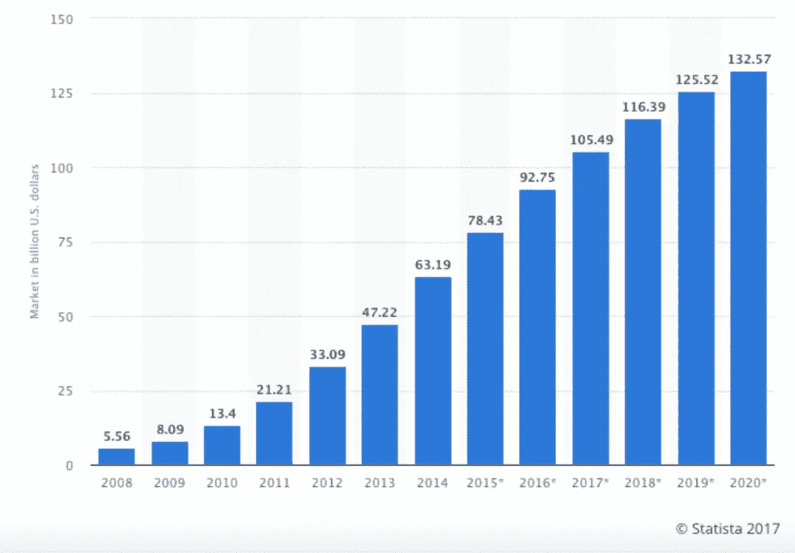
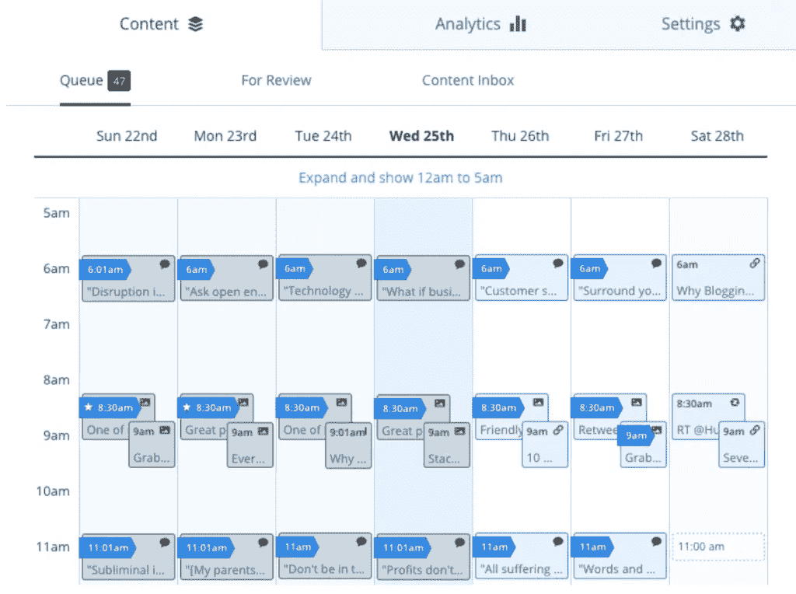
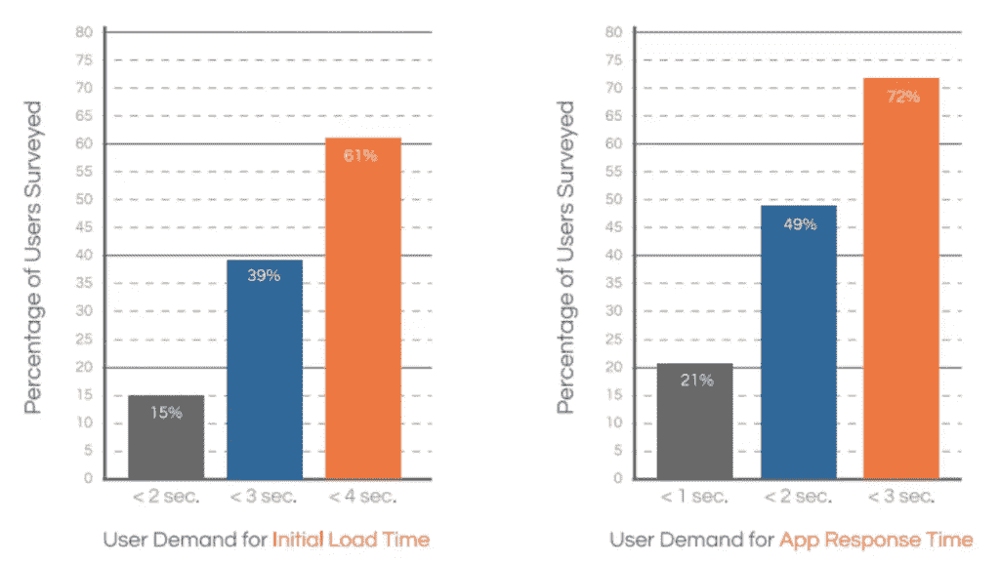

# SaaS 产品的应用程序开发:移动应用前要问的 5 个问题

> 原文：<https://medium.com/swlh/app-development-for-saas-products-5-questions-to-ask-before-going-mobile-b1c13d7fb4d7>

移动 SaaS 市场正迅速变得不可忽视。

为什么？

预计今年将达到 197 亿美元。

自 2008 年以来，整个 SaaS 市场也在持续增长，预计将继续增长，预计到 2020 年[的市场总规模将超过 1300 亿美元](https://www.statista.com/statistics/510333/worldwide-public-cloud-software-as-a-service/):

移动电话是 SaaS 整体增长的主要贡献者。在 2015 年的 Q1，有 313 家移动 SaaS 创业公司筹集了超过 26 亿美元的投资资本，高于两年前的 95 家。这种增长让 MindSea 的团队对我们与致力于在 SaaS 地区提供卓越移动体验的客户所做的工作感到兴奋。

**我们认为，现在是考虑将移动设备添加到您的 SaaS 产品中的时候了。**

移动不再是一种趋势。

2016 年，[美国 85%的企业员工](https://www.neumob.com/wp-content/uploads/2016/05/Neumob-White-Paper-SaaS-in-a-Mobile-App-World.pdf)使用移动设备。最重要的是， [Neumob 显示，现在 80%的员工都被认为是非办公桌员工。](https://www.neumob.com/wp-content/uploads/2016/05/Neumob-White-Paper-SaaS-in-a-Mobile-App-World.pdf)

**世界正迅速成为一个移动优先的社会。**

移动应用可以给你的 SaaS 业务带来巨大的潜在价值，这不仅仅是因为这些趋势。如果给你的用户留下深刻印象可以将他们转化为你最大的拥护者，那么任何提供额外价值并使你的产品更容易使用的机会都是你应该利用的机会。

但是，当你转向移动时，不要没有计划就一头扎进去，也不要没有支持计划的知识。你需要做研究，提前做出一些关键决定，以确保用户会接受你的移动体验。

当我们为客户创建移动应用蓝图时，在开始编写一行代码之前，我们会问并回答以下五个问题。问自己这些同样的问题，以确保您顺利过渡到移动领域。

# 1.你产品的核心是什么？

在为你的 SaaS 产品开发移动应用之前，你首先需要明白的是，人们实际上想从这个产品中得到什么。即使你有一些用户喜欢的很棒的功能，他们最依赖你的是什么？

您的客户是否真正喜欢某个特定的功能？有没有客户告诉过你，他们希望可以在旅途中使用的功能？有没有一项任务非常适合移动体验，但目前仅限于桌面？

一旦你理解了你的核心产品，你就必须决定一个移动应用如何适应这个产品。

Buffer 等公司的核心产品是提前安排社交媒体帖子的能力。在他们的桌面版本中，Buffer 有一个详细的日历视图，一个电源调度器和一些其他功能，以帮助他们的用户最大限度地利用该工具。

但 Buffer 移动应用主要关注该工具的核心功能:社交媒体消息的实际调度和消息队列的管理。

由于您使用的是更小的屏幕和不同的功能，您不需要向移动用户提供桌面产品的每一项功能。SaaS 公司在尝试移动化时面临的一个主要问题是，他们希望囊括一切。他们告诉自己，如果他们的桌面应用做到了，他们的移动应用也应该做到。现实是这样的:

你的移动应用不需要做你的桌面版本所做的每一件事。

如果你的 SaaS 产品功能丰富，试图将其中的每一个功能都整合到一个移动应用程序中会很困难。因为你已经对你的核心价值产品有了很好的理解，所以首先要把重点放在为你的用户提供功能上。为什么？

**拥有更多功能会导致更慢的加载时间和笨重的 UX。**

[Dimensional Research](https://www.neumob.com/wp-content/uploads/2016/05/Neumob-White-Paper-SaaS-in-a-Mobile-App-World.pdf)的一项研究发现，用户希望你的移动应用程序在 4 秒或更短时间内加载，他们希望此后的每一个动作都在 3 秒或更短时间内发生。

所有 SaaS 的创始人都知道，用户体验可以成就一切，也可以毁掉一切。如果一个用户很难浏览你的平台，他们将很难赢回来。这方面的一个主要杀手是缓慢的加载时间，尤其是在移动设备上。

# 2.你能把你的应用定位为增值吗？

开发一个移动应用程序为你的 SaaS 业务带来了巨大的潜力。它带来了为用户增加价值的新机会，这是一个应该永远放在首位的目标。

挖掘回[缓冲区](http://buffer.com/)——他们的移动应用程序在 Instagram 日程安排方面增加了显著的价值。目前，Instagram 仍然要求用户手动分享每一篇帖子。一旦在 Buffer 中安排了一个帖子，该应用程序就会在该发帖时向用户发送推送通知；用户只需打开通知并点击发布按钮。

尽管 Buffer 在应用程序中保留了一些桌面功能，但他们在出色的移动专用功能中工作，将他们的移动应用程序变成了一种资产，而不仅仅是一种便利。

考虑到每天涌现的新的移动机会，一个应用程序可以为你的 SaaS 公司增加的潜在价值是巨大的。自从[苹果发布了具有 ARKit 功能的新 iOS](https://techcrunch.com/gallery/here-are-the-best-arkit-apps-for-ios-11-you-should-try-right-now/)以来，企业已经能够在其移动应用程序中利用增强现实功能——这是你的桌面应用程序根本无法做到的。

当然，AR 只是[许多令人兴奋的移动发展和机会之一](https://www.mindsea.com/mobile-trends-best-cmos-paying-attention/)企业必须继续努力。地理围栏、移动钱包和其他最近的创新对你的 SaaS 应用程序都有巨大的潜力。这里唯一的问题是你想如何利用这些机会。

# 3.你有带宽建一个 app 吗？

构建一个移动版的 SaaS 应用可不是一件容易的事情。你不能只是告诉你的一个开发人员花一两天时间来完成它。开发一个移动应用程序需要一个专注于将这些伟大的想法变成现实的团队。

对 SaaS 公司来说，尤其是初创公司，资源往往很紧张。在你计划应用程序的开发和发布时，记住这一点很重要。

在创建应用时，你需要考虑构成移动应用技术堆栈的各种元素。

如果你不熟悉移动应用技术栈，那么你很可能不是将要编写和构建应用的人。因此，你必须决定最好的解决方案是什么，来创建和建立一个可以原型化、设计和构建你的应用的团队。

# 4.你会外包还是内部建设？

不幸的是，这个问题并不像你想的那样简单。有很多因素在起作用，最大的是上面的带宽对话。

目前，你已经在为你的 SaaS 产品管理原始的桌面应用了。你能在不放弃核心产品的情况下，调动你的团队和资源来开发移动版本吗？

如果答案是肯定的，那么对你和你的企业来说，建立内部机制可能是正确的选择。你甚至可以雇佣额外的开发人员和设计师来领导移动应用程序的开发。然而，对于大多数 SaaS 公司来说，外包可能是更好的行动计划。成本会更低，而且您可以将资源集中在核心产品上。

这绝对是一个需要做出的重大决定，我们已经整合了[一个很棒的免费资源](http://content.mindsea.com/lp-outsource-inhouse?hsCtaTracking=ba5da9a3-5d87-4a93-9183-e7260b860fa4%7C9378eb13-3556-49c2-8817-f92f0162a0db)来帮你导航。查看指南，如果您想了解更多，请随时联系我们。

# 5.应该从苹果、安卓还是两者入手？

你必须问自己的最后一个问题是，你是要为单一操作系统开发应用程序，还是要同时为安卓和苹果开发应用程序。这很重要的原因是，专门从事 iOS 开发的人不一定会成为 Android 应用程序开发的专家。尽早认识到这一点可以让你避免一些严重的头痛，也可以促成一个对话和研究阶段，以帮助你确定哪个操作系统是你的目标受众使用最多的。

# 包装东西

为你的 SaaS 业务开发一个移动应用是一个机会，可以改变你的受众使用你的产品的方式。考虑到你将能够进入的巨大移动市场，你几乎不可能忽视这一对话。

请确保从您的核心产品开始。首先要明白为什么你的用户想要下载你的应用，以及他们主要用它做什么。在此基础上，确定您增加大量移动价值的机会并开始工作。

如果你准备为你的 SaaS 公司投资一款移动应用，我们很乐意帮助你实现它。[今天就联系我们](http://content.mindsea.com/schedule-your-free-meeting-with-our-product-strategist)，我们将带您完成贵公司移动目标的后续步骤。

**在移动 SaaS 世界导航时，还有哪些重要的信息需要了解？发表评论，让我们知道！**

*原载于 2017 年 11 月 29 日*[*www.mindsea.com*](https://www.mindsea.com/app-development-saas/)*。*

## 这个故事发表在 [The Startup](https://medium.com/swlh) 上，这是 Medium 最大的企业家出版物，拥有 272，171+人。

## 在这里订阅接收[我们的头条新闻](http://growthsupply.com/the-startup-newsletter/)。

