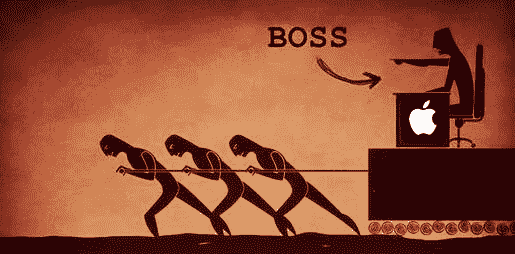

# 蒂姆·库克的代表作

> 原文：<https://medium.com/swlh/apple-and-tim-cooks-magnum-opus-cdcd23c48ebd>

## 四个基本的对与错:苹果说它有意愿，但它需要一个方法

Annotote is the most frictionless way to get informed and inform others

当然，免费开放的网络容易乞求、借用和窃取你的注意力。阅读博客、新闻和研究一直是低效的用户体验——就像在干草堆里找针一样——但现在 Annotote 是解药，查看一下: [*不要浪费时间或注意力；开门见山*](http://annotote.launchrock.com) *。*

Leading from the front or back?

如果你错过了，苹果首席执行官蒂姆·库克上周在欧洲发表了一篇关于消费者数据隐私的激动人心的演讲。来自 [TechCrunch](https://techcrunch.com/2018/10/24/apples-tim-cook-makes-blistering-attack-on-the-data-industrial-complex/) :

> 库克主张美国隐私法优先考虑四件事:
> 
> 1.数据最小化——“拥有最小化个人数据的权利”，表示公司应该“挑战自己”去识别客户数据，或者一开始就不收集数据
> 
> 2.透明度——“知情权”，称用户应该“始终知道收集的是什么数据，以及收集这些数据的目的是什么，称这是“让用户能够决定哪些收集是合法的，哪些是非法的”的唯一方式任何不足都是一种耻辱，”他补充道
> 
> 3.访问权——表示公司应该认识到“数据属于用户”,应该让用户很容易获得、修改和删除他们的个人数据
> 
> 4.安全权——说“安全是信任和所有其他隐私权的基础”
> 
> –[用注释保存的高亮显示](http://annotote.wordpress.com)

他的演讲是一个值得称赞的战斗号令，感觉像是苹果多年消费者权利运动的高潮，这场运动始于 2016 年初库克与联邦调查局的对峙。也就是说，任何人都很难知道库克是否在:

1.  真诚而天真；或者
2.  欺诈和算计

…但必须非此即彼。从表面上看，他的理想主义是有益的，但它的优点被它也是一个稻草人的事实所超越——尽管，重申一下，任何人都很难知道这是否是库克故意的…

## 正确，听起来不正确

蒂姆·库克正在讨论的隐私问题是一种民粹主义立场，但实现这些问题所需的权衡不会如此受欢迎——如果它们没有被如此明显地提及的话。与库克形成鲜明对比的是，其他人也出席了会议，呼吁更加基于现实主义，包括欧洲 GDPR 的看守人(所有人！):

> 在苹果公司首席执行官上台之前，欧洲数据保护主管 Giovanni Buttarelli 在会议开幕式上表示，数字化正在推动尊重隐私方面的新一轮转变，他说监管机构和社会迫切需要达成一致并建立“数字化社会的可持续伦理”…
> 
> 所谓的“隐私悖论”并不是人们有隐藏和暴露的冲突欲望。矛盾的是，我们还没有学会如何驾驭快速数字化带来的新的可能性和弱点…
> 
> “为了培养可持续的数字伦理，我们需要客观地看待这些技术如何以好的和坏的方式影响人们……”
> 
> –[用注释保存的高亮显示](http://annotote.wordpress.com)

如果库克是丁池，全球社会为了达到更完美的状态而更努力、更快地创新，那太好了——让他的呐喊激励我们开始工作。如果苹果自己已经达到了某种更完美的状态，那么，再一次，很好——让我们实施库克和苹果可以作为公开剧本提供的措施。然而，他说的也不是。一方面，他有*而不是*渴望创新；另一方面，苹果的工作方式呈现出它自己的基本权衡——它自己的弱点。[没有灵丹妙药](/@AnthPB/there-is-no-revenue-panacea-d52a5a937613)。

不言而喻，隐私是一项重要的特权。但是，对于在职者和新贵来说，隐私并不总是一个意愿问题。总的来说，这并不像选择走过去摘一些容易摘到的水果那么简单，正如[暗示的那样，整个故事是苹果为自己编造的](/annotote/the-power-of-the-narrative-99e9149036b7)。

蒂姆·库克前面提到的“四项基本权利”都是稻草人——混淆他们的权衡，预先制定行业标准，(错误)认知与现实，或者苹果自己的道德风险:

关于他的隐私愿景的内在权衡，库克对消费者和全球社区有多透明？他对苹果自身的虚伪和利益冲突有多透明，包括:

1.  [放弃中国用户隐私](https://twitter.com/alexstamos/status/1055192743033458688)；
2.  [App Store 免罪](http://many)；
3.  [委托代理问题](/adventures-in-consumer-technology/of-chinese-walls-and-techs-agency-problem-6cab543094d2)；
4.  尽管它从广告商那里获得了巨大的 TAC 收入(血钻？);
5.  [结构性竞争劣势](/adventures-in-consumer-technology/why-the-cloud-and-privacy-put-apple-at-a-structural-disadvantage-589587f1e918)；或者
6.  [临时安全补丁](https://twitter.com/AnthPB/status/1055161597872820224)当马已经在下一个县时，关上谷仓的门

需要说明的是，如果库克和苹果不对其他人指手画脚的话，大部分问题都不会困扰我——好像他们比你还神圣。这一切的虚伪并没有让我感到不安，因为他们在剥离善意。而且，最终，与他们转移社会的愚蠢使命相比，他们的财务费用只是一个小干扰。

## 正义之路

要真正成为社会的倡导者，蒂姆·库克可以从为上面最后一条推文中提出的问题提供解决方案开始，包括定义和区分:

1.  合理预见的风险与不可预见的风险；
2.  平台责任的终结和用户责任的开始

划清界限，为隐私、审查和网络安全的一些最令人烦恼的哲学难题建立客观基础。没有这种建设性的问题解决方案，他的哗众取宠看起来(往好里说)像是推卸责任，(往坏里说)像是故意无视苹果自己的监管套利。从后面而不是前面领导。

在缺乏这种解决方案的情况下，库克是他自己在演讲中谴责的欺诈行为的支持者:

> [库克]还间接抨击了科技行业为方得隐私法所做的努力，称一些公司将“公开支持改革，然后关起门来抵制和破坏改革”。
> 
> –[用注释保存的高亮显示](http://annotote.wordpress.com)

真的，我被包裹在一个悖论中的谜所困惑，这是库克对以下的[断言:](https://twitter.com/tim_cook/status/1055035539915718656?ref_src=twsrc%5Etfw)

> 竞争是一项基本人权。不管你生活在哪个国家，这项权利都应该受到保护。]

然而，苹果继续在中国运营，它不仅怂恿中国政府侵犯公民的隐私权，而且还是唯一一家没有撤出该地区的美国主要科技公司。库克最喜欢的出气筒之一，谷歌，在 2010 年就因为这个原因大声而有原则地退出了中国。

毫无疑问，苹果公司正在发生一些[的生存变化。同样，我们可以推测库比蒂诺隐私运动的动机，但没人能确定。他们是在努力赢得好感，以推进医疗保健吗？落井下石？美德信号？试图启动文艺复兴？](/adventures-in-consumer-technology/apple-is-about-to-change-its-business-model-c6a961a7cb30)

也许就连蒂姆·库克自己也无法挖掘自己的内心深处，但有一点是肯定的:在不承认外部性的情况下，通过花言巧语强行改变是政治——而不是公民。

## 还有一件事…

Highlights, by you and for you, on all the blogs, news, and research you read. Annotote has the pure knowledge you need. All signal. No noise.

## 这篇文章发表在[《创业](https://medium.com/swlh)》上，这是 Medium 最大的创业刊物，拥有+383，380 读者。

## 在这里订阅接收[我们的头条新闻](http://growthsupply.com/the-startup-newsletter/)。

