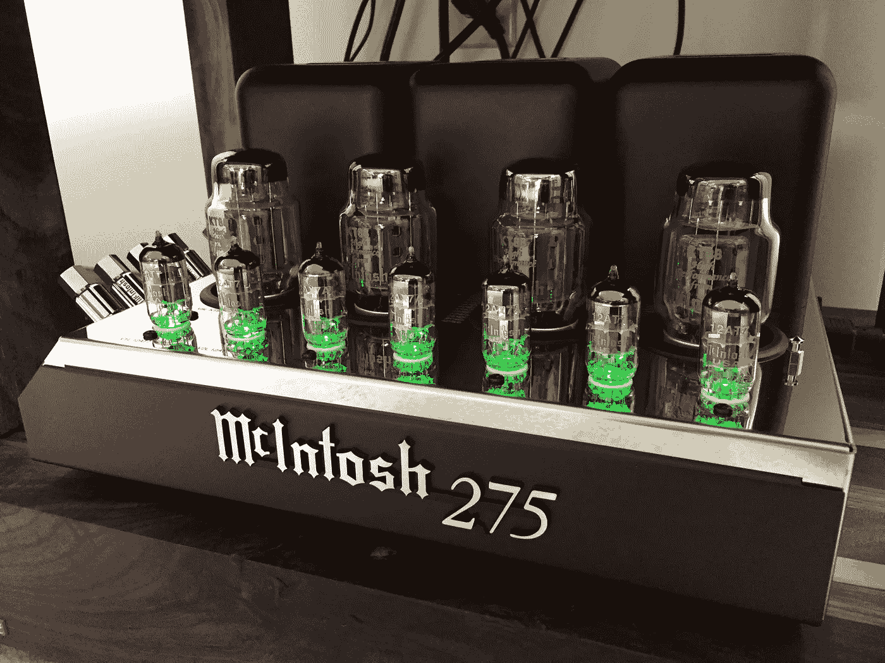
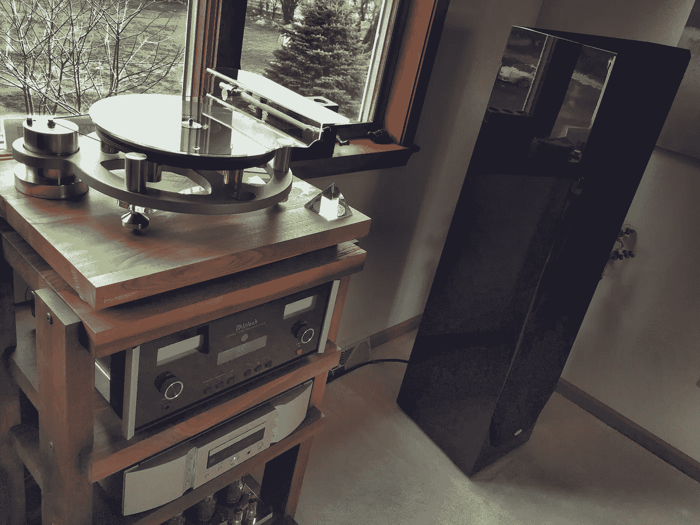
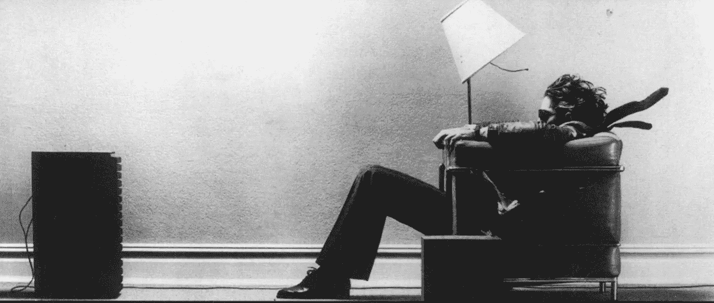

# 苹果音乐:比 Tidal(和 Spotify)好

> 原文：<https://medium.com/swlh/apple-music-better-than-tidal-and-spotify-81f0fa4447f7>

My father’s McIntosh tube amp

我和父亲以及他价值 3 万美元的立体声系统一起度过了周末，所以我借此机会将 Tidal 和 Apple Music(以及 Spotify)进行了比较，看看谁的保真度最好。

**TL；博士:**苹果音乐是明显的赢家。不过，我会说的。希望不用说，我们使用了每项服务的付费、高级版本。

我和一个音响发烧友父亲一起长大，他可能在高端音响设备上花了太多钱，尽管为了收支平衡，他不得不打两份工。话说回来，我一直很尊重他的音乐天赋。毕竟

> 生活只不过是一段美好的时光
> 一盘让你心情愉快的混音带[和](https://itun.es/us/YuEmR?i=724690810)

和

> 没有音乐，生活将是一个错误。——[尼采](https://www.brainpickings.org/2016/04/05/aldous-huxley-music-at-night/?mc_cid=8c122121c6&mc_eid=27e72e826a)

我很感激父亲让我接触音乐欣赏的方式。我的童年充满了持续不断的进步摇滚、爵士融合、后朋克以及早期电子音乐和环境音乐。这就是为什么音乐一直是我的一个爱好，从在几个大学站做 DJ，到 DJ 聚会，到在 Ableton Live/Push 上摆弄电子音乐作曲。

在过去的几十年里，他真的提升了他的发烧友游戏。我们用来测试的设备:

My dad’s setup

1.  [传统福克斯 SE](http://legacyaudio.com/products/view/focus-se/) 带状高音扬声器
2.  [孔径信号](https://www.thecableco.com/Product/WEL-Signature-with-72V-DBS)扬声器电缆
3.  麦金托什 MC 275 电子管放大器
4.  [麦金托什 C-2500](http://www.mcintoshlabs.com/us/Products/pages/ProductDetails.aspx?CatId=preamplifiers&ProductId=C2500) 管前置放大器
5.  定制[蓝色牛仔裤](https://www.bluejeanscable.com/store/audio/)互联电缆

这是我用来测试的[播放列表](https://itunes.apple.com/us/playlist/audiophilia/idpl.ec33a827b1ed408fb24baae0fd26563c)。它是相当折衷的。但统一的线索是，所有这些歌曲都是经过精心设计和录制的。有大量的低音和动态范围。

经过一个晚上和一个下午的工作:

The classic Maxell ad circa 1979

我们三个人一致认为:苹果音乐是明显的赢家。它听起来最干净，压缩最少，非常清脆。宽敞。混合得很好的人声位于前方和中央，飘到我们头顶上方的空间，就好像歌手就在房间里一样。中音从未迷失在混音中。低音深沉而宽广，但不混乱。简而言之，一切听起来都像它被设计出来的那样。

Strong, by London Grammar, one of the test tracks

对于一些歌曲，我们听不出苹果和 Tidal 之间的区别。对于其他人来说，苹果听起来比 Tidal 更好，压缩程度更低。Tidal 声称它是无损的，但在其他地方引用了 1，411 Kbps 的 FLAC 压缩率。在任何情况下，它肯定不是 CD 或乙烯基质量。

除了便宜 60%，苹果还有更大的音乐库。我们在 Tidal 上找不到大约 10%的播放列表。

至于 Spotify，尽管使用 Ogg Vorbis 的[编码，但它非常令人失望，这对我来说并不奇怪，因为这是我对 Spotify 的一个长期投诉。压缩的，混乱的，丢失的细节。Spotify 唯一真正的优势是其社交功能和丰富的音乐库。](https://support.spotify.com/us/article/What-bitrate-does-Spotify-use-for-streaming/)

Every time I Tweet to Spotify they offer tech support, as if it’s my fault

我绝不是录音工程师。但我对为什么会有如此明显的差异的理论是:苹果的音频压缩编解码器更好。不知何故，AAC 击败了 Tidal 的“无损”FLAC 编码。你还能怎么解释？或许在具体的 app 实现上有着至关重要的区别？或者，苹果公司在其平台上偏向于自己的服务？

我很想用安卓来试试这个测试，但是在我在 T4 短暂的安卓停留期间，我从来没有从安卓上的任何应用中获得过接近高保真质量的东西。

The lead and backing vocals on this track are just heavenly

为了清楚起见，我们比较了使用相同设备和原生应用的服务；这一切都非常科学。(我也比较过不同设备上的相同服务。Spotify 在他们任何一个上面听起来都不好听。)最终，我不知道苹果音频质量出众的原因。但我可以告诉你我们听到了什么。

当然，苹果音乐[并不完美](/music-tech/things-that-applemusic-doesn-t-have-yet-that-rdio-does-c241d7f13d9f#.lbglfa924)。除了播放列表共享，没有其他社交功能。所以现在，我将继续穿着我所属的两条专用音乐休闲裤生活，直到苹果在社交领域迎头赶上。

**关于上面音乐嵌入的说明**:这篇文章中所有的音乐链接和嵌入都是指向 Apple Music 的。我考虑过使用 Spotify 链接，因为我 95%的读者可能都在使用 Spotify。但这似乎与我对苹果音乐的立场不一致。这意味着更多的工作。但这是[Spotify 播放列表](https://open.spotify.com/user/lloyddoppler/playlist/4IWfHDlPH7guAnv4bV3wki)。\_(ツ)_/

***更新:*** 我可能应该提到，我们正在从 iPhone 6、iPad Pro 和 iPad Mini 传输到一台旧的 Airport Express，它通过光缆连接到前置放大器。