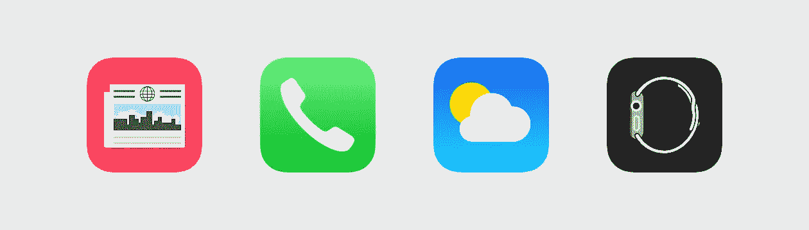
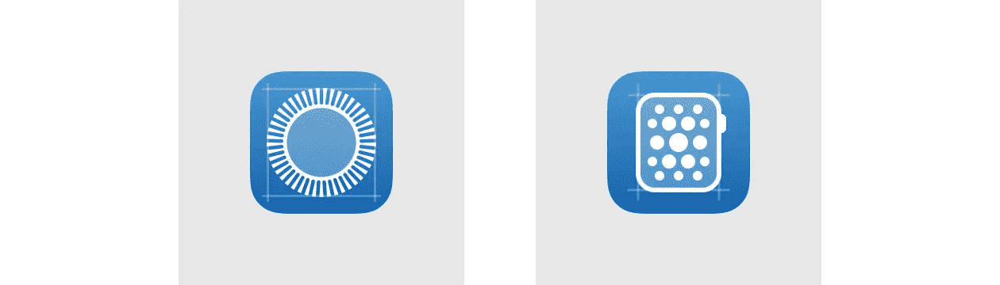
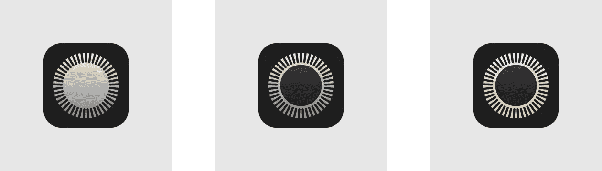
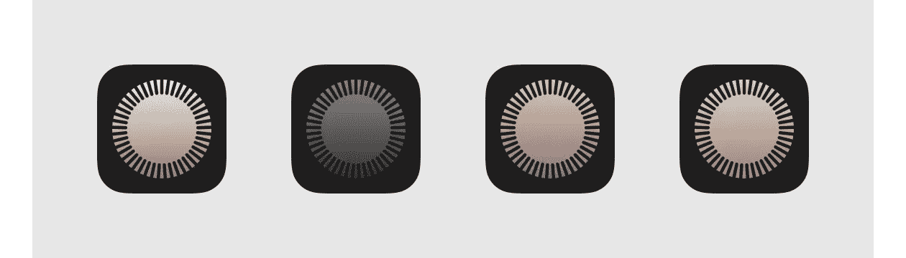
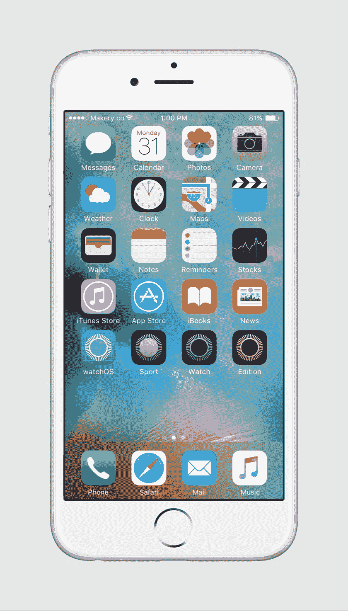
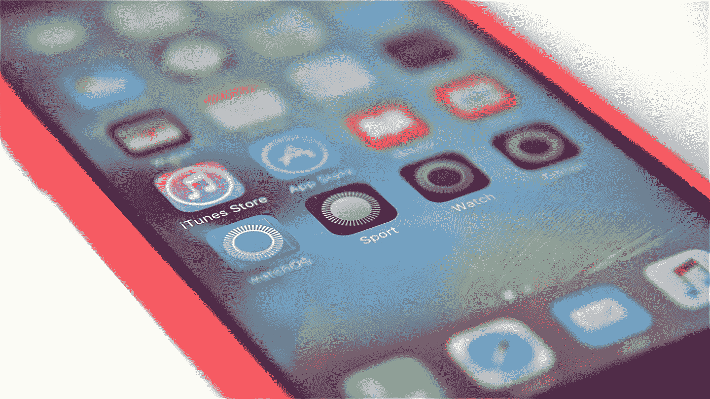
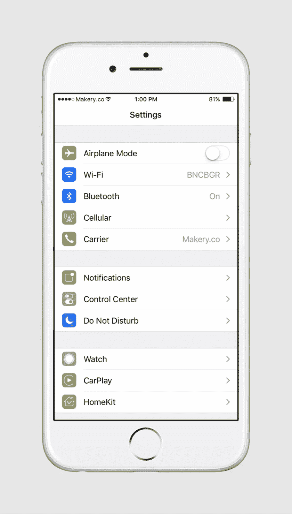
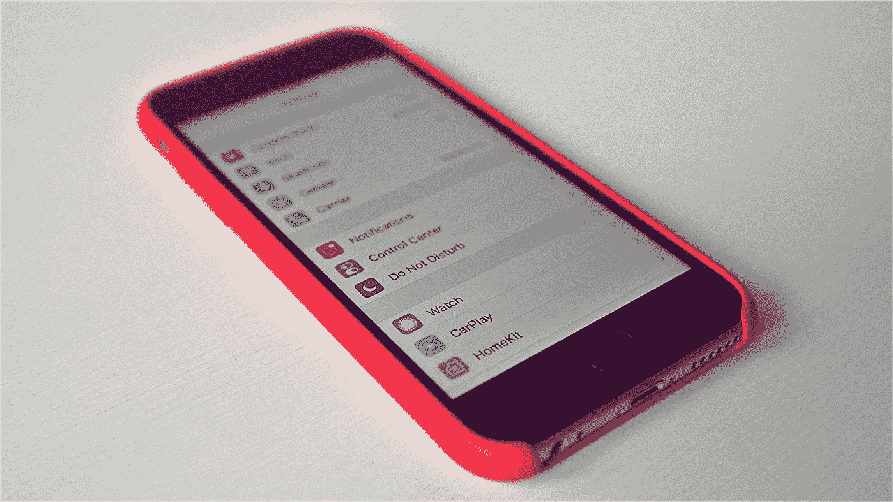

# Apple Watch 应用图标概念

> 原文：<https://medium.com/swlh/apple-watch-app-icon-concept-2b543b1f2b9f>

[tick-tock](https://www.flickr.com/photos/bncbgr/19180831604)

两周前，苹果刚刚分享了新的 iOS 9.3 预览版。它有这么多相当惊人的功能:夜班，改善新闻，健康，CarPlay 等等。

自从手表发布以来，我已经错过了一件小事，那就是一个华丽的图标。我的意思是我喜欢 iOS 默认应用，除了右边的。

News, Phone, Weather and Watch

我知道苹果有很多事情要做，所以我决定设计自己的版本。周末，外面的天气相当冷，所以我在谷仓旁做了一杯非常好的穆鲁塔咖啡，并选择了一家 T2 的大公司，然后我打开了我的 Moleskine，Sketch 和 Medium。

在这里你可以跟随我的脚步。好好享受吧！

**想一想**

首先，我收集了约束条件，并根据它们写了一个简短的摘要。这真的在我的设计过程中帮助了我，让我专注于正确的道路并实现我的目标。在这个项目中，我选择了三个约束:

*   一个周末——让它发生
*   [iOS 设计指南](https://developer.apple.com/library/ios/documentation/UserExperience/Conceptual/MobileHIG)–伟大的象征
*   [思考不同的](https://en.wikipedia.org/wiki/Think_different)哲学——让它独一无二

**设计**

我相信每个伟大的应用程序图标背后都有一个伟大的符号，所以我做了一个小小的研究，发现了两个我可以想象为应用程序图标的符号:

*   数字表冠
*   watchOS

Apple Watch 的拥有者很容易认出并喜爱它们。

Digital Crown and watchOS

在研究会议的最后，我选择了数字皇冠作为一个标志，因为我认为它更有可能使其独一无二:

*   自适应图标主题
*   图标大小相等

*自适应图标主题*

我为所有八款腕表设计了单独的图标:

*   腕表运动–银色、太空灰、玫瑰金和金色
*   手表-不锈钢，太空黑
*   腕表版——玫瑰金和黄金

因此，当你佩戴银色运动手表、不锈钢手表或黄金手表时，你可以使用不同类型的应用程序图标。

Watch Sport – Silver, Watch – Stainless Steel and Watch Edition – Yellow Gold

我更喜欢运动手表(我喜欢哑光表面！)所以我把四个版本都给你看。

Watch Sport — Silver, Space Gray, Rose Gold and Gold

*图标大小相等*

我将应用图标(92 像素)设计为与物理数字表冠(7.2 毫米)相同的大小，因此它可以给你一种熟悉的感觉。

watchOS – TestFlight, Watch Sport – Silver, Watch – Stainless Steel and Watch Edition – Yellow Gold

Home Screen

作为最后一步，我在 iOS 中实现了新的应用图标。我用一个新的连接设备组制作了一个主屏幕和一个设置屏幕:手表、CarPlay 和 HomeKit。

Watch, CarPaly and HomeKit

Settings Screen

在周末，这些工具帮了我很大的忙，感谢车队！

*   [草图](https://www.sketchapp.com)–专业数字设计
*   [设计+代码](https://designcode.io/watch)–watch OS GUI
*   [core 77](http://www.core77.com/posts/37030/Apple-Releases-Apple-Watch-CAD-Drawings)–苹果手表蓝图
*   [color hexa](http://www.colorhexa.com)–颜色探测器和调谐器

那么下一步是什么？我应该把它寄到 info@apple.com 的[吗？我不这么认为。](mailto:info@apple.com)

我很乐意利用这个伟大社区的力量。如果你喜欢这个帖子，请帮我传播这个想法，并点击推荐按钮。

也许我们可以启发苹果考虑重新设计手表应用程序图标。

非常感谢！

本斯

*移动，& AI 设计师* [*推特*](https://twitter.com/bncbgr) *，* [*中型*](/@bncbgr) *，*[*Dribbble*](https://dribbble.com/bncbgr)*。* [*平我！我很想收到你的来信。*](mailto:bogar.bence@gmail.com)

***与***[***Makery***](http://www.makery.co)***这样的伟大团队合作。
“您喜欢与之共事的移动团队。”***

*在这里你可以阅读更多关于我的最新设计项目:* [*产品 Hunt Logo 概念*](/@bncbgr/product-hunt-logo-concept-c6b0c6762ffe) *和* [*中型 Logo 概念*](/@bncbgr/medium-logo-concept-25277d0a06c5) *。*