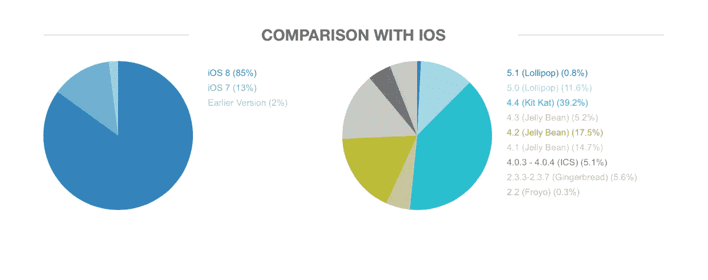
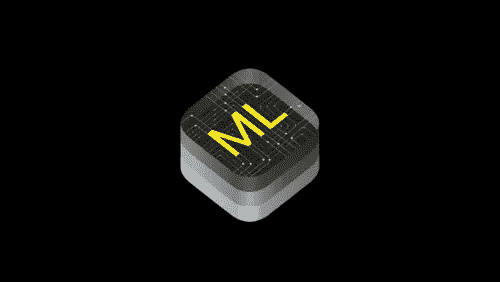

# 苹果的专长不是硬件或软件

> 原文：<https://medium.com/swlh/apples-speciality-isn-t-hardware-or-software-af1e6337d5f2>

## 每个人在批评苹果时都忽略了一个明显的点

对于苹果最新的产品系列有很多负面的意见，从许多功能已经在手机上存在多年，他们不够创新，或者他们所有的产品都定价过高。

但我认为这些人没有抓住重点。

> 虽然它们看起来都像是苹果方面的事故和错误，但这可能只是他们的策略。

毫无疑问，苹果已经从一个改变世界的小公司成长为科技巨擘之一。因此，他们需要更加努力地工作来保持他们的酷和时尚的形象。

如果他们把自己标榜为一家包容的公司，这是不可能的。如果每个人都有一部 iPhone，他们感知的“酷因子”就会下降。这就是为什么苹果一直把他们的产品定价那么高。由于超出了许多人的预算，iPhone X 和苹果新的旗舰产品系列会引起那些没有它的人的嫉妒。**iphone 既是一种实用工具，也是一种身份象征。**

除此之外，苹果最大的优势之一在于它的操作系统。iOS 是排他性的，是一个封闭的系统，只针对 iPhone 用户，相比之下，Android 是包容性的，开源的，适用于任何选择使用它的手机。尽管 Android 是世界上使用最多的手机操作系统，但可以说它也是最分散的。

在 iOS 系统中，更新是强制性的，并且经常受到鼓励，而在 Android 系统中，操作系统版本之间存在着极大的差异。如果人们不更新他们的手机，如果软件仍然落后，开发者就很难使用新的硬件功能。

除此之外，苹果有一个完善的生态系统来推广新的应用程序，并允许开发者使用他们最新的硬件。难怪大多数公司在 Android 之前就为 iOS 创建了应用程序。

最后，随着苹果发布 CoreML 和 ARKit，这表明他们正在为人工智能和 AR 创建一个平台，以便轻松地集成到产品中，并在公众中传播，在未来，它甚至可能是此类服务的领先平台。

开发人员在创建他们的人工智能和增强现实产品时应该并将会被吸引到苹果，由于它的影响力和“酷因素”，甚至可能有助于推动这些产品的广泛采用。

人们没有看到的是，苹果不是一家硬件公司，也不是一家软件公司，而是两者的完美结合。它的发行策略确保了它是一种身份的象征，为它的客户提供最高质量的应用，为它的创造者提供最好的开发平台。

> 苹果的专长不是硬件或软件，而是它们的排他性

没有它，它就无法保持在全球行业的领先地位，无论我们消费者喜欢与否，我们都不会获得如此高质量的应用和服务。

抱怨苹果不够创新很容易，但事实是，他们正在为他们的情况做最好的事情。

这是一篇由十几岁的苹果粉丝写的文章，因此，请记住，不能保证它在某些方面没有偏见。我很感激你对所提供信息的任何更正。

¯\_(ツ)_/¯

萨尔瓦夫

***看看我的其他故事吧！***

**十五 Y/O 给聊天机器人工作人员的消息—**[https://medium . com/swlh/A-Message-From-A-fifty-O-to-any one-Working-With-Chatbots-fd1b c 6292028](/swlh/a-message-from-a-fifteen-y-o-to-anyone-working-with-chatbots-fd1bc6292028)

**关于为什么计算机永远不会真正理解任何东西的高度分歧的争论—**

https://hackernoon . com/高度分歧的“为什么计算机永远不会真正理解任何东西”的争论

## 这个故事发表在 [The Startup](https://medium.com/swlh) 上，这是 Medium 针对企业家和初创公司的领先出版物。

# 你可以订阅[在这里获取头条](http://growthsupply.com/the-startup-newsletter/)。

